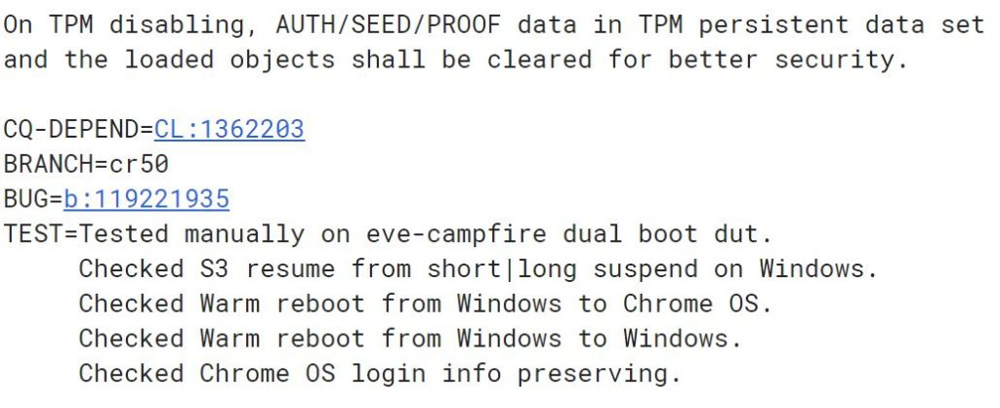

Months ago we heard about [Project Campfire](https://www.aboutchromebooks.com/tag/campfire/); Google's effort to [run Windows on Chromebooks](https://www.xda-developers.com/chromebooks-chrome-os-windows-10-dual-boot-apple-boot-camp-campfire/). The feature hasn't been officially announced yet but there have been a number of code commits in recent days showing that the development team is making good progress and may be in the home stretch, with an official announcement possibly coming soon.

We already knew that the dual booting option was originally called Alt-OS, but has [since been dubbed "Dual-Boot"](https://www.aboutchromebooks.com/news/project-campfire-alt-os-dual-boot-windows-10-chromebooks-linux/), which is a bit more descriptive. Some of the code commits still refer to Alt-OS, however, such as one from yesterday that [tests disk partitioning when cycling the dual boot functionality on and off](https://chromium-review.googlesource.com/c/chromiumos/third_party/autotest/+/1362636). I suspect that internally, Alt-OS is still used behind the scenes at Google, but from a front-facing perspective, "Dual boot" is likely what device owners will see.

And for now, the only device being tested [with the Campfire build is Eve](https://chromium-review.googlesource.com/c/chromiumos/platform/ec/+/1358738); the codename for last year's Pixelbook. That's been the case since the beginning of Project Campfire and based on various Chrome OS builds for individual devices, Eve is still the only one with a Campfire build of Chrome OS. I expect that to change in the coming months but it makes sense to get Chromebooks booting into Windows on a _single_ model before rolling it out to others.

Keep in mind that there will be certain hardware requirements needed to switch between Chrome OS and Microsoft Windows, particularly in the storage: Last I heard, the plan was to mark off 40 GB of storage for Windows, but that may have changed in the past few months.

All of this partitioning and enabling (or removing) dual boot functions for Windows on a Chromebook can't impact device security of course. To that end, there has been [recent dual boot testing done on how to handle the TPM, or Trusted Platform Module, data inside every Chrome OS device](https://chromium-review.googlesource.com/c/chromiumos/platform/ec/+/1372029).

At this point, it seems clear that for testing purposes, Eve is booting back and forth between Chrome OS and Microsoft Windows in the lab. And it appears to be doing so without compromising the security of Chrome OS. Aside from ensuring the Pixelbook has the appropriate hardware drivers for Windows -- something I think has already been taken care of some time ago -- I'm not sure there's much work left to do for Project Campfire to be officially announced.

I suppose it's possible that Google makes some announcement in conjunction with Microsoft at the Consumer Electronics Show in a few weeks. I'm a bit skeptical of that though: Microsoft ceased having a booth on the CES show floor a few years back while Google has never had one. Instead, both of these companies generally rely on their device partners to make news at CES. In this case, they **are** the partners, so it's hard to say how and when this development will be announced.

Regardless, I know some folks aren't happy with the amount of optional new features being added to Chrome OS. First, it was Android apps, then Linux packages and coming soon: Microsoft Windows. I understand that perspective, although these are all optional features. If you just want a Chrome OS experience in the browser, you still have that.

Still, I'd love to hear from folks who do (or don't) want Windows as an option on their Chromebook, and why. I still think it's [all upside for the platform](https://www.aboutchromebooks.com/news/run-windows-on-a-chromebook-great-idea/) in general.
