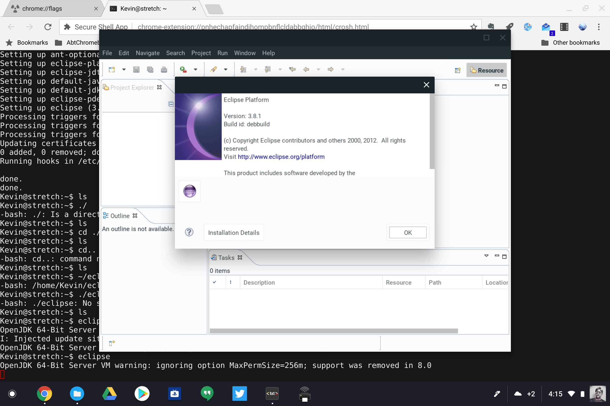

I'm getting this question a bunch lately now that [Project Crostini is quickly spreading to many Chromebooks](https://www.aboutchromebooks.com/news/project-crostini-enabled-on-apollo-lake-chromebooks-from-acer-asus-dell-and-lenovo/): What Linux apps should I install? The answer is, I don't know. ;) That's because I don't know what each individual is trying to do. But that doesn't mean I can't point you in the right direction to help.

For me, I'm using Linux apps to do things I would normally do on my MacBook because I either can't do them in a browser or because there isn't quite a perfect Android app for what I need.

I'm down to just one activity on the MB: Recording weekly podcasts. I have a multi-track audio recording over Skype and then need to edit the audio, add intro music, etc... On the MB, I obviously use Skype for the conversation and I then use Audacity for the edits. There's a Linux version of both apps so that solves my problem. Or at least it will once Google adds audio support to Project Crostini. And I've already moved my coding from the MB to the Pixelbook since most of the text editors and IDEs I use are available for Linux.

If you don't record podcasts or code then, what can you do using Linux on a Chromebook?

The best I can do is point you to this [Wiki of Windows app equivalents for Linux](http://wiki.linuxquestions.org/wiki/Linux_software_equivalent_to_Windows_software). It hasn't been updated since 2016 but it's still a decent resource to get you started. And it's broken down into type of applications: Office/Productivity, Networking, Desktop Publishing, etc... so you can focus on the specific activities you're looking to do on a Chromebook using Linux apps.

If you want a second resource that's not quite as comprehensive, the [Linux Alternative Project site](https://www.linuxalt.com/), might be worth the look as well.

Got fave Linux apps that you're using on a Chromebook? Drop 'em in the comments and help the "Crostini Community" out!
