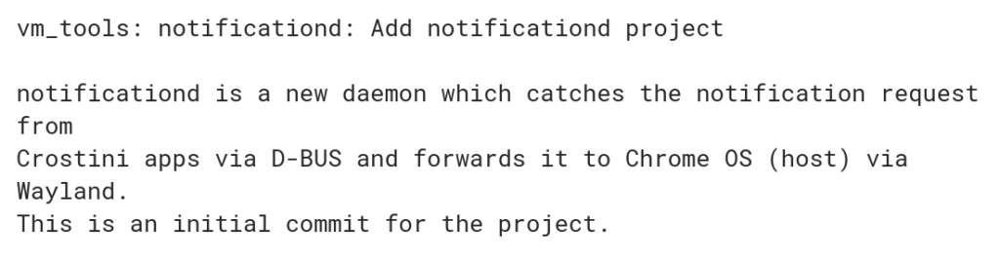

A request for [Linux app notifications to appear on a Chromebook](https://bugs.chromium.org/p/chromium/issues/detail?id=838531) was first noted back in May but work hasn't progressed on the feature for months. Now, it's in full flight with [several Chrome OS code commits related to Project Crostini notifications over the past two weeks](https://chromium-review.googlesource.com/c/chromiumos/platform2/+/1179508).

You might think that [Project Crostini](https://www.aboutchromebooks.com/tag/project-crostini) already supports the Chrome OS notification based on messages seen in the system tray when [installing .deb packages](https://www.aboutchromebooks.com/news/how-to-install-debian-linux-packages-in-project-crostini-chrome-os-files-app/). But remember, it's the Chrome OS native Files app that handles the process; those notifications (as shown in the above top image) are coming from Chrome OS, _**not**_ the Linux container of Crostini.

Why might you need this if Linux apps are generally secondary to web apps?

It comes in handy when a Linux program is running in the background. For example, you may prefer a desktop-class email client instead of running Gmail in your Chromebook browser. If you can't see the Linux client because you're in a full screened browser, how will you know when messages arrive? Or maybe you're building a code package in a development tool and passing the time in Android or [Progressive Web Apps](https://www.aboutchromebooks.com/news/heres-what-progressive-web-apps-or-pwas-look-like-on-a-chromebook/): Error and completion notifications are key.

Will this feature be widely used? Perhaps not since I anticipate a small percentage of Chrome OS device owners ever run Linux apps. For those that do, however, this is a sorely needed function. I don't know which version will bring Linux notifications to Chrome OS yet; it appears that the feature is still in the works and being tested, so stay tuned.
