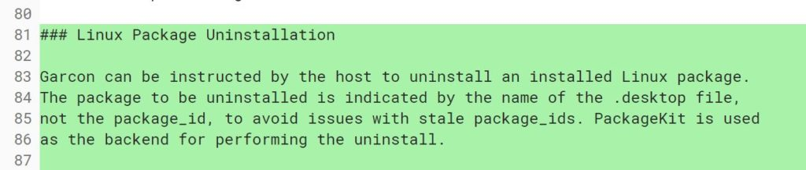

Google is clearly trying to make the Project Crostini experience on Chromebooks easy for folks not necessarily familiar with Linux. In August, Chrome OS gained the ability to [install Debian packages directly in the native Files app on a Chromebook](https://www.aboutchromebooks.com/news/how-to-install-debian-linux-packages-in-project-crostini-chrome-os-files-app/). A few weeks ago, work began to [show the package information during the install process](https://www.aboutchromebooks.com/news/chrome-os-will-show-debian-package-details-when-installing-in-the-files-app/). Now, the Chromium team is building functionality to remove Linux apps with a simple click.

There are three parts to this process since Project Crostini has several functional layers.

First is the [addition of an uninstall option for Crostini apps](https://chromium-review.googlesource.com/c/chromium/src/+/1214048): Desktop icons for the Linux apps will show an "Uninstall" choice when right clicked.

Next is the uninstall command tasking Garcon, the code name for what's essentially a"go-between" from Chrome OS to the Crostini container.

And finally is Cicerone, which accepts messages from Garcon and communicates directly with Crostini containers. Here's [the supporting change to Cicerone](https://chromium-review.googlesource.com/c/chromiumos/platform2/+/1259589/4):

> vm\_tools: Pass uninstall messages through cicerone
> 
> Pass the uninstall messages to and from garcon. Also update cicerone\_client to support uninstalling.

Keep in mind that the uninstall functionality within Chrome OS will only be supported by Linux apps that have icons in the Chrome launcher. That should be most of them, but I know I have a few missing launcher icons; perhaps that's from testing on the Dev Channel for months.

And of course, for people familiar with the Linux Command Line Interface (CLI) or have a package manager installed in the Linux container, those options are still available. The idea here -- at least as I see it -- is for folks that might want to tinker with some Linux apps or install just a few key ones such as Skype, Libre Office or another popular desktop application.
