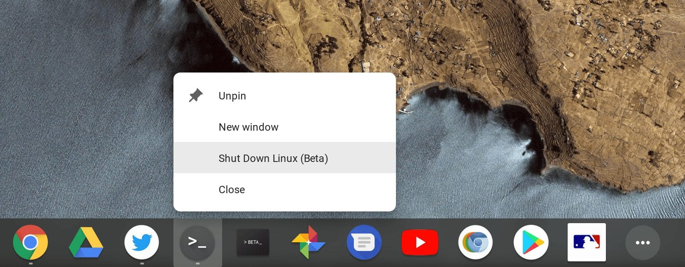
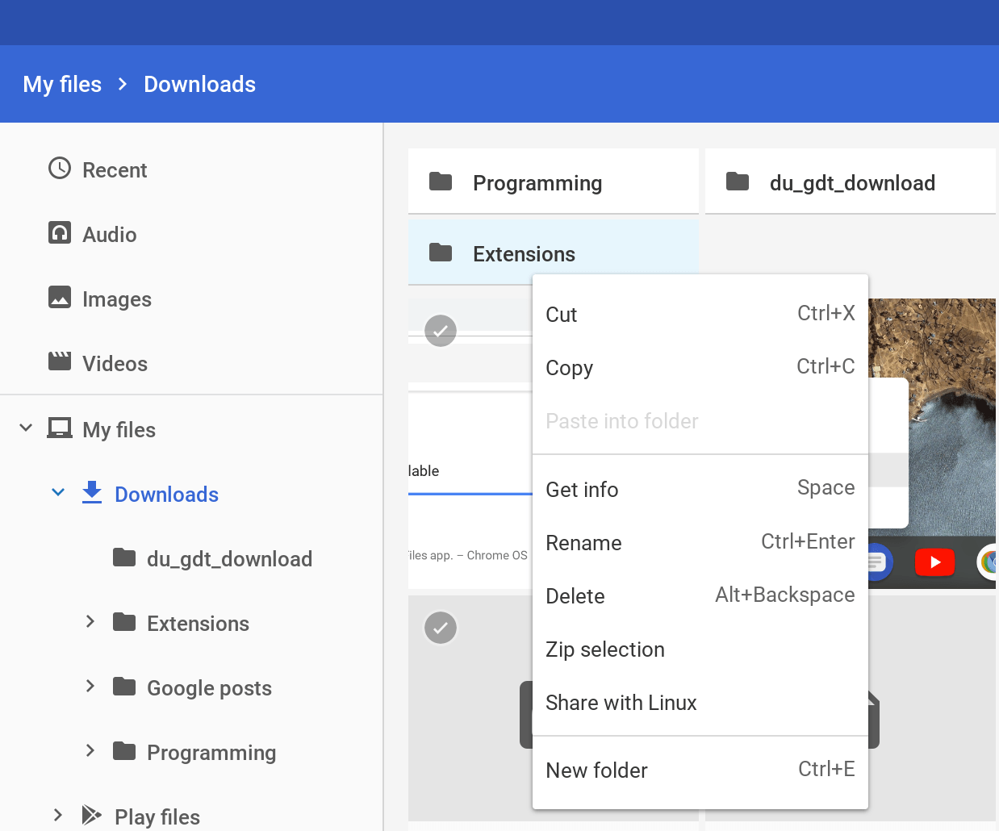
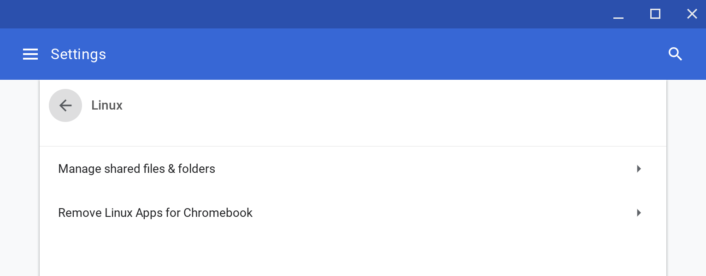
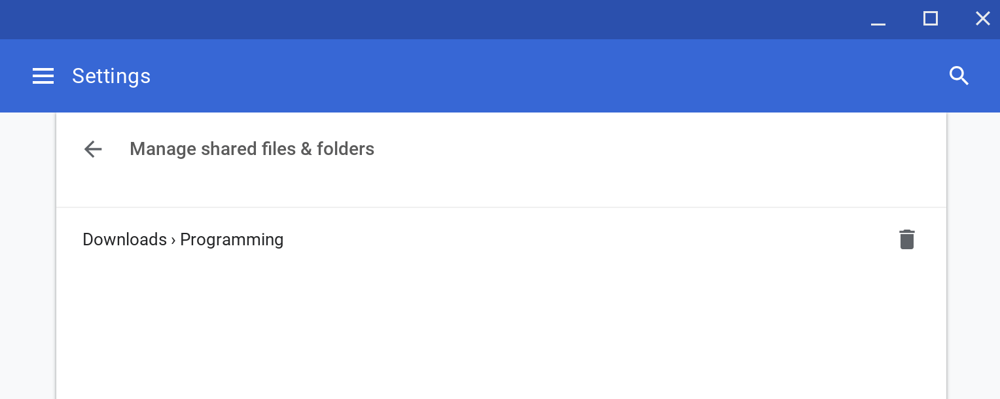
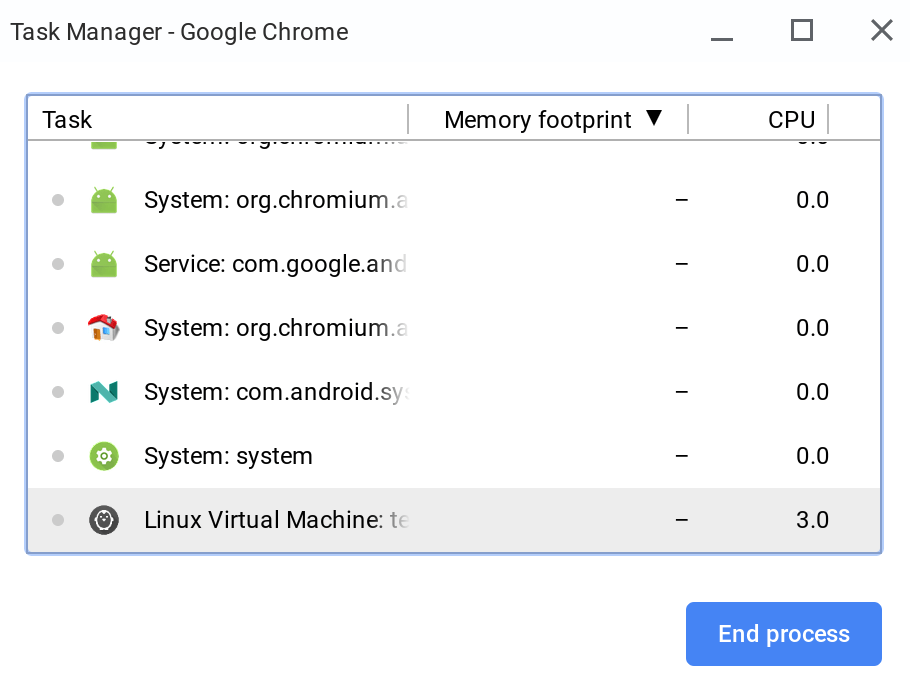

Although [Google rolled out support for Linux apps through Project Crostini in the Stable version of Chrome OS 69](https://www.aboutchromebooks.com/news/chrome-os-69-stable-release-project-crostini-linux-apps/), there's still some work to be done. And some of that work comes with [Chrome OS 71 in the Dev Channel, which was released on Wednesday](https://chromereleases.googleblog.com/2018/10/dev-channel-update-for-chrome-os_17.html).

First is an [easier way to stop the Linux virtual machine](https://chromium.googlesource.com/chromium/src/+/64e6bcceca05f4026d01b870a823dd4140c525e9). There's a new contextual menu option for the Terminal app in the dock: Right-clicking the icon will now show a new "Shut Down Linux (Beta)" option to close down the Linux instance.

Also implemented is a way to [share files and folders within the native Chrome OS Files app to the Linux VM](https://chromium.googlesource.com/chromium/src/+/83e0cbb508d756326ef59edddd4644afc7861839), although it only seems to be working (partially) for files at the moment. When fully working, you can right-click on a local file or folder and see a new "Share with Linux" action.

For me, it's only appearing on folders, not individual files. And even when I choose to share a folder, I don't yet see it in my Linux directory in the Terminal.

However, there's a related feature that is working. In the Settings, there's a new way to [directly manage files and folders shared with Linux](https://chromium.googlesource.com/chromium/src/+/031609b88d700e0eca91bacc33e2b9bcfd34cdaf). You'll find it in the settings where you enable or disable Linux support:

Lastly, there are the beginnings of an effort to [view device resource usage by the Linux VM](https://chromium.googlesource.com/chromium/src/+/1907c68b6af96306b3591685fc12c982a0af1f36). If you open the Chrome OS Task Manager, you should see the Linux Virtual Machine as a task. For now, I can only view the CPU usage and not the memory resources, but I'm sure that will be resolved shortly in an upcoming Chrome OS update.

Some users reported [low-resolution launcher icons for their Linux apps in Chrome OS](https://chromium.googlesource.com/chromium/src/+/ad944ddf0de18374204af0ab8503c32629eaa886), but that should be resolved in this update. There's one more item that's a behind-the-scenes fix so you won't see it. [This relates to uninstalling Crostini](https://chromium.googlesource.com/chromium/src/+/1dca66c036d7329f81f6b350558504cda41d6af9), i.e.; disabling the Linux app support, but again, it's more of a cleanup process than anything else.
