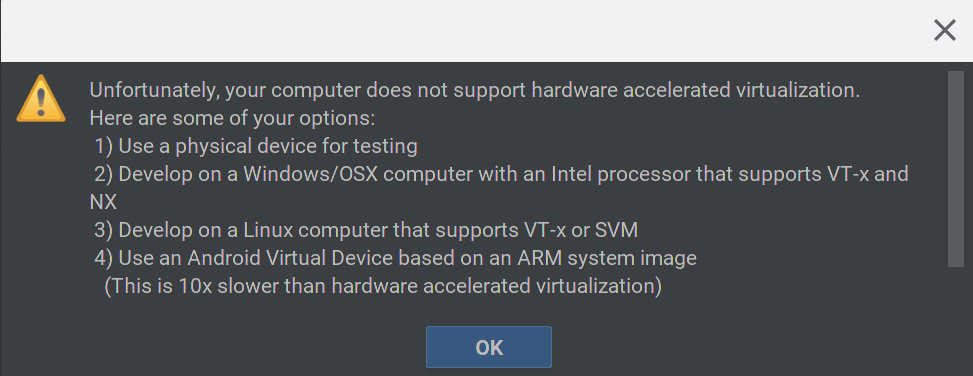

One of the remaining key features [not yet working in Project Crostini is GPU acceleration](https://www.aboutchromebooks.com/news/project-crostini-progressing-towards-gpu-acceleration-for-chromebooks-running-linux-apps/). We already know how Google plans to add it -- [this video covers the technical approach](https://www.aboutchromebooks.com/news/video-how-project-crostini-works-run-linux-apps-on-chromebooks/) in great detail -- but we still don't know when to expect it. There's no official announcement but today at its Android Developers Conference, Google provided us a big hint: Early 2019.

Why do I say that? Because of Google _did_ announce today, namely: [Official support for Android Studio on Chromebooks](https://android-developers.googleblog.com/2018/11/unfolding-right-now-at-androiddevsummit.html).

> Android Studio 3.3 launches beta 3 today. In coming releases expect to see a strong focus on quality and fundamentals: reducing the number of crashes and hangs, optimizing memory usage, and fixing user-impacting bugs. We also announced today that we're making Android Studio an officially supported IDE on Chrome OS early next year; learn more here.

Yes, you can already run the Linux version of Android Studio on any Chrome OS device that works with Project Crostini. What doesn't work is the Android Emulator though: It requires GPU hardware acceleration.

Putting all of that together: If full, official Android Support on Chromebooks for developers is coming in early 2019, it follows that GPU hardware acceleration in Crostini has to arrive in tandem. I say that because as far as I can tell, the Android Virtual Device (AVD) emulator requires hardware acceleration:

Assuming I'm correct -- please chime in if I'm not since I tend to code in Java for school -- I can't see how Google will officially support Android Studio on Chromebooks for devs without supporting the AVD. Yes, you can run your Android app within Android Studio or on a local Android device connected to your computer -- well, you could if [USB support was working; it's not but looks to be coming soon](https://www.aboutchromebooks.com/news/project-crostini-linux-usb-support-chromebooks/).

Again, this is conjecture on my part since a release date hardware acceleration for Crostini on Chromebooks hasn't been specifically announced. Early 2019 is sounding like a good bet, though.
