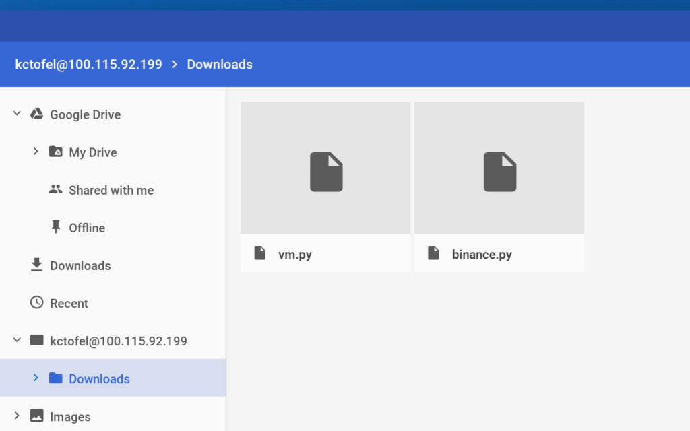

Back in March, the team that maintains LXC, or Linux Containers, [announced that LXC 3.0.0 was generally available](https://discuss.linuxcontainers.org/t/lxc-3-0-0-has-been-released/1449). Now, the [Chromium team is working to upgrade LXC from version 2.1.1 to 3.0.0](https://chromium-review.googlesource.com/c/chromiumos/overlays/chromiumos-overlay/+/1056130). If you wondering what all this means, let me break it down.

The Linux Containers that Google's Project Crostini for Chrome OS are built using [LXC](https://linuxcontainers.org/lxc/introduction/). Using these containers lets you run [a full Linux terminal and apps on a Chromebook](https://www.aboutchromebooks.com/news/google-officially-unveils-project-crostini-linux-apps-on-chrome-os/). Yes, that's currently only on the Chrome OS Dev Channel for the Google Pixelbook at the moment but last week Google said it plans to bring the feature to other Chromebooks. They'll need to have Linux Kernel 4.4.x or better; here's a list of the current [Chromebooks and Chromeboxes that currently meet this requirement](https://www.aboutchromebooks.com/news/these-are-the-chromebooks-and-chromeboxes-that-can-support-linux-apps/).

\[caption id="attachment\_505" align="aligncenter" width="800"\] Chrome OS Files app showing Linux mount\[/caption\]

Version 3.0.0 of LXC will be supported until June 2023 so over the long term, Google will have a fairly stable Linux container platform for Chrome OS devices, save for minor updates along the way.

I'm still dissecting what the improvements and new features are for LXC 3.0.0 compared to the current version on my Pixelbook, but if you're interested in the nitty gritty, [all of the details can be found here](https://discuss.linuxcontainers.org/t/lxc-3-0-0-has-been-released/1449). From my cursory glance, it appears that very little of the changes will have a front-facing effect but instead will be behind the scenes functionality for running Linux apps on a Chromebook or Chromebox. There might be, for example, some minor file path changes for the containers; since this is all still in development, that shouldn't have a major impact on anyone.
