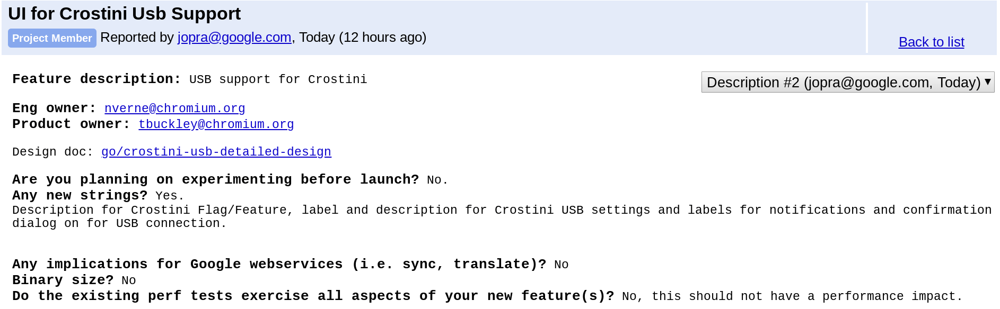
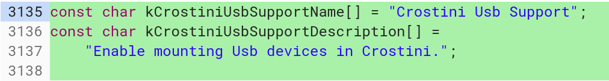

Among the still missing features in Project Crostini are GPU hardware acceleration, audio support and the ability for Linux apps to access USB drives and devices on a Chromebook. That last function is moving forward now, based on [a newly opened bug that you can follow along here](https://bugs.chromium.org/p/chromium/issues/detail?id=899568&desc=2), dubbed "UI for Crostini USB Support".

I did some digging in the Chromium code to see if there was any immediate progress on the new change and sure enough, [there's a start](https://chromium-review.googlesource.com/c/chromium/src/+/1301095/5/chrome/browser/flag_descriptions.cc).

This code commit adds a new features flag to enable the USB support, although for now, [it appears it will be off by default](https://chromium-review.googlesource.com/c/chromium/src/+/1301095/5/chromeos/chromeos_features.cc). I'd expect that to change in the future, however: My guess is that when USB support officially arrives in Project Crostini, there won't be a flag to enable it and/or it will simply be enabled by default.

It's possible that the flag is already available in the Chrome Canary Channel but I generally run the Dev Channel on my Pixelbook. As of the time of writing, I don't see it on the Dev Channel for Chrome OS version 71.0.3578.21.

So what does this mean when the feature lands?

First and foremost, the Linux container should be able to access data from a USB drive. I'd expect USB devices such as keyboards, cameras and the like would be usable within the Linux container.

Additionally, any developers who are using the [Linux version of Android Studio](https://www.aboutchromebooks.com/news/google-adds-a-chrome-os-emulator-to-android-studio/) on a Chromebook can then attach an Android device over USB to the development environment to push their in-progress application to a test device. And lastly, folks who tinker with external hardware -- say an Arduino or Raspberry Pi board -- will be able to access it over USB for programming and testing.

It's difficult to predict when USB support will arrive for Project Crostini, but my hope is that we see it in Chrome OS 71, which should arrive in late November or early December. That happens to coincide nicely with when we [could see the Pixel Slate become available](https://www.aboutchromebooks.com/news/google-pixel-slate-release-date-november-22-best-buy/) since the demo units of the tablet were all running Chrome 71 Dev Channel earlier this month at the #MadeByGoogle event.

_**Update**: As noted by an astute reader, Denny, in the comments, this feature is currently targeted for Stable version 73 in the bug. That could change in either direction, of course, based on code development and testing, so I'll keep an eye -- a closer one! -- on progress._
