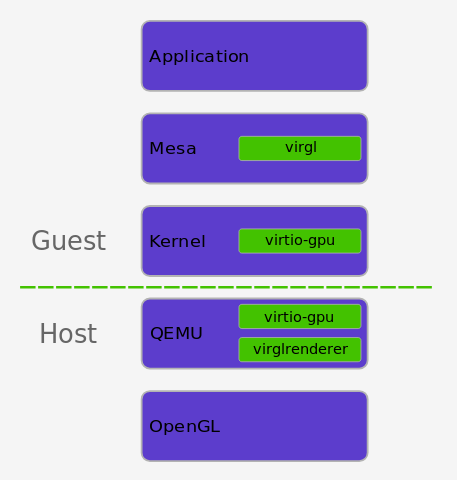

There are still a few key functions not yet supported in [Project Crostini](https://www.aboutchromebooks.com/tag/project-crostini), which is Google's implementation to run Linux apps in a container within Chrome OS. One of them is graphics acceleration because the Linux container doesn't yet have access to graphics hardware -- the GPU -- on a Chromebook. Now, a feature to provide a virtual GPU with acceleration is heavily in the works.

I noticed some code commits last week regarding 2D and 3D graphics for Crostini. Today I followed up and see even more progress. The first one of interest [is this one in the Crostini-specific code, described as "_gpu: implement virtio-gpu_"](https://chromium-review.googlesource.com/c/chromiumos/platform/crosvm/+/1036862).

The key point there is mention of virtio-gpu, which is part of [a virtual 3D GPU project known as Virgil](https://virgil3d.github.io/). Here's a description of Virgil, which is a research project by Dave Airlie at Red Hat:

> Virgil is a research project to investigate the possibility of creating a virtual 3D GPU for use inside qemu virtual machines, that allows the guest operating system to use the capabilities of the host GPU to accelerate 3D rendering. The plan is to have a guest GPU that is fully independent of the host GPU.

If it helps to see this visually at a high level, here's [a look at the Virgil3D stack](https://www.collabora.com/news-and-blog/blog/2018/02/12/virtualizing-gpu-access/), as created by Robert Foss at Collabora earlier this year:

Indeed, in his blog post from February, Foss notes that "Currently Collabora and Google are implementing OpenGL ES 2.0 support. OpenGL ES 2.0 is the lowest common denominator for many mobile platforms and as such is a requirement for Virgil3D to be viable on the those platforms."

Looking at the Virgil3D stack, it mentions _virgilrender_ as part of the graphics solution. And guess what: There's [a recent code commit also from last week](https://chromium-review.googlesource.com/c/chromiumos/platform/crosvm/+/1043447) described as "_gpu\_renderer: add virglrenderer bindings. These bindings are needed for virtio-gpu 3D capabilities._"

So the Chromium team is working on both of the required pieces to bring accelerated 2D and 3D graphics to Linux within Chrome OS.

I won't claim to be an expert in the nuts and bolts of this approach, but on the face of it, it appears that hardware accelerated graphics will be able to "cross over" into a Linux container via a virtual GPU using Virgil3D once Google works the kinks out.

It's even possible that we'll see such support when Crostini lands on the Stable Channel, [which is currently slated for Chrome OS version 69](https://www.aboutchromebooks.com/news/project-crostini-linux-apps-chromebooks-release-date-chrome-69/). Then again, Google could decide to focus on getting all key functionality into Crostini and pushing it back to Chrome OS 70; it would still meet its target date of implementation by year end in that case.
