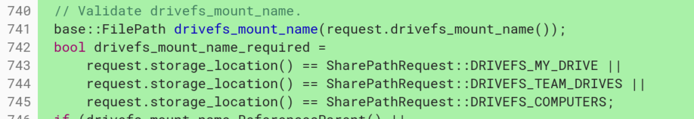
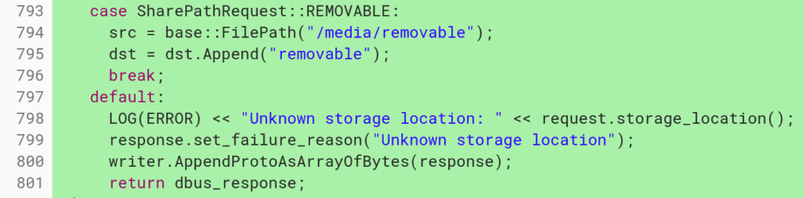

Google is continuing to make file sharing between Chrome OS and Linux easier on Chromebook. After recently adding [a method to share a Chrome OS folder in the Files app with a Linux container](https://www.aboutchromebooks.com/news/project-crostini-chrome-os-files-share-with-linux/), evidence shows additional Google Drive integration as well. And although Linux access to USB devices isn't yet supported, this change also brings the ability to access a shared removable media device, such as microSD card or USB drive.

[This Chromium OS code commit](https://chromium-review.googlesource.com/c/chromiumos/platform2/+/1287390) spells out the new functionality that has been coded and tested in the Chrome OS Files app.

> vm\_tools: seneschal: Support sharing for drivefs Updated seneschal.conf to mount /media in addition to /home. Added MEDIA storage\_location to support drivefs and removable media.

If you're not familiar with [seneschal](https://chromium.googlesource.com/chromiumos/platform2/+/HEAD/vm_tools/seneschal/), it's the service that manages specific file access for the Linux container in Project Crostini.

Here's what's being added to seneschal:

What this means is that in the Files app on a Chromebook, you'll be able to share items from the My Drive, Team Drives and Computers in Google Drive with the Linux partition. [Team Drives are for G Suite customers](https://gsuite.google.com/learning-center/products/drive/get-started-team-drive/#!/), so if you're signed in to a Chromebook with a personal Google account, you won't see that option. And Computers are those devices that have Google Drive installed for [backup and sync purposes across multiple computers or mobile devices](https://support.google.com/drive/answer/2374987).

Essentially, once this change migrates through the Chrome OS channels, nearly any data you have on your Google Drive should be accessible from any Linux apps you have installed if you choose to share it.

While you can't currently access USB devices from a Linux container, that's [been in the works for some time](https://chromium.googlesource.com/chromiumos/docs/+/master/containers_and_vms.md). I suspect that feature is getting close to delivery since this change also supports sharing removable media on a Chromebook with a Linux instance:

All of these features should alleviate many current file access workarounds that are needed when working in Linux on a Chromebook.

For the time being, I've been accessing my Google Drive through the Chromium browser in Linux on my Pixelbook for any files I need to download or view. Clearly, that's not ideal when this type of file sharing can be natively and securely built into the Chrome OS Files app, providing a better user experience.
