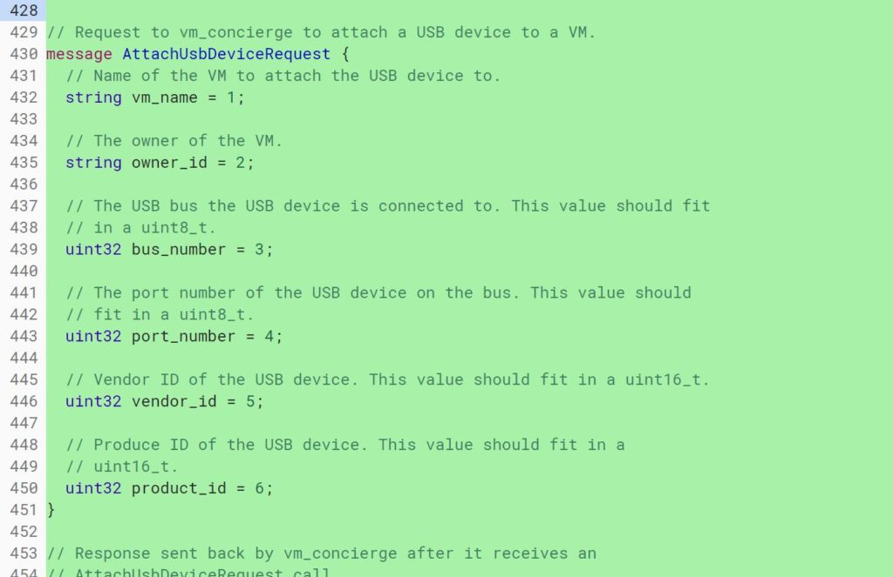
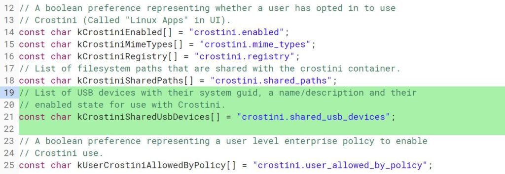

Last month, the [Linux containers in Chrome OS gained access to external storage](https://www.aboutchromebooks.com/news/chrome-os-72-dev-channel-usb-sd-card-support-project-crostini-chromebooks-android-9-pie/), such as microSD cards or USB drives on a Chromebook. That's just the first step though: There are Chrome OS owners who want their devices to have broad access to a range of USB devices from Linux. Think of Android phones for debugging or Arduino boards for coding and monitoring.

I've been watching [these](https://bugs.chromium.org/p/chromium/issues/detail?id=831850#c39) [two](https://bugs.chromium.org/p/chromium/issues/detail?id=899568&desc=3) Chrome OS bugs to help bring this type of USB support for Project Crostini and there's some new, current information: Aside from progress on both of these, one is targeted for the Chrome OS 72 release, offering us an idea of when full USB support will be available in the Stable Channel.

The first bug is labeled "[Enable USB emulation in crosvm](https://bugs.chromium.org/p/chromium/issues/detail?id=831850)"; crosvm is the virtual machine where the Linux container is run on Chrome OS using Crostini. Here's a summary of the additional functions added:

> This CL defines AttachUsbDevice, DetachUsbDevice, and ListUsbDevices dbus methods for vm\_concierge and adds corresponding request and response protobufs.

And although the prototype code is fairly long, here's a portion of the functionality between the USB device and the virtual machine:

If you enjoy reading code and want to see how this service is managed, [here's the full listing](https://chromium-review.googlesource.com/c/chromiumos/platform2/+/1343717/9/system_api/dbus/vm_concierge/service.proto). This code still shows a target of Chrome OS 71, but I think that's out of date and needs an update as [Chrome OS 71 Stable is actually expected any day now](https://www.chromestatus.com/features/schedule). I found that it's also what version shipped with the [Pixel Slate when I reviewed last month](https://www.aboutchromebooks.com/reviews/google-pixel-slate-review/).

The second, related change is dubbed "[UI for Crostini USB Support](https://bugs.chromium.org/p/chromium/issues/detail?id=899568)" and adds user preferences to see if USB support is enabled or not. The flag for this is already available, [having arrived last month in the Dev Channel](https://www.aboutchromebooks.com/news/chrome-os-72-dev-channel-preps-crostini-usb-support-easier-linux-package-installs-and-more/).

The newest code appears to help manage the preference selection but also support the first code change above by tracking the name and description for all USB devices connected to the Linux container.

This change is slated for Chrome OS 73 at the moment so it might not arrive on the Stable Channel for a good three months. I'm going to keep watching it though because that seems a long time out considering some of the dependent changes are already in versions 71 and/or 72 of Chrome OS.

Regardless of the actual landing date, this will add some highly desired functionality to Linux on Chrome OS; particularly for developers, yes, but most everyone could find some benefit with broader USB support in Project Crostini.
