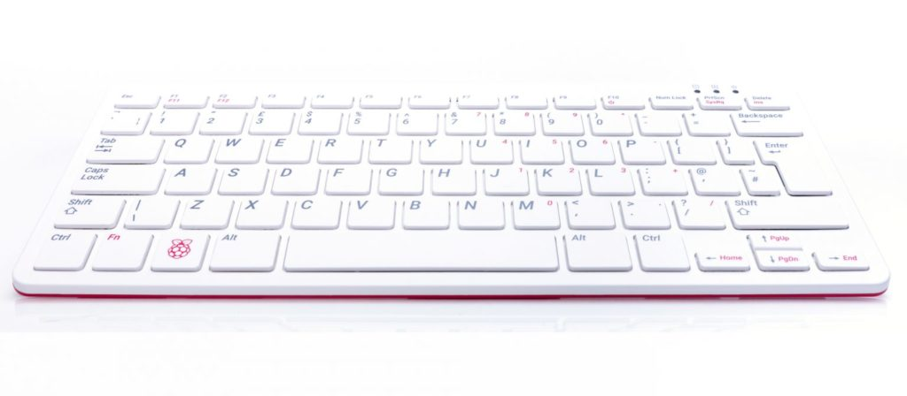
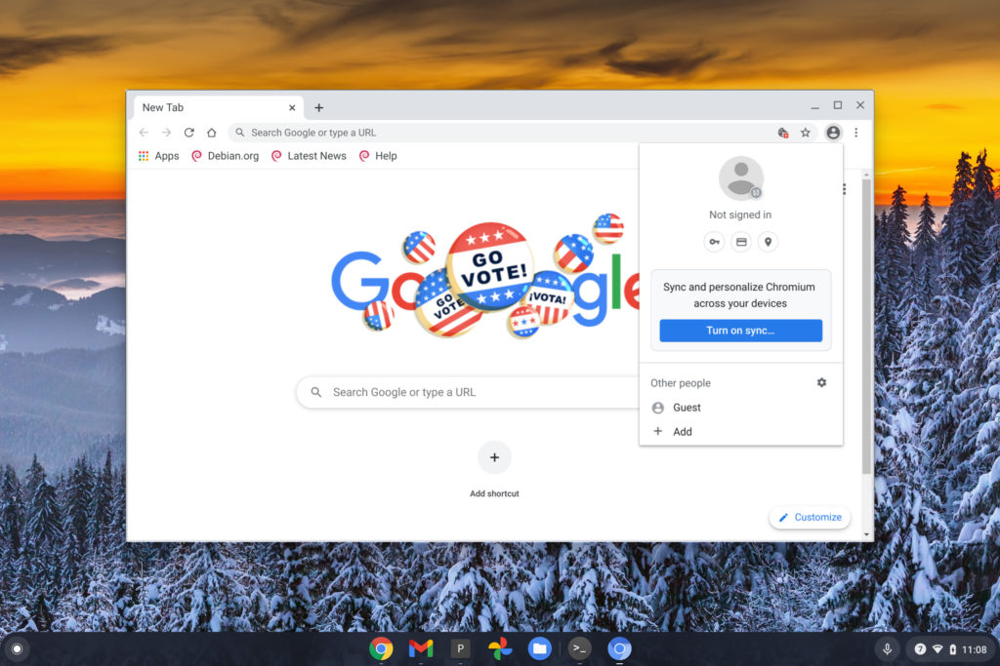

I normally don't write about non-Chromebook devices here. I'm making a rare exception today because the just announced [Raspberry Pi 400 computer starts at just $70](https://www.raspberrypi.org/blog/raspberry-pi-400-the-70-desktop-pc/) and because Chromebook inventory is so low. I've read reports about school districts and parents that can't find a Chromebook for their kid's remote school learning during the COVID-19 situation.

Frankly, the Raspberry Pi 400 could suffice as a low-cost substitute.

First, a quick description of what the Raspberry Pi 400 is.

Essentially, it's an all-in-one computer that runs on a slightly upgraded Raspberry Pi 4 tucked inside the thin keyboard. You simply connect it to a compatible monitor, add a mouse, power it up and you've got a basic computer.

You can also get a $100 bundle that adds a matching mouse, power supply, cables, pre-installed software on a microSD card, and a Beginners Guide book. The $70 model is really for folks who already have the cables and power supply to run a Pi; presumably, someone who owns a Pi.

[Even for $100 with everything you need](https://www.raspberrypi.org/products/raspberry-pi-400/?resellerType=home), minus the monitor, this is far less expensive than any recent Chromebook that you could find in stock right now. And it will be supported and produced through January 2026, so your $100 will be a good investment over time.

https://youtu.be/ZSvHJ97d8n8

So how would you use it similarly to a Chromebook for school?

It's actually not that complicated, even though the Raspberry Pi 400 isn't running Google's Chrome OS. Instead, it runs a custom distribution of Linux. That adds some complexity but most of it can be ignored. For online learning with a Chromebook-like experience, you just need a browser. And while the software on the Pi 400 comes pre-installed with the Mozilla Firefox browser. That will get students to their online classroom documentation whether it's hosted on services by Google, Microsoft or any other company.

However, you _can_ also download and install the [Chromium browser, which is the open-source version that Google adds on to for Chrome and Chrome OS](https://chromium.googlesource.com/chromium/src/+/master/docs/chromium_browser_vs_google_chrome.md). You miss out on a few features, but you gain a big one: Synchronization of Chrome bookmarks, stored passwords, web apps, and other items that make switching between Chromebooks super easy.

I haven't connected to my Raspberry Pi 4 in a while because it's running as a HomeAssistant smart home server. So I'm not sure you can install Chromium through a native app store on the Pi 400. I suspect not.

It's relatively easy to manually download and install Chromium though. You open up the Terminal application on the Pi and then type these two commands, pressing enter after each one to let it do its thing.

1. `sudo apt-get update`
2. `sudo apt-get install chromium --yes`

Once these commands have completed, you should have the Chromium browser on the Raspberry Pi, where you can sign in to Google upon first launch. And as long as you basically ignore all of the other apps, you'll get a Chrome OS-like experience. Note that the Raspberry Pi 400 doesn't have a webcam, so for video classes, you'll need to add one. The Pi 400 has a few USB ports on the back so you can connect cameras or other peripherals.

Would I rather have a Chromebook for learning at home? Sure, I would. In fact, [I use one for my college classes now](https://www.aboutchromebooks.com/news/how-my-chromebook-is-getting-me-through-computer-science-college-classes/).

But I already _had_ that Chromebook. For students who are borrowing a parent's computer or simply don't have a computing device available to them, I'd say the Raspberry Pi 400 would be $100 well spent. No, you won't get the simplicity and security that a Chromebook offers but you will get a low-cost capable computing experience.
