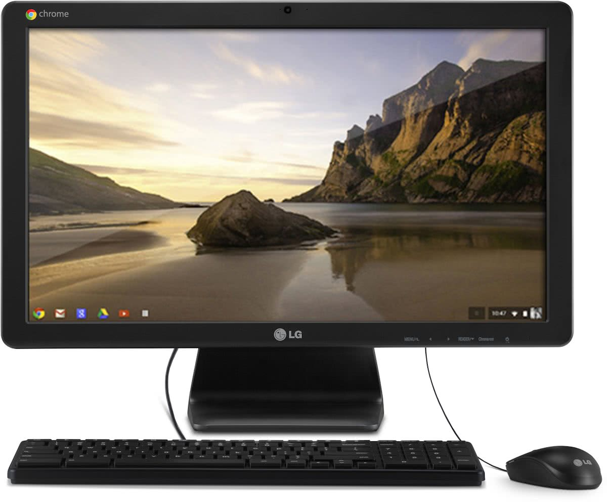

Today in the electronic mailbag is a great question from George and has to do with Chromebase machines. These are all-in-one desktops, complete with a monitor, keyboard and mouse, running Chrome OS.

George says:

> "I currently own two Chromebooks and Chrome OS has been my preferred operating system for some time. Much of my computing activity, however, still takes place on an AIO desktop (iMac) which I would ideally like to replace with a premium 4K UHD 'Pixel' Chromebase from Google or one of the major hardware manufacturers. The sole Chromebase option at the present time is from Acer, whose Chromebase line-up is outdated (still running 5th-generation Celeron processors and FHD displays). A new generation of Chromeboxes has recently breathed new life into the Chrome OS mini desktop form factor but a similar upgrading has not taken place for the AIO Chromebase form factor. I would prefer a Chromebase over a Chromebox because the latter requires the purchase of a stand-alone display which almost universally lack an AIO's integrated webcam and microphone required for video calling/conferencing."

It's a good question because much of the Chrome OS focus is mainly on Chromebooks, followed by Chromeboxes. Part of the reason in general is that people tend to want a computer for "on the go" use: A Chromebook can be used out and about, but also function on the desk. Of course, you can enhance that experience with a high resolution external monitor.

It wouldn't surprise me to see a new Chromebase model or two in the next six to twelve months. But I don't anticipate a slew of options and I definitely don't see the "Pixel" Chromebase that George envisions. Google's hardware division is relatively new and for the past two or three years, the company has been focused on turning profits in business lines _outside_ of its advertising revenue streams. Advertising accounted for [$26B of Google's $31B in revenues in the last reported quarter,](https://abc.xyz/investor/pdf/2018Q1_alphabet_earnings_release.pdf) for example. Simply put: Google can sell far more of it's Chromebook devices than Chromebase models

That doesn't mean the Chromebase is a bad device, nor is there zero demand for it. It's actually ideal for -- and marketed to -- some small & medium sized business as well as enterprise customers to be used as a kiosk or for videoconferencing. I know this for a fact: I authored the articles for Google [introducing the Acer Chromebase](https://blog.google/topics/connected-workspaces/chromebase-meetings-makes-video-conferencing-personal-and-simple/) and the one [announcing the AOPEN Chromebase Mini](https://blog.google/topics/connected-workspaces/chrome-expands-business-opportunities-android-kiosk-apps-and-improved-device-management/). ;)

Regardless of those targeted use cases, the desktop market in general has given ground to laptops for years now. It's simply not a high growth segment. And Google wants to grow its relatively new hardware business with Pixel phones, Pixelbook laptops and Google Home products. That doesn't necessarily mean the Chromebase is going "extinct" but I'm not expecting many new choices in the pipeline.

\[caption id="attachment\_879" align="aligncenter" width="1200"\] The LG Chromebase which appeared in 2014 and then was discontinued.\[/caption\]

Instead of waiting for a product that will likely never arrive, my suggestion would be to consider a high-end Chromebox (you've got new choices from [Acer](https://www.aboutchromebooks.com/news/acer-chromebox-cxi3-landing-page-goes-live-with-competitive-pricing-and-options/), [Asus](https://www.aboutchromebooks.com/news/official-asus-chromebox-3-overview-page-has-a-few-surprising-specs/) and [HP](https://www.aboutchromebooks.com/news/hp-chromebox-g2-available-release-date-cost/) to choose from now) and add a monitor of your choice.

True, you'll also need a webcam and (possibly) speakers since there aren't too many 4K monitors -- or small 4K TVs -- with those built in. You can even mount a Chromebox on the back of some monitors to hide it and you'll get to choose a high-quality web cam instead of settling for the lower resolution ones that are often bundled in with a AIO desktop.

Got a Chrome OS related question? Drop me a note at [kevin@aboutchromebooks.com](mailto:kevin@aboutchromebooks.com) and I'll see if I can get you either an answer, or at the very least, an informed opinion.
