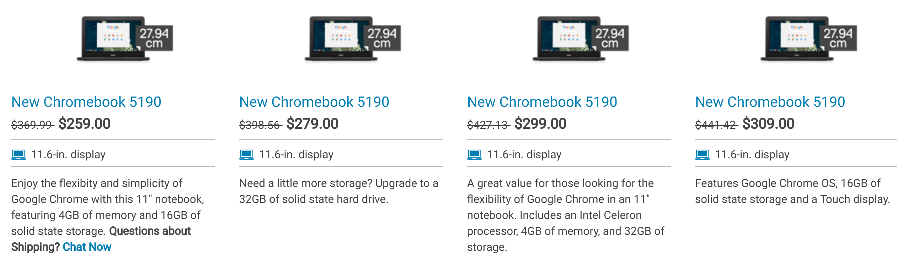
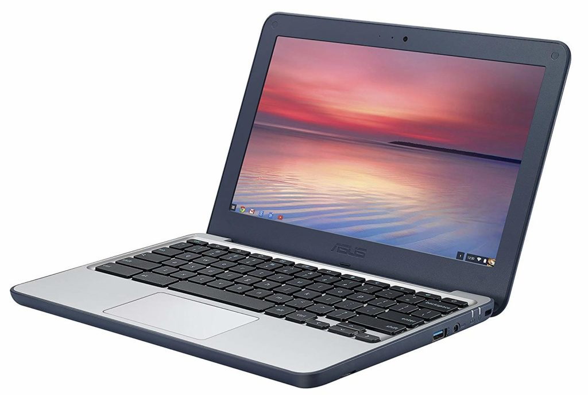

I received a great question from Kent, who's interested in getting a Chromebook for his 10-year old daughter and wants to keep the price at or under $300. There are still plenty of choices in that price range but you're looking at low-powered processors, minimal memory and storage capacities and typically, 720p displays sized at 11.6-inches.

Even so, for online programming activities, a low-cost Chromebook is up to the task. Here are Kent's requirements:

> Looking to get my daughter a Chromebook for Christmas as we've started doing some beginner programming together with things like Hour of Code and I want to keep that momentum going for her. And with the new Family Link controls I "think" we'll be able to look it down to a degree I can feel somewhat comfortable with.
> 
> Looking to spend <$300 but am a little nervous with a 2Gb RAM device. Probably ok for a kids first computer, but ideally would like something that can also do Android Apps for little future capabilities for her.
> 
> Any suggestions or directions to look in?

My recommendation is to consider a Chromebook specifically made for the education market; it should meet all of these requirements and doesn't require a big cost investment. Specifically, I think the [Dell 5190 series of devices would work well here](https://www.dell.com/en-us/work/shop/dell-laptops-and-notebooks/chromebook-5190-for-education/spd/chromebook-11-5190-laptop?view=configurations). Depending on specifications, there are four models ranging in price from $259 to $309; the differences are upgrades to storage, slight processor variances (all are Intel Celerons though), and touch vs non-touch screen displays.

If you don't want a touchscreen, I think the sweet spot is the $279 model, which includes 4GB of memory and 32 GB of storage. Choosing the touch option adds $30 to the cost if that's important; and for Android apps, it might be.

All of these fully support the Google Play Store so you're covered there. In fact, the Dell 11 Chromebook 5190 is even on the list of supported Chromebooks that work with Linux apps, although performance won't likely be fantastic. Even so, that's a future option as the kids outgrow coding in a browser through [Hour of Code](https://hourofcode.com/us) or [Scratch](https://scratch.mit.edu/), for example. A little Python never harmed anyone!

A much less expensive but similar option is the [Asus Chromebook C202SA-YS04 for $189 on Amazon](https://www.amazon.com/gp/product/B01DBGVB7K/ref=as_li_qf_asin_il_tl?ie=UTF8&tag=aboutchromebo-20&creative=9325&linkCode=as2&creativeASIN=B01DBGVB7K&linkId=f84fd4cebaf05bc783ade2bf05ea656a) (_affiliate link_), which is ruggedized to handle wear and tear of everyday life in younger hands.

[It too supports Android apps](https://www.chromium.org/chromium-os/chrome-os-systems-supporting-android-apps) although there is some type of file migration activity that has to first take place. I wouldn't be too concerned about it though. This device has the same 4 GB of memory as most of the Dell choices and uses a similar Celeron chip. At this price, you only get 16 GB of storage; to get the same 32 GB as the $279 Dell, you'll pay $269 for the Asus. The C202 also brings [Linux support through Project Crostini](https://www.aboutchromebooks.com/tag/project-crostini).

In either case, Kent can take advantage of the [new Family Link settings for Chromebooks](https://www.aboutchromebooks.com/news/family-link-chromebook-parental-controls-for-kids-screen-time-limits-site-whitelisting/) to [allow or deny access to the Google Play Store](https://support.google.com/families/answer/7680868?hl=en) in general, or he can allow only certain apps to appear in the store. And individual websites can be whitelisted so that his daughter sticks to browsing the coding sites only if he prefers. With a relatively small investment then, his daughter can learn to code and use a few Android apps without worrying about opening up the entire world wide web to his 10-year-old.
