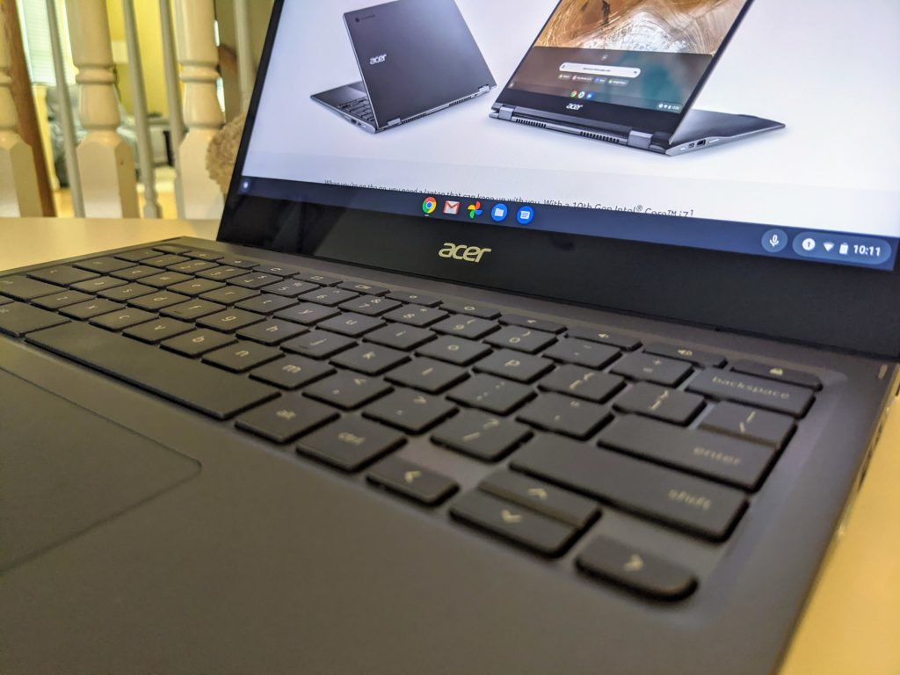

My shortlist of "Chromebook of the year" for 2020 includes the $629 Acer Chromebook Spin 713 and you can [get a certified refurbished one right now for $559.99](https://www.ebay.com/itm/Acer-Chromebook-Spin-713-13-5-Intel-i5-10210U-1-6GHz-8GB-Ram-128GB-SSD-ChromeOS-/264838534587). Acer is selling these through its eBay store but don't let that put you off.

Shipping is free and Acer is providing a full 2-year warranty on what I think is [one of the best high-end Chromebooks you can buy right now](https://www.aboutchromebooks.com/news/acer-chromebook-spin-713-review/).

Here's how I concluded my full review:

> Simply put, the Acer Chromebook Spin 713 is improved in nearly every way from its predecessor, rivaling more expensive, other Project Athena devices from Asus, HP, and Samsung. How Acer does this for $629, I don’t know, but unless you’re a heavy duty developer, you can’t go wrong with this convertible Chromebook.

Unless you have to have an integrated fingerprint sensor, widescreen aspect ratio or a 4K OLED display, I see very few reasons to spend $799 to $999 for the other Project Athena Chromebooks launched this year from Asus, HP or Samsung.

You're getting nearly all of the same internal components as those devices for several hundred dollars less with the Acer Chromebook Spin 713.

In case you need a refresher on the specs of this 2-in-1 convertible:

<table class=""><tbody><tr><td>CPU</td><td>Intel Core i5-10210U Processor</td></tr><tr><td>GPU</td><td>Intel UHD 620 Graphics</td></tr><tr><td>Display</td><td>13.5-inch 3:2 2256 x 1504 touchscreen, USI stylus support</td></tr><tr><td>Memory</td><td>8 GB DDR4</td></tr><tr><td>Storage</td><td>128GB PCIe NVMe SSD, microSD card for expansion</td></tr><tr><td>Connectivity</td><td>Dual-band WiFi6 (802.11ax), Bluetooth 5.0</td></tr><tr><td>Input</td><td>Backlit keyboard, multitouch trackpad, dual microphones, 720p webcam</td></tr><tr><td>Ports</td><td>2 USB Type-C (3.2), 1 USB Type-A, combination microphone / headphone jack, HDMI out</td></tr><tr><td>Battery</td><td>48 WHr, claimed run-time of 10 hours</td></tr><tr><td>Weight</td><td>3.02 pounds</td></tr><tr><td>Software</td><td>Chrome OS automatic update expiration date: June 2028</td></tr></tbody></table>

The [Acer Chromebook Spin 713 easily handled all of my daily tasks during the review period](https://www.aboutchromebooks.com/news/acer-chromebook-spin-713-review/), ranging from heavy-duty web work, a few Android apps, and [coding in Linux for my computer science classes](https://www.aboutchromebooks.com/news/can-you-learn-to-code-in-a-college-computer-science-program-with-a-chromebook/).

During my downtime, I also used it for game streaming via Nvidia's GeForce Now service ([which you can get free for three months](https://www.aboutchromebooks.com/news/free-nvidia-geforce-now-game-streaming-offer-chromebooks/)) and watching plenty of online video content from Netflix and YouTube TV.

There's not much to not like with this Chromebook and getting a certified refurbished one with a 2-year factory warranty just sweetens the deal.
