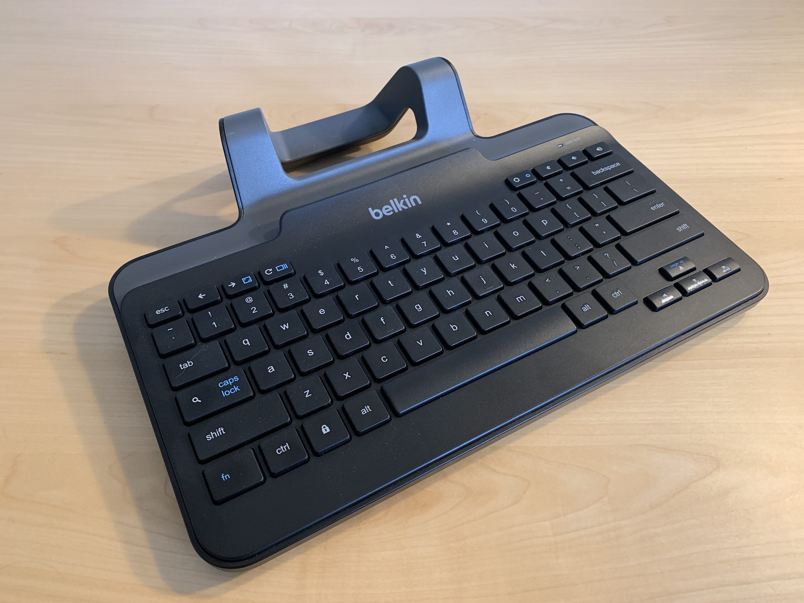
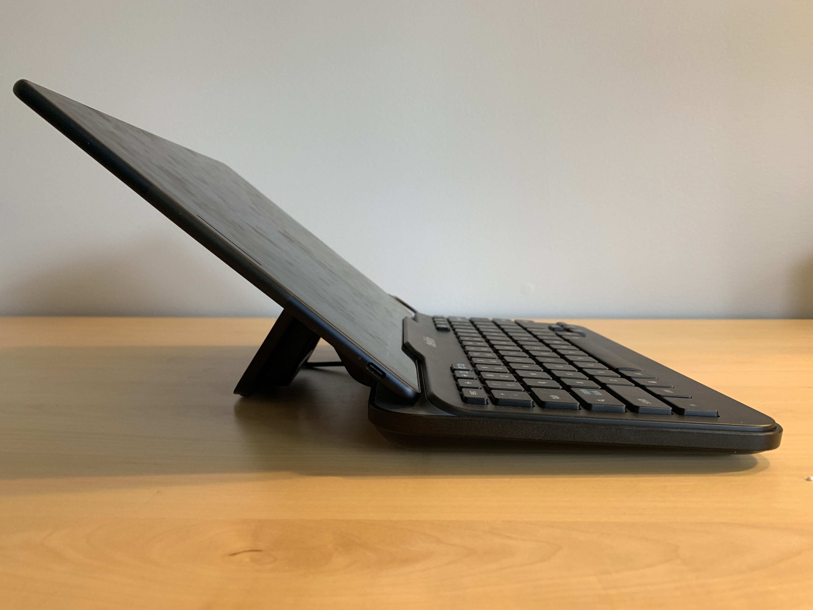
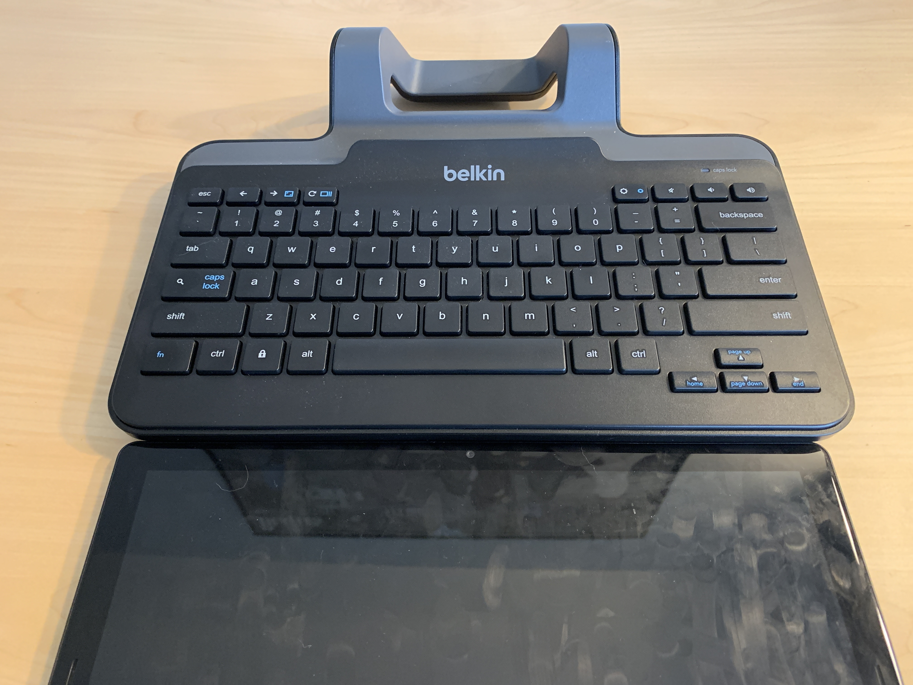
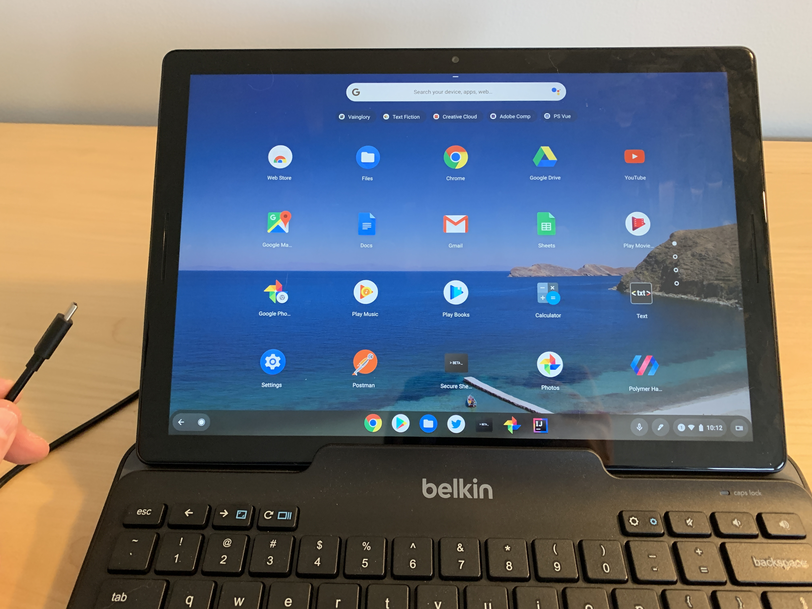

With the Pixel Slate launched and in people's hands, the big debate seems to be which keyboard to get. Do you buy the $199 [Pixel Slate Keyboard with its lapability challenge](https://www.aboutchromebooks.com/reviews/google-pixel-slate-review/) or do you drop less money on the [$](https://www.brydge.com/pages/gtype-keyboard-for-google-pixel-slate)[159 Brydge G-Type keyboard](https://www.belkin.com/us/p/P-B2B191/) that uses Bluetooth and adjustable grips to hold your tablet?

I'm still happy with Google's own keyboard, but for the past week, I've been using a different option than either of the previously mentioned two. I'm typing on a loaner [Belkin Wired Tablet Keyboard with Stand for Chrome OS](https://www.belkin.com/us/p/P-B2B191/), which uses a USB-C connector and costs $49.99.

This keyboard launched months ago as it was really designed for the Acer Chromebook Tab 10, which is much smaller than a Pixel Slate. But I was curious if the integrated stand would work with a larger slate, and sure enough, it does. And it also has some, but not all of the native Chrome OS keys you'd find on a Chromebook.

For example, using either dedicated or combination keys, I can get a fullscreen view, see all of my running apps, reload a browser tab, and adjust both volume and screen brightness on the Pixel Slate. I haven't found, however, a keyboard combo to open the Chrome OS launcher. Again, this keyboard was designed well before the software launcher in Chrome OS arrived in the form we see today. A simple tap of the on-screen launcher button gets around this.

There _are_ a few other challenges to be aware of though. You won't get an adjustable angle for your Pixel Slate display. I'd guess you're looking at around 130-degrees when the tablet is sitting in the keyboard. And there's no trackpad built-in: This is a keyboard accessory only so you'll either need to BYOM (bring your own mouse) or rely on the touchscreen. I actually did the latter when writing this post; it's not ideal yet it works.

I find it actually a great angle when working on my desk because it actually forces me to sit up straight. But that's really the only place you'd want to use this type of keyboard because it's not meant for lap use. I suppose if you have a lap desk or something else flat to put on your legs you could try it, but again; it's meant for a desktop experience.

That experience is pretty good from a typing perspective. It's definitely less like a laptop keyboard and more like a desktop accessory. Meaning: lots more key travel and bounce on the keys. The keyboard's width is slightly more than the Pixel Slate itself in landscape mode and my hands don't feel cramped together when typing.

Of course, Chrome OS now has both a desktop and tablet mode. So after I've done my typing, I just unplug the USB-C cable, which is long enough to fit in either the left or right side of the Pixel Slate, and the tablet mode transition occurs. No muss, no fuss. However, I _haven't_ seen this work the other way around: After using the Pixel Slate in tablet mode, plugging in the keyboard hasn't yet enabled Chrome OS desktop mode.

Shortcomings aside, if you mostly use a Chrome OS tablet as a true tablet and only occasionally as a "desktop mode" device, Belkin's keyboard might be worth the look.

Again, you'll primarily be limited to using it on a flat surface and just have the single viewing angle, but if that works for you, it's a lot less expensive than the keyboard folios and bases currently available. Sure, you could always connect any USB-C or Bluetooth keyboard to your Pixel Slate, provided you have some mechanism to hold the tablet up. That's where this option has a slight edge if you can live with the limitations.
