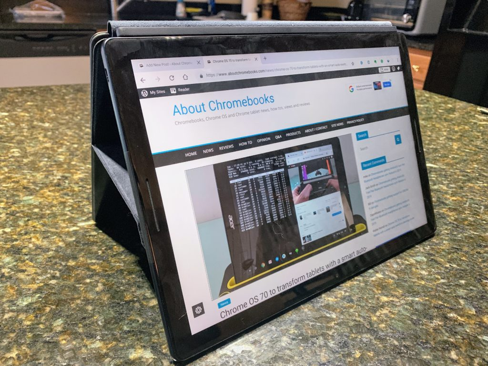
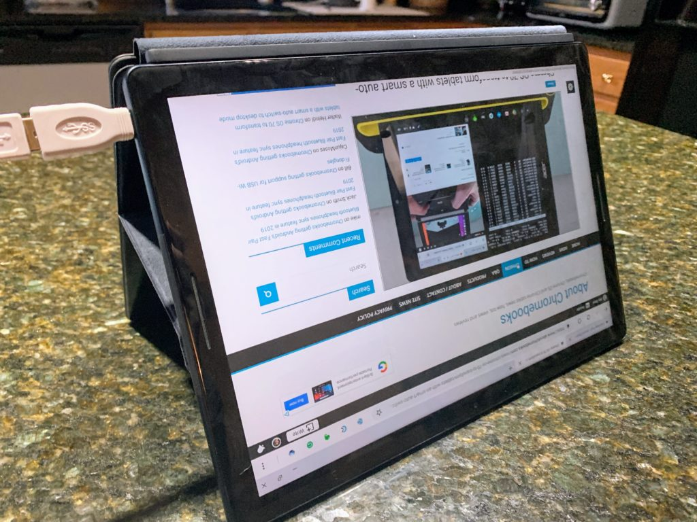

Did you know the Pixel Slate works in tent mode with the Pixel Slate Keyboard? I didn't and it's not really advertised as having a tent mode, but it works. Well, as long as you _don't_ have an external mouse plugged in, it works: If you do, the display actually shows everything upside down.

This [also applies to 2-in-1 Chromebooks as noted by one of our readers with his Asus C302 Chromebook](https://www.aboutchromebooks.com/news/chrome-os-70-to-transform-tablets-with-an-smart-auto-switch-to-desktop-mode/#comment-8866). The problem is related to the [automatic switching between Desktop and Tablet modes that arrived in Chrome OS 70](https://www.aboutchromebooks.com/news/chrome-os-70-to-transform-tablets-with-an-smart-auto-switch-to-desktop-mode/).

Don't sweat it though: There's a fix in the works.

[A bug for "User orientation in clamshell mode"](https://bugs.chromium.org/p/chromium/issues/detail?id=900789) has led to [a code change to address the problem](https://chromium-review.googlesource.com/c/chromium/src/+/1312113):

> Introduce the rotatable clamshell mode if plug an external mouse in tablet mode. The only difference between this new mode and normal clamshell mode is that the screen can be rotated between landscape screen orientations.

The code fix needs some testing at this point but it is planned to be part of the Chrome OS 72 release.

It's possible that it's already available in the Dev or Beta channels for Chrome OS 72, but since my Pixel Slate review unit is on Chrome OS 71 Stable, I haven't tested it on version 72. You can see though, it's definitely an issue in version 71 based on using the Pixel Slate in tent mode both with and without an external mouse.

\[caption id="attachment\_2389" align="aligncenter" width="800"\] Tent mode, no mouse\[/caption\]

\[caption id="attachment\_2391" align="aligncenter" width="800"\] Tent mode, with mouse\[/caption\]

The reason for the issue is how Chrome OS switches between the two relatively new modes. Well, technically, we always had Desktop mode and Chrome OS 70 added the new Tablet mode.

Some of the triggers to switch modes have to do with sensors. The Pixel Slate goes into Tablet mode any time it's not connected to the Pixel Slate Keyboard, for example. Plug in an external mouse or keyboard though, and you're back in Desktop mode where the screen rotation setting disappears from the system tray settings.

Oh and as far as tent mode with the Pixel Slate and Google's own keyboard, you clearly need it on something flat because there's no "base" between the display and the keyboard edge. I'd probably be sure to have a soft surface too; you don't want to scratch up the tablet or the keyboard. Thanks to the strong magnets in the Google Pixel Slate Keyboard, the tablet in tent mode is surprisingly stable.
