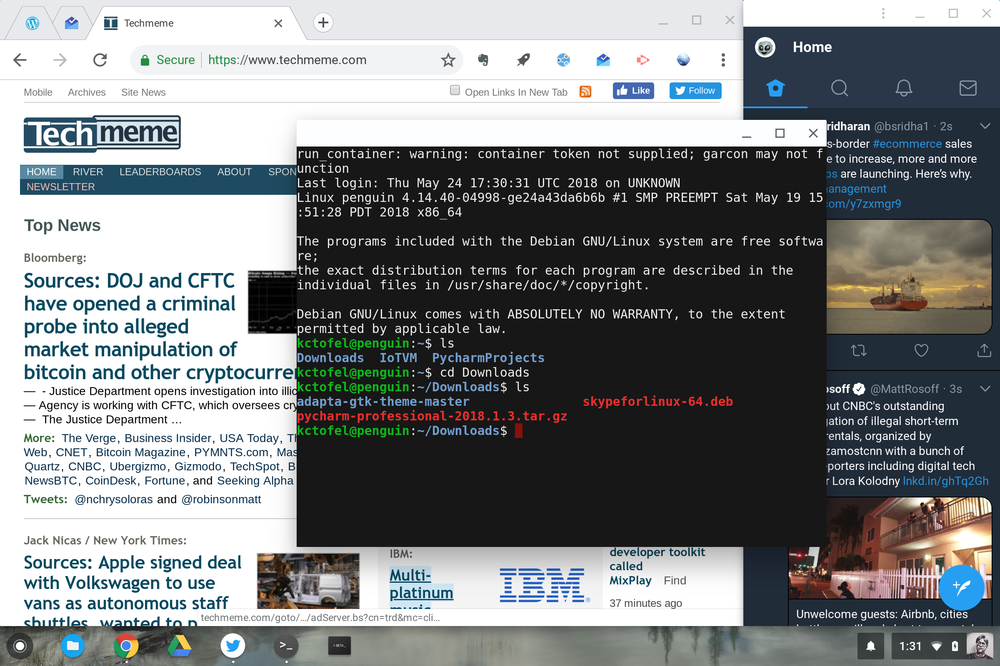
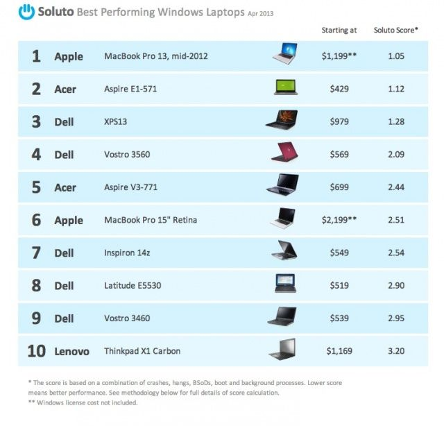

We already knew the Alt-OS feature was coming but now we have full confirmation: Some [Chromebooks will be able to boot into Windows thanks to Project Campfire](https://www.xda-developers.com/chromebooks-chrome-os-windows-10-dual-boot-apple-boot-camp-campfire/) reports XDA Developers. That raises some interesting questions on why Google is doing this and if the idea is a good or bad one.

[This article](https://www.slashgear.com/chromebooks-dual-booting-windows-10-is-a-terrible-idea-14541129/) suggests it's a "terrible idea" going so far to say in the first paragraph that:

> "\[C\]ome October, Chromebooks might be declared dead or at least on their way to becoming pointless. And that will be thanks to an admittedly appealing feature that will be introduced by none other than Google itself."

_**I couldn't disagree more**_, for several reasons.

Right off the bat, I expect this development will boost the number of available Chromebooks with improved hardware, whether that be more storage, more memory or other higher-level components. The storage alone [just to install and to use Windows on a Chromebook is 40 GB](https://chromium-review.googlesource.com/c/chromiumos/platform2/+/1154862/3/debugd/src/campfire_tool.cc#23), so devices with 32 GB of local storage -- something many Chrome OS device owners feel is far too little today -- won't cut it.

Adding a Windows boot option also brings similar benefits to Chrome OS that adding support for Android apps and Linux apps: A broader range of software to choose from. I already think that [Project Crostini for Linux apps](https://www.aboutchromebooks.com/tag/project-crostini) plus Google Play Store support for Android makes Chrome OS the platform with the most software available, but that's just an educated guess. Adding Windows software to the mix surely does this, however.

Getting back to the "Chromebooks might be declared dead or at least on their way to becoming pointless" thought. When Apple introduced Boot Camp to the Mac for dual-booting Windows make the Mac dead or pointless? Nope. If anything, it spurred additional Mac sales from those who prefer a Mac but occasionally want to or have to use Windows apps.

In fact, after Boot Camp arrived, one company declared that [the best computer to run Microsoft Windows on was the MacBook Pro](https://www.cultofmac.com/224841/the-best-laptop-to-run-windows-on-is-a-mac/).

Part of the reason was the Mac's hardware but another part was that using Boot Camp provides a clean install of Windows without any "crapware". And that's exactly what you'll get with Windows on a Chromebook: A clean installation. Indeed, Google has been working on certifying Chromebook hardware for Campfire to ensure there aren't any driver issues. So Windows should run as well as it possibly can on Chrome OS devices.

Frankly, this is all about choice. Google isn't stupid. It knows that while G Suite may work for 80 percent of the population, there's still 20 percent that require certain software features to get specific tasks done. Google has no chance to win over that 20 percent -- many of which are enterprise users where Google has been pushing Chrome OS for a while now -- if it can't provide the tools they need.

And Microsoft is surely going to be happy because if you want to run Windows on a Chromebook, you'll need to purchase a license for it and for any other Microsoft apps you need to use. (If only it would fix [the Excel for Android installation on Chromebooks](https://www.aboutchromebooks.com/opinion/android-microsoft-excel-incompatible-chromebooks-wont-install/), it could have even more revenue!)

Look, if you don't want to run Windows on your Chromebook, that's fine. Google isn't forcing you to any more than it forces you to run Android or Linux apps. That's your choice. Chrome OS will still work just fine, even on a device that's capable of dual-booting into Windows. Frankly, there's nothing but upside here and although I'll likely never use Windows on my Chromebook, it's going to be nice to have the option in any unforeseen circumstances.
