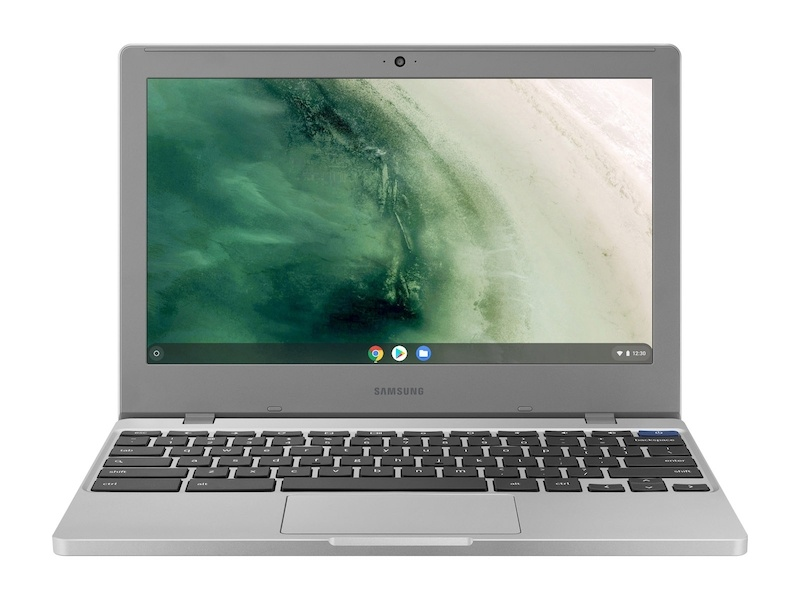

The venerable Samsung Chromebook 3 finally has a replacement. Two replacements actually. We've known for a few weeks that these were coming and today [the Samsung Chromebook 4 and Samsung Chromebook 4+ are official](https://news.samsung.com/us/samsung-chromebook-4-chromebook-4plus-faster-tougher-smarter/), with availability from Best Buy and Samsung.com.

The main differences between the $229.99 and $299.99 models, besides the price, are the size and display resolution. The Samsung Chromebook 4 is an 11.6-inch device with 1366 x 768 resolution and large bezels while the Chromebook 4+ uses a 15.6-inch 1920 x 1080 panel. Both are clamshells and neither has a touch screen.

Samsung Chromebook 4

Here's a rundown of the internals, which again, are mostly shared between the two:

<table class="wp-block-table"><tbody><tr><td>CPU</td><td><a href="https://ark.intel.com/content/www/us/en/ark/products/128988/intel-celeron-n4000-processor-4m-cache-up-to-2-60-ghz.html" target="_blank" rel="noreferrer noopener" aria-label="Intel Celeron Processor N4000 (opens in a new tab)">Intel Celeron Processor N4000</a></td></tr><tr><td>GPU</td><td>Intel UHD Graphics 600</td></tr><tr><td>RAM</td><td>4 GB / 6 GB LPDDR4</td></tr><tr><td>Storage</td><td>32 GB / 64 GB eMMC, microSD card expansion</td></tr><tr><td>Wireless</td><td>Wi-Fi 5 (2x2), Bluetooth</td></tr><tr><td>A/V</td><td>Stereo speakers, 720p webcam integrated microphone</td></tr><tr><td>Ports</td><td>1 USB Type-C (2 on the 4+), 1 USB Type-A, Headphone/microphone combo</td></tr><tr><td>Battery</td><td>39 W/Hr (12.5 hours expected on the 4, 10.5 hours on the 4+)</td></tr><tr><td>Weight</td><td>2.6 pounds / 3.75 pounds</td></tr></tbody></table>

Both devices are designed for ruggedness as well, meeting "eight military-grade standards, measuring resistance to extreme temperature, dust, and other shocks", according to Samsung. The island keyboard isn't backlit, or at least I've seen no mention that it is.

Samsung doesn't really have a high-end Chromebook model to compete in the $600 and up price range, but it has long been a player in the entry-level space. The first commercial Chromebook, for example came from Samsung in 2011.

So the new Chromebook 4 and 4+ definitely meet a need in this segment.

These would be ideal for daily browsing or a secondary computer in most homes, as well as for students, in my opinion. And even though, they're entry level devices, you can boost the configurations a little in the memory and storage department. An extra $50 brings you to 6 GB of memory and doubles the internal storage. Plus, they get Google Assistant integration, something we'll see more of with newer Chromebooks.

Interested? Here's the official product page for the [Samsung Chromebook 4](https://www.samsung.com/us/computing/chromebooks/under-12/chromebook-4-11-6-32gb-storage-4gb-ram-xe310xba-k01us/) and [Samsung Chromebook 4+](https://www.samsung.com/us/computing/chromebooks/15-18/chromebook-4-15-6-32gb-storage-4gb-ram-xe350xba-k01us/).
