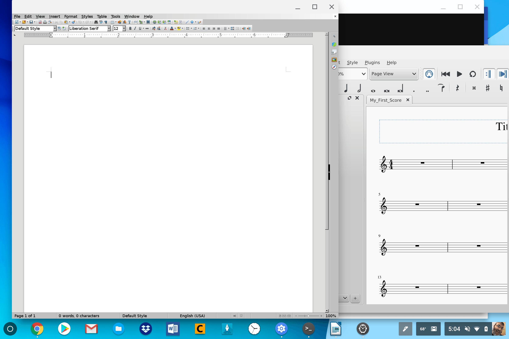
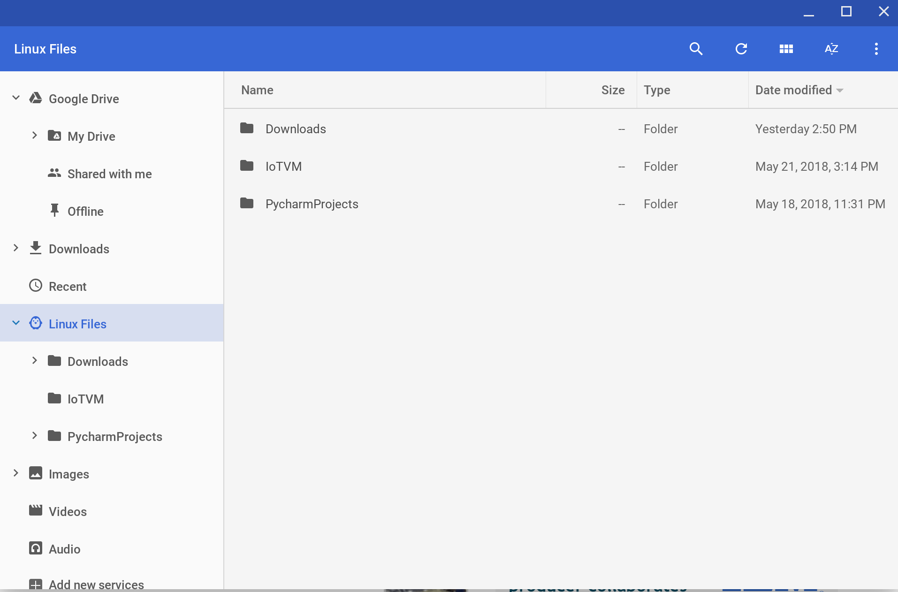

Looks like the Pixelbook isn't the only game in town for running Linux apps, which is great news. Redditor FrMarkFenn posted [screenshots of LibreOffice and MuseScore the ARM-powered Samsung Chromebook Plus](https://www.reddit.com/r/Crostini/comments/8nmyup/chromebook_plus_running_full_gui_linux_apps/). Of course, like the Pixelbook, you'll need to be on the Dev Channel of Chrome OS because version 68 supports Project Crostini: The container-method Google is using to bring Linux apps to Chromebooks.

The steps to get Linux app support on the Samsung Chromebook Plus are basically the same as for the Pixelbook, but if you need a refresher, [another Redditor posted a list for you to follow](https://www.reddit.com/r/Crostini/comments/8o1u2o/chromebook_plus_linux_beta_quick_how_to/).

Note that this brings all of the same Crostini functionality to the Chromebook Plus: You should see your [Linux files mount automatically to the Chrome OS Files app if you have the proper flag enabled](https://www.aboutchromebooks.com/news/project-crostini-linux-files-now-automatically-mount-in-chrome-os-files-app/).

If you opted for the Samsung Chromebook Pro over the Plus, don't fret: [Google is working to backport certain modules](https://www.aboutchromebooks.com/news/theres-hope-that-older-chromebooks-will-run-linux-apps-with-crostini/) to get Linux apps on that device as well as others. You just may have to wait a bit longer for that to happen.
