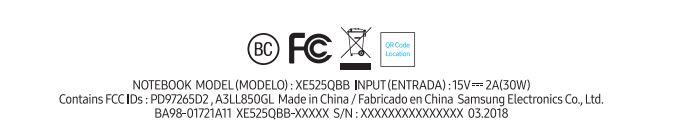
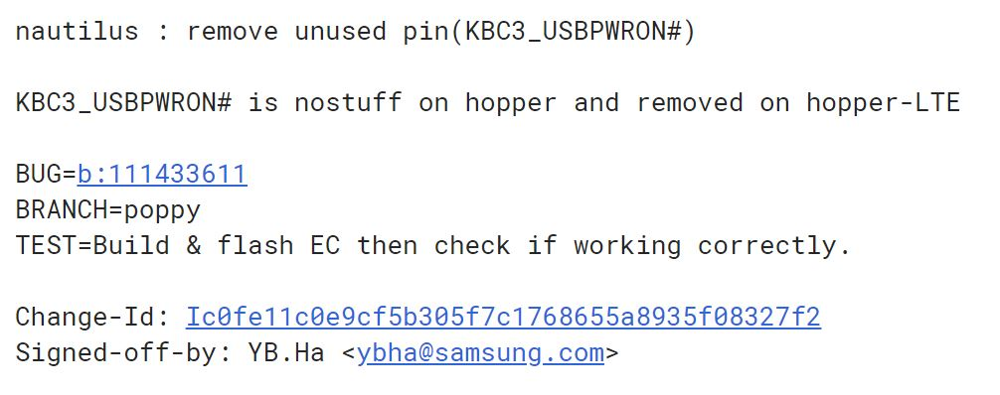

I know [version two of the Samsung Chromebook Plus](https://www.aboutchromebooks.com/news/samsung-chromebook-plus-v2-release-date-price/) just launched a few months ago, but it appears an updated model will break cover soon. [The FCC tested a Samsung Chromebook](https://apps.fcc.gov/oetcf/eas/reports/ViewExhibitReport.cfm?mode=Exhibits&RequestTimeout=500&calledFromFrame=N&application_id=6F9iXyRp2BasDd0YXNZR6g%3D%3D&fcc_id=A3LL850GL) that looks just like the Plus model on the outside and has an LTE module on the inside. Indeed, this is essentially the same model number, [XE525QBBI, that was certified about a month ago by the Wi-Fi Alliance](https://www.aboutchromebooks.com/news/new-samsung-chromebook-xe525qbbi-plus-pro/).

The tested LTE module is from Fibocomm, which is becoming fairly standard in the few Chromebooks with -- or expected to come with -- LTE service. The color is specified as "Mid-Titan", which is also a new color.

I had thought that [Chromebook Pro revision would get LTE](https://www.aboutchromebooks.com/news/samsung-chromebook-pro-v2-lte-core-m3/) but I'm fairly certain this is the Plus model for a few reasons. The most telling one is the Intel Celeron sticker on one of the many device photos; the Chromebook Plus v.2 switched from an ARM processor to the Celeron. You can also see the camera module on the keyboard that was added to the recently upgraded Plus model.

\[gallery type="slideshow" size="full" ids="1844,1845,1847,1846,1841"\]

Additionally, the device schematic calls this device "Hopper". Sure enough, there's [mention of Hopper in the Chrome OS code for Nautilus](https://chromium-review.googlesource.com/c/chromiumos/platform/ec/+/1137806), which is the name of the Samsung Chromebook Plus v.2.

So what might the price premium be for adding LTE to the Chromebook Plus v.2, which is currently priced at $499?

Typically, you can expect $100 to $120 for the privilege of an integrated 4G radio in a laptop or tablet. My hope though, is that Samsung cuts the price of the current Plus v.2 model by $50 or so and starts the LTE model at $549. We should know soon: Passing the FCC certification process usually means a device launch is imminent.
