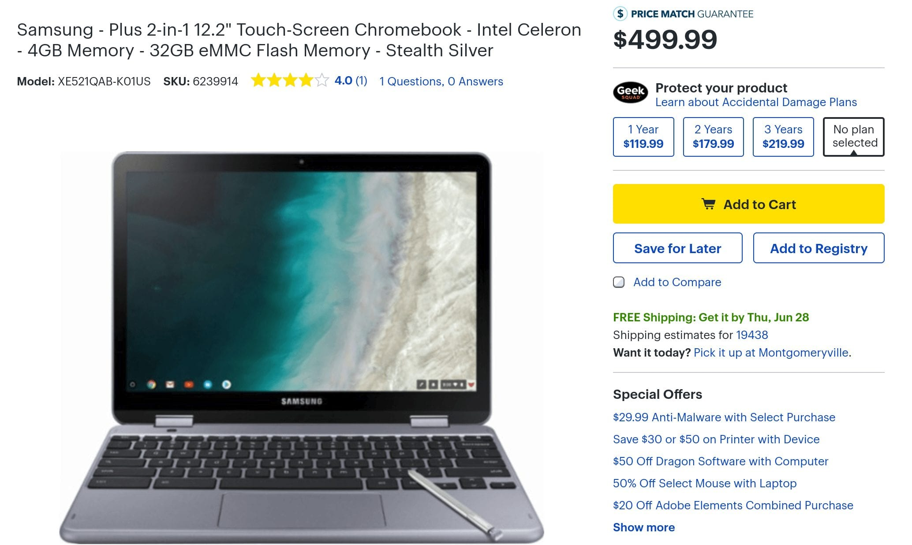

Well that was quick. [Samsung just introduced the Chromebook Plus v2](https://www.aboutchromebooks.com/news/samsung-chromebook-plus-v2-release-date-price/) earlier this month and you can [get one in Best Buy stores](https://www.bestbuy.com/site/samsung-plus-2-in-1-12-2-touch-screen-chromebook-intel-celeron-4gb-memory-32gb-emmc-flash-memory-stealth-silver/6239914.p?skuId=6239914) already. Some locations have the device on display as well -- mine does not -- but inventory in my neck of the woods looks readily available for the [$499.99 Chromebook](https://www.samsung.com/us/computing/chromebooks/12-14/samsung-chromebook-plus-xe521qab-k01us/).

This next-gen model has a few changes, including the removal of an ARM processor in favor of an Intel Celeron 3965 Y chip, plus a reduction in screen resolution, although 1920 x 1080 on a 12.2-inch display is still a sharp screen. That display is also widescreen, not the 3:2 aspect ratio on the original version.

You still get the integrated stylus, 32 GB of local storage, 4 GB of RAM and a front facing camera as well as two USB Type-C ports and microSD card slot. New to version 2 is a 13-megapixel camera just above the keyboard, which becomes a front-facing camera when in tablet mode. The weight does get a boost too unfortunately; this model is 2.93 pounds.

Here's a promo video showing off the new device:

\[embed\]https://youtu.be/Q28YfVKHk9A\[/embed\]

Before you rush out to buy one, keep in mind that [Samsung is working on a Chromebook with integrated LTE](https://www.aboutchromebooks.com/news/samsung-chromebook-pro-v2-lte-core-m3/). It could be a variant of this Chromebook Plus, but I think it's more likely a higher performing upgrade of the Samsung Chromebook Pro.
