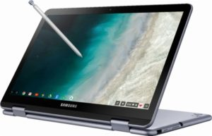

No, you won't be able to buy a [Google Pixel Slate with mobile broadband](https://www.aboutchromebooks.com/news/pixel-slate-fcc-certification-november-release-date-lte-wifi-bluetooth/), but you can get a Samsung Chromebook Plus v2 with an LTE connection. [Announced last month](https://www.aboutchromebooks.com/news/samsung-chromebook-plus-v2-lte-release-date-specs-599-price-verizon/), Samsung says the new model is available now at [Best Buy](https://www.bestbuy.com/site/samsung-plus-2-in-1-12-2-touch-screen-chromebook-intel-celeron-4gb-memory-32gb-emmc-flash-memory-stealth-silver-verizon/6303406.p?skuId=6303406), Verizon and soon [directly through Samsung's own website](https://www.samsung.com/us/computing/chromebooks/12-14/samsung-chromebook-plus-lte-xe525qbb-k01us/).

Expect to pay $599.99 from Samsung or Best Buy without activating that LTE radio. If you decide to go with an activation at Verizon or Best Buy, the Chromebook Plus v2 with LTE will cost $499.99 but you'll also be locked into a service plan for two-years. Strangely, there's no information on any of these retailers sites about the supported LTE bands, other than Verizon saying it works on its networks, of course.

So there's no official word on if the Chromebook is locked to Verizon's network out of the box with support for bands 2, 4, 5 and 13. However, the [Chromebook Plus v2 with LTE was tested for LTE bands](https://www.aboutchromebooks.com/news/samsung-chromebook-plus-lte/) that work with AT&T and T-Mobile as well; possibly for Sprint but I can't recall and for some reason, the FCC page isn't loading for me at time of writing. When that site is back up, I'll update the post with all of the tested bands.

My suspicion is that based on the many tested bands and the fact that Samsung's own product page doesn't mention Verizon, this device could work with any compatible SIM for at least three of the big four U.S. carriers. If I can sneak over to Best Buy I'll ask, although I doubt they'd admit to broader carrier support since they want you to activate the device with Verizon.

Keep in mind though: While you can enjoy the privilege of paying for a nearly always-available web connection, this is a Celeron-powered device with a [downgraded screen from the first edition](https://www.aboutchromebooks.com/news/samsung-chromebook-plus-v2-release-date-price/) and still doesn't have a backlit keyboard. That may be acceptable to some, of course, but don't forget what you're actually getting for $600 here.
