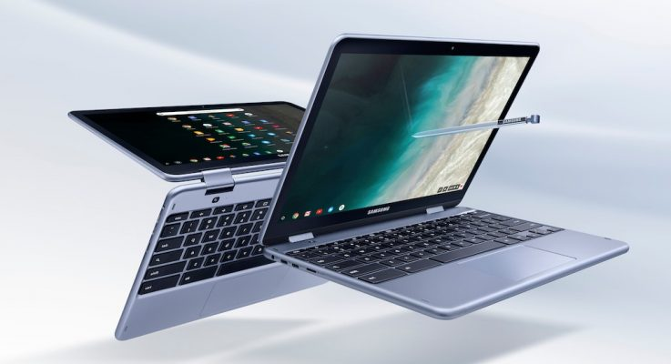

Around 18 months after being introduced, the Samsung Chromebook Plus has a successor. The new model -- simply called [Samsung Chromebook Plus v2](https://news.samsung.com/us/samsung-chromebook-plus-v2-do-more-from-anywhere/) -- arrives at Best Buy on June 24 with a no change in price from the original model. You'll pay $499 for version 2, which loses its ARM processor in favor of an [Intel Celeron 3965Y](https://ark.intel.com/products/122698/Intel-Celeron-Processor-3965Y-2M-Cache-1_50-GHz).

That 1.5 GHz, dual-core chip launched roughly a year ago, so it's not the latest and greatest that Intel has to offer. However, the integrated Intel HD Graphics 615 does support 4K resolution at 60fps. You can take advantage of that with external monitor, since the Samsung Chromebook Plus v2 now uses a 12.2-inch 1920 x 1080 resolution panel with 300 nits. The first edition panel was a 12.3-inch 2400 x 1600 resolution screen with 370 nits of brightness, so the display is a step down.

The 2.93 pound 2-in-1 Chromebook still has a 360-degree screen for tablet use and includes a stylus. That's a jump up in weight as the first model was 2.38 pounds. You'll have 4 GB of memory and 32 GB of local storage along with a microSD card for memory expansion up to 400 GB more. There's a pair of USB Type-C ports like the old version but also includes one standard USB 3.0 port as well. There still a 720p front camera but now Samsung has added a 13 MP sensor on the back. And by "back", I mean just above the keyboard: When you flip the screen over, the camera is on the back of the device.

Both old and new models share the same battery rating of 39 wH, so the battery life should be about the same 8.5 hours or so: The Intel processor has a TDP of 6W, which is essentially the same as [the 6.05W of the OP1 chip](https://www.google.com/url?sa=t&rct=j&q=&esrc=s&source=web&cd=1&cad=rja&uact=8&ved=0ahUKEwjqkMyAxdPbAhWCxFkKHVEiDbUQFggpMAA&url=http%3A%2F%2Fopensource.rock-chips.com%2Fimages%2F6%2F60%2FRockchip_RK3399_Datasheet_V1.6-20170301.pdf&usg=AOvVaw0akLNOYye7hudD0uUCp_dn) used in the original.

So from a chip standpoint, you may get more performance without sacrificing battery life between the first and second versions of the Samsung Chromebook Plus. Then again, you will be carrying a heavier device that has a lower resolution display.
