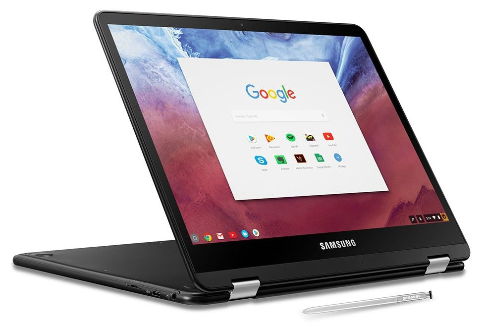

The [Samsung Chromebook Pro](https://www.samsung.com/us/computing/chromebooks/12-14/samsung-chromebook-pro-xe510c24-k01us/) is normally priced at $599 and while you can often find it for less on Amazon, [Best Buy is currently discounting the 2-in-1 Chromebook by $100](https://www.bestbuy.com/site/samsung-pro-2-in-1-12-3-touch-screen-chromebook-intel-core-m3-4gb-memory-64gb-emmc-flash-memory-metallic-black/6111507.p?skuId=6111507). Even better, this is the model with 64 GB of storage, not the base 32 GB configuration that Samsung sells direct.

Best Buy shows this is as a "Student Deal" but I was able to add the Samsung Chromebook Pro to my online shopping cart at the $499 price; no need to include a valid student email address. In fact, they have inventory at my local store, so I could pick one up today at this price. I don't see the discount in Best Buy's current weekly ad so it's possible that the discount continues beyond this week, although I wouldn't wait if you're in the market.

I tested out the ARM-powered Samsung Chromebook Plus last year but not this Pro model, which runs on an Intel Core m3 processor. That's the main difference between the Plus and the Pro other than the black casing on this configuration; the Plus comes in silver.

I like that the 12.3-inch touchscreen display on the Samsung Chromebook Plus has the same 2400x1600 resolution as my Pixelbook. There is a stylus included (although I remember it being a challenge to get out of the Chromebook Plus) and the device does support the Google Play Store, so it works with Android apps. One thing this Chromebook has that isn't on my Pixelbook: a microSD card slot for memory expansion. All in all, it's a compelling package at this price, provided the Core m3 chip paired with 4 GB of memory will meet your needs.
