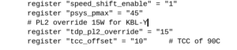

On Friday, XDA-Developers found evidence of [LTE support for an upcoming Samsung Chromebook](https://www.xda-developers.com/samsung-chromebook-plus-v2-lte/). There's no doubt that's accurate as the code commit clearly has multiple LTE functions. But they believe this is likely another Samsung Chromebook Plus variant. I'm thinking not. Here's my rationale.

Samsung just updated the [Chromebook Plus earlier this month with a version two](https://www.aboutchromebooks.com/news/samsung-chromebook-plus-v2-release-date-price/). That model switches from an ARM processor to an Intel Celeron 3965Y and lowers the display resolution to full HD. It really doesn't make sense to me for Samsung to have a third SKU, or configuration, that adds LTE right away. Still, it's _possible_.

Here's another interesting tidbit, though. The current Samsung Chromebook Plus board is code-named Glados, which is Aperture Sciences's AI system in Portal, an amazingly unique and fun video game. Why does that matter? Because the code indicating LTE support is for a board called Nautilus. Now hear me out, because this is a stretch...

I hit up a fun Wiki page that lists the [fictional test one would take to become a test subject at Aperture](http://combineoverwiki.net/wiki/Enrichment_Center_Test_Subject_Application_Process), which is the role you plan in the game. A quick search of all answers for the questions turned up a mention of.... wait for it..... Nautilus, as one of the test answers. Typically, Chrome OS boards follow a fun naming convention around a specific theme. Again, I grant that this is a stretch, but it's a pretty interesting coincidence if nothing else.

Lastly, and perhaps more importantly, XDA also found code pertaining to Nautilus suggesting a processor with [2 cores and 4 threads for Nautilus.](https://chromium-review.googlesource.com/c/chromiumos/overlays/board-overlays/+/1109447) And I see [code indicating a Kaby Lake Y chip](https://review.coreboot.org/#/c/coreboot/+/27147/5/src/mainboard/google/poppy/variants/nautilus/devicetree.cb). But that's definitely not the Celeron 3965Y, which is a Kaby Lake Y variant but only has 2 cores and 2 threads per core.

So why would there be a two models of the Samsung Chromebook Plus with different processors when the Pro is the upscale, "second" model of this device? Note that to get the 2/4 core/thread configuration with Intel, you need [at least the Core m3 7Y30 or slightly faster 7Y32](https://en.wikichip.org/wiki/intel/cores/kaby_lake_y) chip. And guess what chip is inside the current Samsung Chromebook Pro? It's an older Core m3 6Y30, so it surely makes sense than upgraded model will get a newer, similar chip.

I could be wrong, but I'm thinking one of these newer Core m3 chips are the referenced processor for Nautilus and we'll see a Samsung Chromebook Pro v2 with an integrated LTE option by fall.
