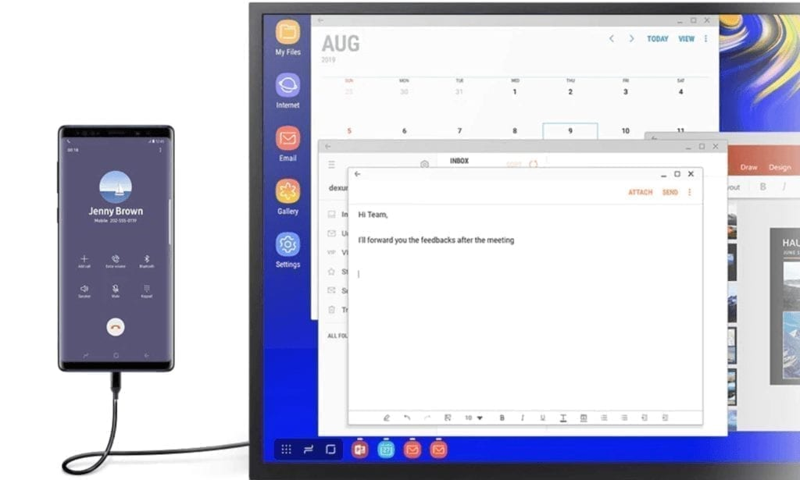

One of the touted features of the Samsung Galaxy Note 10 Plus (as well as other Galaxy S and Note phones since 2017) is Samsung Dex. If you're not familiar with it, DeX stands for "Desktop Experience". Essentially, [when connecting your DeX supported phone to an external monitor, the DeX environment appears](https://www.samsung.com/us/explore/dex/). It's essentially a custom Android desktop experience with resizable windows.

I've been watching DeX improve since its debut as Samsung continues to push the platform forward. This year, the company added [a companion DeX app for macOS and Windows](https://news.samsung.com/global/introducing-galaxy-note10-designed-to-bring-passions-to-life-with-next-level-power), bringing Android apps to these platforms and making it easier to share data between your handset and computer.

So what does this have to do with Chrome, Chrome OS or Chromebooks?

I think Samsung is very close to nailing something I've publicly mused about since doing the old "Chrome Show" podcast from 2013 to 2015: A "Chrome Phone".

Before I go any further, let me clarify that my idea of a Chrome, or Chrome OS Phone, likely isn't similar to yours. I've had dozens of folks tell me they want to see a handset built solely on Chrome OS, along with Android apps in a container, similar to how they run on a Chromebook today.

I'd prefer to see a phone that natively runs Android, just as Android phones do today. However, when connecting the phone to an external monitor, I'd like to see Chrome OS on the display.

Think of it as a dual-boot phone only you don't have to reboot to switch platforms. And since the data files can easily be shared between the platforms - they are today between Chrome OS, Android, and Linux - you'd have all of your local data in your hand on a single device, with cloud storage still available as an option too.

Regardless of what you or I think a Chrome phone should be and do, Samsung's DeX is a pretty darn close experience. I say that after watching this video, which focuses mainly on the standard DeX experience. However, near the end (at the 8:45 mark), you can see how the Linux on DeX Beta runs.

https://youtu.be/zcJmOTAghpM?t=526

This is a full Ubuntu desktop instance, complete with a graphical user interface (GUI). Project Crostini added Debian to Chromebooks, and while it does run GUI apps, the actual interface is a command line. Even so, the concept is similar and you can be very productive with Linux on Chrome OS: [I use it daily for coding](https://www.aboutchromebooks.com/news/how-to-code-on-a-chromebook-crostini-pixel-slate/), for example.

Now I have no knowledge or evidence of Google actually working on a Chrome phone the way I'd envision it. I don't think it's in the cards, to be honest for a few reasons. Android is still the mobile platform of choice for Google while Chrome OS is more of a desktop paradigm. And of course, [the Fuschia microkernel](https://fuchsia.dev/) has been in the works for some time; I expect it will scale up or down for any device size or type.

But I'd still like to see that phone that runs Android in your hand and Chrome OS on a desk. I used to think that processors and other hardware requirements couldn't handle such a thing, but Samsung's DeX is starting to show me that it's a possibility: One device with all of your data and an interface that adjusts to your use case and location.

Some folks who use a Chromebook for basic purposes may actually be able to use a DeX phone as a full replacement. I could not because I need full Linux desktop applications. And to be honest, even with DeX supporting Ubuntu in beta, I'm still leery of trying a DeX-only solution. Linux on ARM processors, such as the one used in the Galaxy S and Note phones, can be a little limiting as compared to running Linux on an x86 chip. Still, I'm impressed with what Samsung is doing with DeX.
