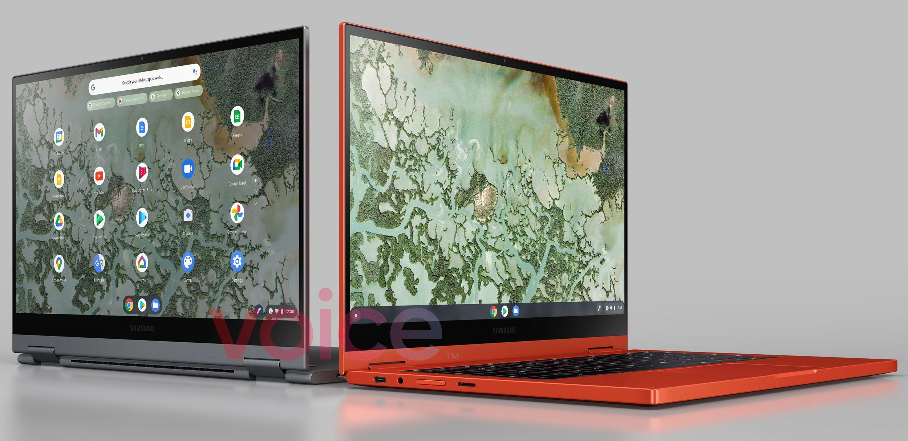
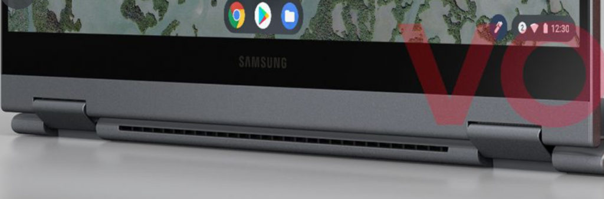

[After being announced almost a year ago](https://www.aboutchromebooks.com/news/samsung-galaxy-chromebook-specifications-release-date-price-ces-2020/), it appears we have an incoming successor to the Samsung Galaxy Chromebook. Based on [a leaked render posted by Evan Blass at Voice.com](https://www.voice.com/post/@evan/samsung-galaxy-chromebook2-first-images-1608577621-196464122), the company is playing it safe with both the design and name: Yes, it's the Samsung Galaxy Chromebook2.

At first glance, it's hard to see much difference between the current convertible and its follow up. Take a closer look though and you'll see some key changes.

## Colors and ports on the Galaxy Chromebook2

First, Samsung is sticking with the same colors for the Galaxy Chromebook2: Mineral Gray and Fiesta Red.

However, the sides are now color-matched, both on the chassis and the displays. I presume Samsung is keeping [the gorgeous 4K OLED display](https://www.aboutchromebooks.com/news/samsung-galaxy-chromebook-hands-on-yes-its-as-nice-as-it-looks/) although I wouldn't be shocked if there were a lower resolution option this year.

Next, it appears the port placements have been moved, likely due to an internal board redesign.

On the original model, the left side of the chassis had the headphone jack, USB port from back to front. These are now switched and the microSD card slot moves from the right to the left side of the device.

Interestingly, there are no left and right speaker grilles on the side of the Galaxy Chromebook2 chassis, leaving us to wonder about speaker placement.

Here's the right side of the current model showing the speaker and garage placement:

We can only see a sliver of the right side chassis, on the new gray model, and there's a small change here too.

The current Galaxy Chromebook has the pen garage at the back of the deck. From the looks of it, Samsung moved the USB-C port in place of the garage. Will there still be a storable pen then? I suspect so as it's a key feature differentiator against competing high-end Chromebooks.

## No keyboard camera but a fan looks likely

It's hard to make out much of the keyboard from the angles but I don't see the "world camera" module that Samsung currently offers on its top-tier Chromebook. I wouldn't be too upset if that's gone, personally.

Obviously, we can't tell what's inside the Galaxy Chromebook2 from a hardware perspective. Samsung could use the same or a similar 10th-generation Intel Core chipset but the more likely scenario is newer 11th-generation silicon.

And I'd bet this newer model isn't fanless like the existing Galaxy Chromebook. It looks to me like there are air vents in the back of the chassis; something that isn't present in the current, fanless edition.

It's impossible to determine if Samsung is addressing one of the largest gaps of its current Galaxy Chromebook with the second edition: battery life. Hopefully, improved efficiency tuning with a redesign lets the Galaxy Chromebook2 run for 8 to 10 hours on a charge.

I expect we'll find out much more in a few weeks at the virtual Consumer Electronics Show 2021, so stay tuned.
