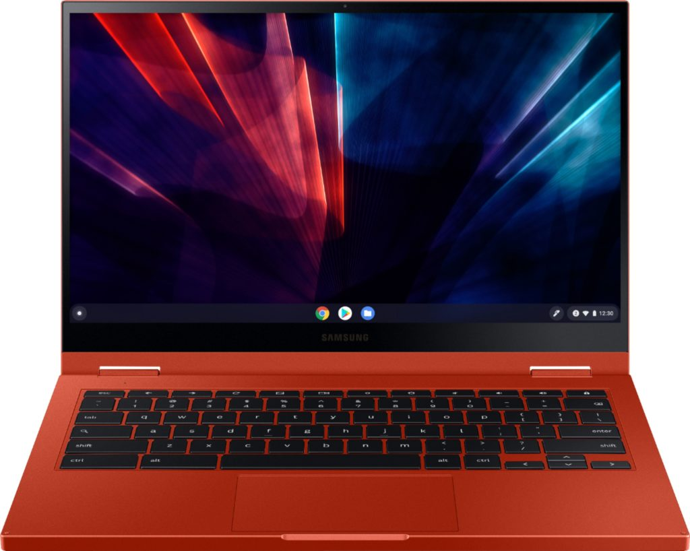
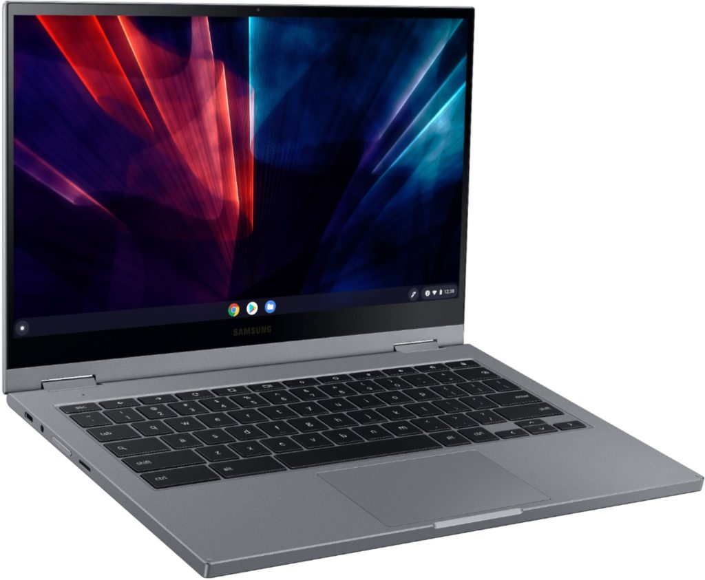
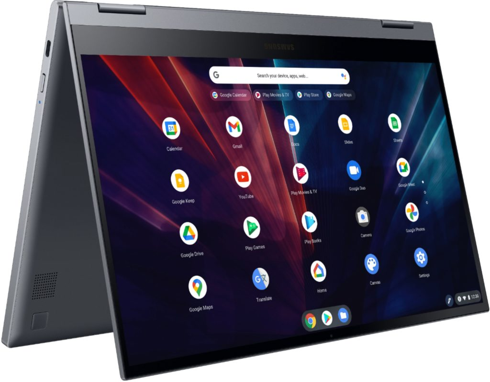

Holding out for the successors to last year's [Samsung Galaxy Chromebook](https://www.aboutchromebooks.com/news/samsung-galaxy-chromebook-hands-on-yes-its-as-nice-as-it-looks/)? The wait is just about over. As of now, you can pre-order and reserve a Samsung Galaxy Chromebook 2 from either [Samsung](https://www.samsung.com/us/computing/chromebooks/galaxy-chromebook2/) or [Best Buy](https://www.bestbuy.com/site/samsung-galaxy-chromebook-2-13-3-qled-touch-screen-intel-core-i3-8gb-memory-128gb-emmc-fiesta-red/6448525.p?skuId=6448525). Doing so will earn you up to $50 in additional purchases for either online destination.

The Samsung Galaxy Chromebook 2 is really [a less expensive iteration of its $999 predecessor](https://www.aboutchromebooks.com/news/ces-2021-samsung-galaxy-chromebook-2-price-release-date-specifications/). So you won't get all of the bells and whistles of the first iteration. Then again, you won't pay as much either.

Available in either Mercury Gray or Fiesta Red, the Galaxy Chromebook 2 can be had with an Intel Celeron and 4 GB of memory for $549, or an Intel Core i3 and 8 GB of memory for $699.

The 13.3-inch panel drops last year's 4K OLED option in favor of a 1080p QLED display. Those, and other internal changes, should help mitigate the mediocre battery life buyers of the 2020 edition experienced.

Here's the full spec list:

<table><tbody><tr><td>CPU</td><td>10th-gen Intel Celeron and Core i3 processors</td></tr><tr><td>GPU</td><td>Intel UHD Graphics</td></tr><tr><td>Display</td><td>13.3-inch QLED 1080p touchscreen, 16:9 aspect ratio, with optional USI stylus support</td></tr><tr><td>Memory</td><td>4 or 8 GB</td></tr><tr><td>Storage</td><td>64 or 128 GB, microSD slot for expansion</td></tr><tr><td>Connectivity</td><td>Wi-Fi 6 (Gig+), 802.11 ax 2x2, Bluetooth 5.0</td></tr><tr><td>Input</td><td>Backlit keyboard, multitouch trackpad, 720p camera</td></tr><tr><td>Ports</td><td>Two USB Type-C, combination microphone/headphone jack</td></tr><tr><td>Battery</td><td>45.5 Whr</td></tr><tr><td>Weight</td><td>2.71 pounds</td></tr><tr><td>Software</td><td>Chrome OS automatic update expiration date: June 2028</td></tr></tbody></table>

As far as the pre-order details and bonus credits are concerned, here's the deal.

Pre-orders through Samsung or Best Buy through the end of February will earn up to $50 on select additional purchases through their respective store.

After the pre-orders end on February 28, Samsung Galaxy Chromebook 2 buyers can simply purchase their device at the same stores. If they do so between March 1 and March 14, they'll get $30 off their next store purchase. So you're not getting discounts on the Chromebook itself in either case. There is the potential for some future savings on accessories or other purchases.

Starting March 15 then, there are no additional bonuses; at least at this time; Samsung or Best Buy could modify or bring back these deals, I suppose.

So, anyone pre-ordering? I'm going to pass, just like I did on the original; the battery life and price stopped me from buying that one. And although the new Galaxy Chromebook 2 retains much of what I liked in its successor, I personally value beefier hardware for the price over nice looks.
