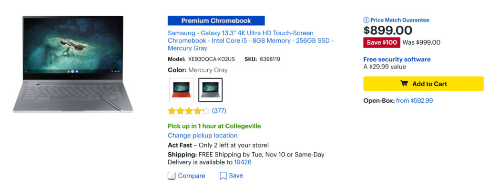
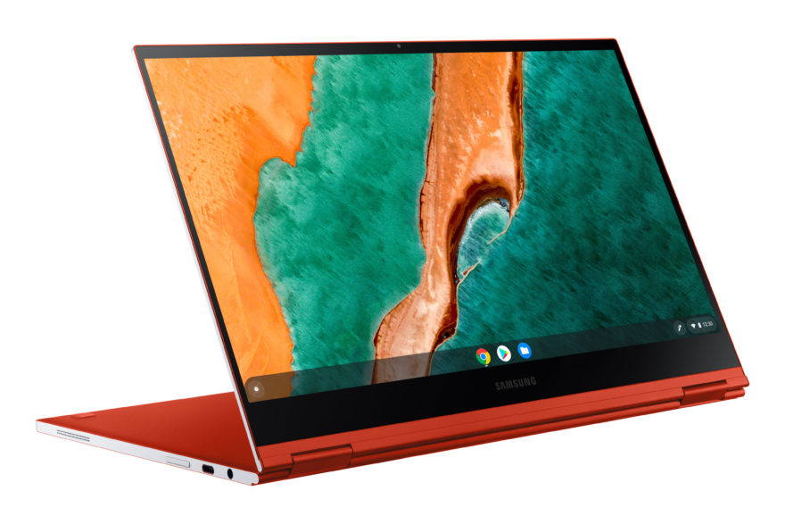

I don't hear too many people talking about the Samsung Galaxy Chromebook these days. Perhaps it's because along with the big price, you get a smaller than normal amount of battery life. Be that as it may, it has many desirable features including a light, thin build, fantastic 4K OLED display, and integrated Samsung stylus. If this is the Chromebook you're looking for, you can find it [discounted by $100 today, bringing the price to $899](https://www.bestbuy.com/site/samsung-galaxy-13-3-4k-ultra-hd-touch-screen-chromebook-intel-core-i5-8gb-memory-256gb-ssd-mercury-gray/6398119.p?skuId=6398119). Just keep in mind that on Black Friday, it will be discounted by $200.

It appears that if you want the fiery Fiesta Red model, you'll have to wait a few days before delivery. However, the more low-key Mineral Gray option is available in some stores for pickup now.

I still think that the [Acer Chromebook Spin 713 is a far better value at $629](https://www.aboutchromebooks.com/news/acer-chromebook-spin-713-review/) but you are giving up a fingerprint sensor, the OLED display, some of that screen resolution, and an integrated stylus. You'll have to decide how you want to spend your money on which better meets your own personal needs, of course.

Buying a Samsung Galaxy Chromebook today does mean that you'll pay $100 more for one than if you held out for Black Friday. The question is: Will there be enough inventory to actually get one at the $799 price? And if not, would a purchase today qualify for a $100 price adjustment in a few weeks. That's a tough call.

Maybe a refresher on the specs will help you decide one way or the other:

<table><tbody><tr><td>CPU</td><td>10th-gen Intel Core processors</td></tr><tr><td>GPU</td><td>Intel UHD Graphics</td></tr><tr><td>Display</td><td>13.3-inch UHD touchscreen, 16:9 aspect ratio, with stylus support</td></tr><tr><td>Memory</td><td>Up to 16 GB DDR3</td></tr><tr><td>Storage</td><td>Up to 1 TB, UFS/microSD slot for expansion</td></tr><tr><td>Connectivity</td><td>Wi-Fi 6 (Gig+), 802.11 ax 2x2 <em>Note: No mention of Bluetooth but I'm sure it's there.</em></td></tr><tr><td>Input</td><td>Backlit keyboard, multitouch trackpad, 1MP camera, 8 MP webcam on keyboard, dual array microphone</td></tr><tr><td>Ports</td><td>Two USB Type-C, combination microphone/headphone jack</td></tr><tr><td>Battery</td><td>49.2 Whr</td></tr><tr><td>Weight</td><td>1.04kg (2.3 pounds)</td></tr><tr><td>Software</td><td>Chrome OS automatic update expiration date: TBD</td></tr></tbody></table>

Let me know if any of you plan to take advantage of either this or the Black Friday sale. I'd also like to hear from any current Samsung Galaxy Chromebook owners: Have you found it to be worth its $999 MSRP and how's the battery life treating you these days?
