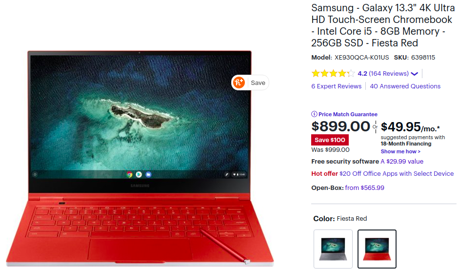
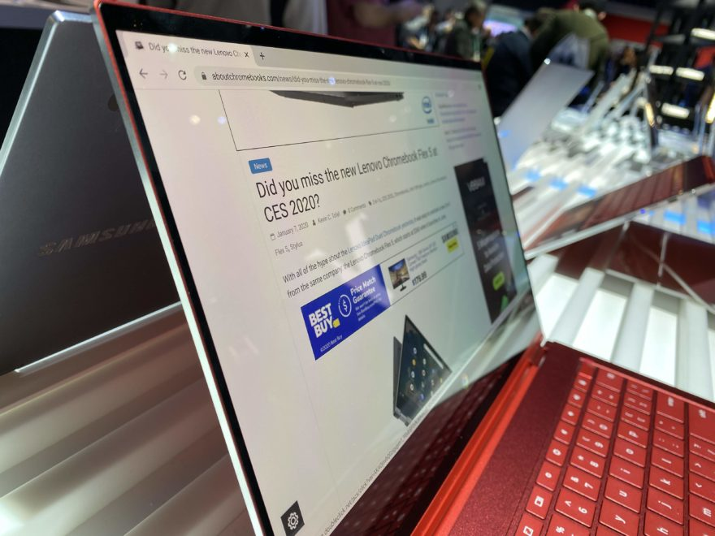

Did the $999 price tag of the Samsung Galaxy Chromebook with 4K display keep you from pulling the trigger on a purchase? Maybe a $100 discount will give you the incentive: [Best Buy has the 10th-generation Intel Core i5 convertible Samsung Galaxy Chromebook priced at $899 on sale](http://d-touch-screen-chromebook-intel-core-i5-8gb-memory-256gb-ssd-fiesta-red/6398115.p?skuId=6398115) in your choice of color.

Click the image to buy the Samsung Galaxy Chromebook

This device is about the highest performing consumer Chromebook you can buy out of the box, which explains the standard $999 price tag.

You could opt for similar specifications and save some money with the $799 [Asus Chromebook Flip C436](https://www.aboutchromebooks.com/news/999-asus-chromebook-flip-c436-now-available-vs-samsung-galaxy-chromebook/), but you're forgoing that gorgeous 4K AMOLED display on the Samsung. And yes, [it really does look good based on my own eyes](https://www.aboutchromebooks.com/news/samsung-galaxy-chromebook-hands-on-yes-its-as-nice-as-it-looks/).

On the downside though, pushing that many pixels takes a toll on the battery life.

[Samsung told me to expect 9 or 10 hours of run time on a single charge](https://www.aboutchromebooks.com/news/samsung-galaxy-chromebook-specifications-release-date-price-ces-2020/) at the January device launch, but [most reviews and user write-ups have fallen well short of those figures](https://www.aboutchromebooks.com/news/samsung-galaxy-chromebook-review-round-up/), which vary by how you use the device. And the fanless cooling system isn't quite as efficient as one with a fan: This Chromebook warms up quickly.

Battery-life and thermal challenges aside, you do get a lot with the Samsung Galaxy Chromebook: The aforementioned Intel Core-i5-10210U processor, 8 GB of memory, 256 GB of SSD local storage, WiFi 6 connectivity, an in-keyboard fingerprint sensor, built-in digital stylus, and a pair of USB-C ports.

Of course, this 9 mm thin device folds 360-degrees for tablet use with or without the stylus. With a 13.3-inch display, this may not be the most comfortable 2-in-1 Chromebook to use in tablet mode, but it's definitely workable for short periods of time. Don't forget, this Chromebook weighs all of 2.29 pounds.

Will a $100 discount sway you to grab a Samsung Galaxy Chromebook in Fiesta Red or Mercury Gray? I'm not in the market for a new Chromebook personally right now. If I was, I'd probably skip this deal.

Not because it's not a good one; any time you can save on a high-end Chromebook or get a nice 4K device at a discount is a win. I'm just too leery of the battery life limitations because I'm often away from an outlet for hours and hours. Perhaps a software update to the Samsung Galaxy Chromebook will address that in the future.
