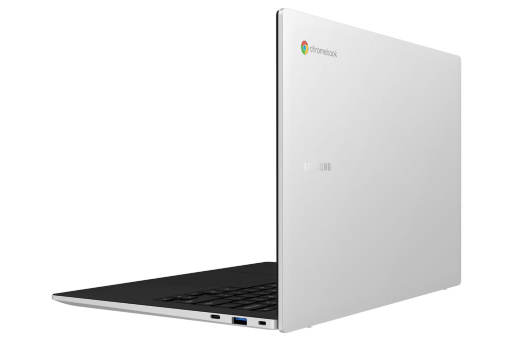

Quietly announced last month, the Samsung Galaxy Chromebook Go is now available direct from Samsung. You can [order the Wi-Fi model now for $299.99](https://www.samsung.com/us/computing/chromebooks/12-14/galaxy-chromebook-go-14---silver--wifi--xe340xda-ka1us/). Samsung tells me an LTE version will arrive in the coming weeks. Additional retailers will carry the 14-inch slim Chromebook as well.

Many thought Samsung would use Qualcomm's Snapdragon 7c chipset in a new Galaxy Chromebook, [like the Acer Chromebook Spin 513](https://www.aboutchromebooks.com/news/hello-acer-chromebook-spin-513-the-first-with-a-qualcomm-snapdragon-7c/). That's not the case.

The [Samsung Galaxy Chromebook Go](https://www.samsung.com/us/computing/chromebooks/12-14/galaxy-chromebook-go-14---silver--wifi--xe340xda-ka1us/#specs) is powered by an [Intel Celeron N4500](https://ark.intel.com/content/www/us/en/ark/products/212326/intel-celeron-processor-n4500-4m-cache-up-to-2-80-ghz.html) processor, 4 GB of onboard DDR4x memory and 32 GB of eMMC storage. You can add additional storage capacity through the microSD card slot, but memory is fixed at 4 GB.

The internals are what you'd expect for the $299.99 price tag.

And although it would be nice if the 14-inch display was 1920 x 1080 resolution, it isn't. This is a 220 nit, 1366 x 768 non-touch panel with a 16:9 aspect ratio. So, not great for outdoor usage and the minimum resolution you'll find on a Chromebook these days.

That said, the convertible design looks nice and you do get a 720p webcam, pair of USB Type-C ports and one Type-A. WiFi 6 and Bluetooth 5.1 are also supported.

Again, a higher resolution display would be nice but for basic web usage, home and school activities, this isn't a bad-looking entry-level Chromebook.

I don't yet know the price of the LTE model, but here in the US, there will be configurations that work on either AT&T or Verizon networks. I'm expecting a good $120 premium for that LTE radio, plus your monthly service.

Adding LTE into an entry-level Chromebook like this doesn't make the most sense to me as the target audience is probably more cost-conscious. Even so, it's great to see [another LTE Chromebook option, which I'll be adding to the list I posted earlier this week](https://www.aboutchromebooks.com/news/want-an-lte-chromebook-here-are-your-current-options/).
