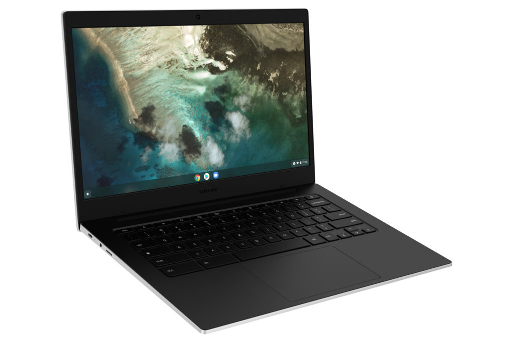

Last month, Samsung introduced a new entry-level Chromebook, promising that an LTE model would soon follow. It turns out, at least in this case with AT&T, the [Samsung Galaxy Chromebook Go](https://www.aboutchromebooks.com/news/samsung-galaxy-chromebook-go-is-now-available-at-299/) has an integrated 5G radio. At least the way AT&T defines 5G. [Android Police](https://www.androidpolice.com/2021/08/05/samsungs-affordable-galaxy-chromebook-go-is-now-available/) flagged the news of AT&T's announcement and you can now [pre-order the Samsung Galaxy Chromebook Go with 5G directly from the U.S. carrier](https://www.att.com/buy/tablets/samsung-galaxy-chromebook-go-32gb-silver.html).

I expected a bigger price hike for the mobile broadband radio. The premium for 5G with LTE failover is only $50 more than the WiFi model at $349.

Of course, that doesn't include a data plan, which you'll need, or at least want, with this 14-inch Chromebook. And for that, AT&T is touting its $20 a month unlimited data plan.

That means a year of always-on connectivity will set you back $240, which is nearly two-thirds the cost of the Samsung Galaxy Chromebook Go.

However, in typical U.S. carrier fashion, [AT&T will cut you a break on the $349 device cost](https://about.att.com/story/2021/samsung_connected_devices.html).

> Get 50% off the Samsung Galaxy Chromebook Go for a limited time when you purchase on a qualifying installment plan with wireless service.

I hit the AT&T pre-order page and could get this Chromebook on a monthly installment plan of $4.86 a month, for 24 months. That's just for the hardware but it makes that $20 monthly fee a little easier to swallow.

If you missed the details of the Samsung Galaxy Chromebook Go, it's essentially a 14-inch Chromebook that has a 180-degree hinge.

You're only getting a 1366 x 768 screen resolution, Intel Celeron N4500, 4 GB of memory, and 32 GB of storage inside. Again, think entry-level pricing for basic online browsing.

Even so, I can now add this to the [very short list of LTE Chromebooks](https://www.aboutchromebooks.com/news/want-an-lte-chromebook-here-are-your-current-options/). Any takers?
