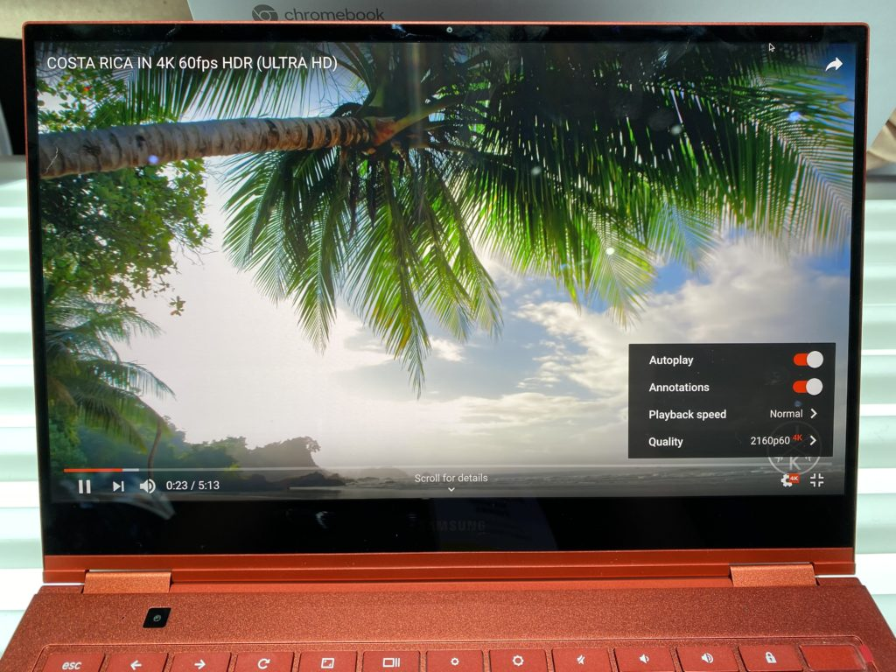

I was able to navigate through the CES 2020 crowds this morning and head over to Samsung's booth. I expected to maybe find a single [Samsung Galaxy Chromebook](https://www.aboutchromebooks.com/news/samsung-galaxy-chromebook-specifications-release-date-price-ces-2020/) but was surprised to see an entire table full of them. And in both colors! After spending some time with the device, I walked away mostly impressed by this $999 device.

Yes it's thin at 9.9mm and yes it's light at 2.3 pounds. You'd think that perhaps the Samsung Galaxy Chromebook could be flimsy or have some twist to it but nope. It's a super solid device and well built. I didn't experience any chassis flex and even the 4K display has good rigitidy. However, that screen does wobble forward and back a bit too much for my taste. Perhaps that can be addressed by a stronger hinge prior to device availability.

About that screen: It's easily the best I've seen on a Chromebook thanks to the AMOLED panel. Blacks are what you'd expect; they're not there.

And the color range combined with the high resolution 3840 x 2160 screen made watching a 4K YouTube video as enjoyable as on my 50-inch 4K TV at home. Perhaps even better since there are so many pixels packed into a smaller screen.

Keep in mind though: With the way Chrome OS handles display scaling, the default pixel-scaled resolution is 1440 x 810.

And if you change the resolution to the native panel resolution you can tell it's 4K. And you can't really use it because everything is so small. At least I can't.

Viewing angles on the display are excellent, so no issues there.

Given that the device is so thin, there's not a lot of room for those keyboard keys to travel. I can work with that while others can't. If you're in the latter camp, you're likely best off trying to type for a while on this device before making the purchase.

The trackpad is quite wide but not very deep, although you can't tell that from the below image due to the camera angle. Even so, I didn't experience any issues while navigating around Chrome OS. This model was running the current Stable Channel of Chrome OS 79, by the way.

Of course, you can use the included stylus, which I almost want to call an S-Pen, for input as well. If you were hoping for some special Samsung app to open on this Chromebook when removing the stylus, don't. It opens up the same standard Chrome OS input options as every other Chromebook with a digital pen. That's to be expected as Google doesn't allow its hardware partners to make software customizations.

Aside from the stylus garage and ports are the dual stereo speakers integrated on the side of the metal chassis. Obviously, it's nearly impossible to do any kind of speaker test on a very crowded show floor but I did my best.

They didn't seem loud to me, even with my ear pressed right next to one, but that could be due to the ambient noise, of course. I didn't hear or feel much bass from them; again, this is something that needs to be tested in a controlled environment.

From a performance standpoint, I logged out of the Samsung test account and logged back in as a guest. At that point, I ran a single Octane 2.0 benchmark just to get a feel for how well the Intel Core i5-10210U clocked at 1.6 GHz fares. The Samsung Galaxy Chromebook turned in a score of 35,649, as shown.

More testing is needed of course, but this gives you an idea of the Chromebook's capabilities. Note too that due to mitigation of the Spectre issues from last year, this Chromebook is only using four of its eight CPU cores:

I wasn't about to change the experimental flag to enable all of the cores since this isn't my device. Having said that, I wouldn't be surprised to see Octane scores approaching or topping 40,000 with all cores enabled on a personal device.

With all of that power, paired with 8 GB of memory and 256 GB of NVMe storage, basic browsing with a few dozen tabs and some Android apps proved to be no problem for the Samsung Galaxy Chromebook in my limited usage window.

I did ask Samsung what the expected battery life is and I was told 9 hours, which surprised me a bit. It's not that 9 hours is _bad_ but claimed battery life is often inflated a little. That's also the price we pay for more power-hungry processors in a Chromebook.

Overall, I'm super impressed by what Samsung has put together for $999. Yes, that's a lot of money for a Chromebook but you're also getting many advanced features, functions and design choices here. There's the 4K UHD AMOLED display, for example, 10th-gen U-Series Intel chips, NVMe storage, and a stylus in a very well designed 2-in-1.

Ironically, when bumping into at least a dozen other tech journalists, not one of them mentioned the price as a potential barrier, even though some have written that in the past about the $999 Pixelbook. The Samsung Galaxy Chromebook really is the talk of the town here at CES 2020.

Even so, there's more "Chromebook" here than most people need unless they want one of the best devices around and have the budget to pay for it.

I have a feeling that depending on the price, more will opt for the [new Asus Chromebook Flip C436](https://www.aboutchromebooks.com/news/asus-chromebook-flip-c436-specifications-release-date-price-ces-2020/), which brings many of the performance aspects along but without the 4K display. Or they'll simply choose a low- to a mid-range device for $250 to $600 and pocket the rest.

Either way, it's nice to have Chromebook choices that run the gamut of budgets and features. And if you have the budget, I can see you being pretty happy with the Samsung Galaxy Chromebook. I'll know for sure when I get one for a full review.

Oh and here's a quick shot of the Mineral Gray color if Fiesta Red is a little too red for you!

