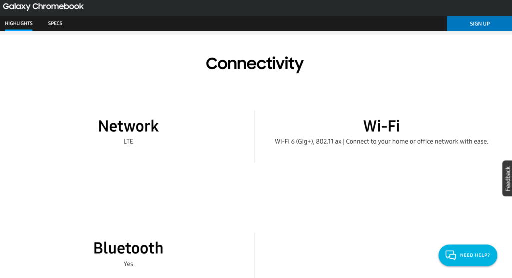
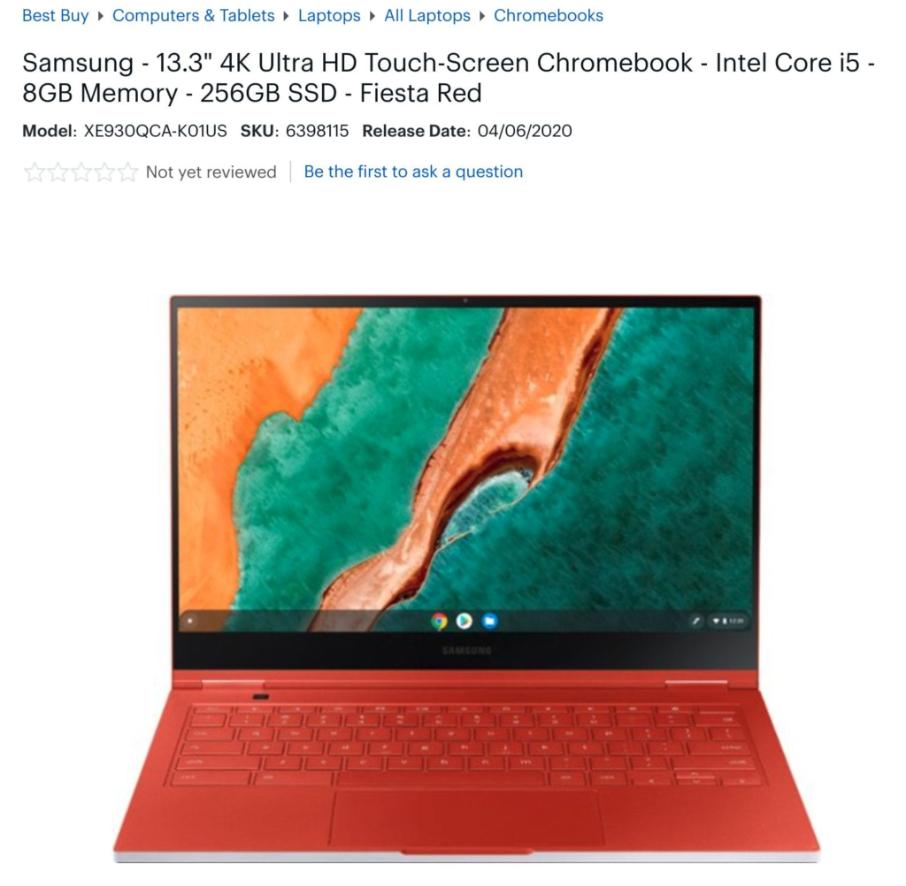

**_(Updated below)_** The [official product page for the Samsung Galaxy Chromebook](https://www.samsung.com/us/computing/chromebooks/galaxy-chromebook/) is online where you can now sign up for email updates. I got a great 30 minutes of [hands-on time with the Galaxy Chromebook](https://www.aboutchromebooks.com/news/samsung-galaxy-chromebook-hands-on-yes-its-as-nice-as-it-looks/) and walked away very impressed. And there isn't really anything on the product page that you and I don't already know about this device.

Or is there?

Oddly, and new to me, is the mention of LTE connectivity for the Samsung Galaxy Chromebook, as spotted by About Chromebooks reader, George.

That's super interesting for a few reasons.

First, [Samsung didn't mention LTE connectivity when debuting the product at CES](https://www.aboutchromebooks.com/news/samsung-galaxy-chromebook-specifications-release-date-price-ces-2020/). Instead, the company noted the inclusion of Wi-Fi 6 and Bluetooth.

Second, there really haven't been many Chromebooks with integrated LTE modems in the past few years. I can count them on one hand. And yet Samsung has been one of the few vendors to include an "always-on" mobile broadband connection. So it wouldn't be out the realm of possibilities for Samsung to do that again.

Third, the [Samsung Galaxy Chromebook listing on Best Buy's site](https://www.bestbuy.com/site/samsung-13-3-4k-ultra-hd-touch-screen-chromebook-intel-core-i5-8gb-memory-256gb-ssd-fiesta-red/6398115.p?skuId=6398115), which has a release date of April 6, by the way, doesn't show LTE in the specifications for the $999 Chromebook.

This makes me wonder if there will be a separate SKU, or product configuration, that Samsung hasn't yet announced, with the inclusion of an LTE radio. And if so, what will the premium be for such connectivity?

We already knew that the $999 configuration was a base model: Samsung said at CES that you could have up to 16 GB of memory and 1 TB of storage as options. I'm thinking that one of those options could include an LTE radio.

I have an email in to Samsung asking about this mysterious mention of LTE and will update this post if/when I hear back.

I do know that the 10-generation Intel Core i5 inside the Galaxy Chromebook doesn't have an integrated LTE radio, so if there is an LTE model, it would have to use a separate chip for the connectivity. And I checked both the FCC database as well as the Chromium code repository for any mention of LTE on this device and came up empty.

**_Update at 4:47pm ET, February 20:_** I've heard back from Samsung and have some bad news for those who were excited by an LTE option for the Galaxy Chromebook. There isn't one. My assumption is that the official product page is in error, as I've been told it will be updated to have the LTE specification removed. Also, although Best Buy has listed a release date for the Galaxy Chromebook, Samsung has not yet provided one as of yet.
