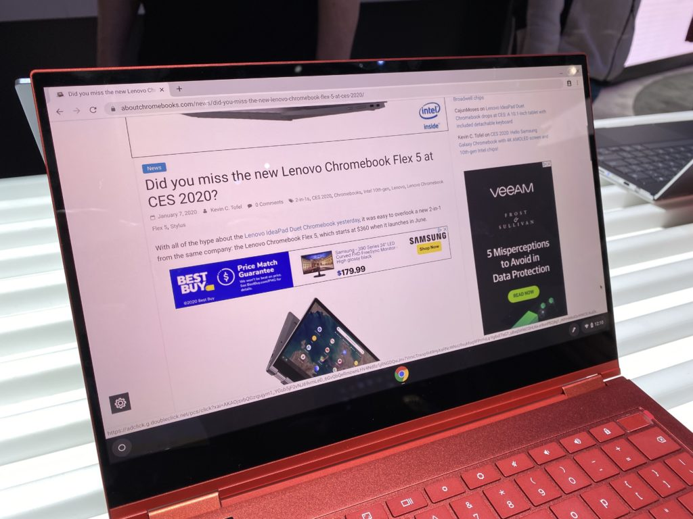

As previously reported, [today is the day you can buy the Samsung Galaxy Chromebook](https://www.aboutchromebooks.com/news/looks-like-the-samsung-galaxy-chromebook-release-date-april-6-after-all/). The only model available is the $999 configuration shown off at CES back in January, with your choice colors: Fiesta Red or Mercury Gray.

You can order the new Chromebook [directly from Samsung](https://www.samsung.com/us/computing/chromebooks/buy/?skipModel=galaxy-chromebook) or [from Best Buy here](https://www.bestbuy.com/site/samsung-galaxy-13-3-4k-ultra-hd-touch-screen-chromebook-intel-core-i5-8gb-memory-256gb-ssd-mercury-gray/6398119.p?skuId=6398119). In my area, there are very few quantities available in Best Buy stores; I'd have to drive an hour to get one. However, you can have your device shipped to you for receipt later this week.

It appears that Samsung seeded review units for large media outlets in advance. I'm waiting to hear when I'll be getting one. Yes, I could purchase one but I'm not going to. I don't need to spend any extra money during the coronavirus pandemic, for starters. And I don't need yet another Chromebook right now, nor do I want to overuse or abuse Best Buy's return policy.

Having said that, I read through the reviews published today and see some expected trends along with one that's disappointing. [The Verge](https://www.theverge.com/2020/4/6/21206151/samsung-galaxy-chromebook-review-android-laptop), [Engadget](https://www.engadget.com/samsung-galaxy-chromebook-review-120003557.html), and [Wired](https://www.wired.com/review/samsung-galaxy-chromebook/) all have full reviews and I recommend reading them before pulling the trigger on a new Samsung Galaxy Chromebook.

All three echoed my sentiments from the [hands-on time I had with the Samsung Galaxy Chromebook](https://www.aboutchromebooks.com/news/samsung-galaxy-chromebook-hands-on-yes-its-as-nice-as-it-looks/) in January: The build quality and the 4K AMOLED display are exceptional. One reviewer also said something I noticed about the device: The vertical space of the trackpad is a little short. Glad to know it wasn't just me.

Chrome OS ran great for all of the reviewers on this model with a Core i5 processor and 8 GB of memory. Twenty or so tabs? Not a problem.

There were some grumblings about Android apps and those are justified. There still isn't a cohesive Android experience across all apps when running on a Chromebook. And having a 4K display can make the issue worse in some cases due to scaling issues. But that's probably not news to anyone who uses Android apps on a Chromebook today.

What is news is the battery life reviewers have seen. I was initially concerned about that due to the 4K display. I asked Samsung at CES what the expected battery life of the Galaxy Chromebook would be and was told 9 hours. I know that most battery life expectations provided by a Chromebook hardware partner are typically higher than real-life usage, so that didn't help my concern.

So how is real-life and test scenario battery life? I'll let the reviewers tell you:

> Samsung claimed eight hours of battery life; I got four hours and 20 minutes on a charge, swapping between several apps and several Chrome tabs at 50 percent brightness. It also doesn’t juice back up particularly fast. After an hour of charging via one of its USB-C ports, the Chromebook’s battery was only at 50 percent.
> 
> Monica Chen - The Verge

> In a test of my basic daily routine, I failed to clear the four-hour mark multiple times. The best I did was three hours and 52 minutes of use before the laptop shut down. When looping an HD movie stored on the laptop’s drive, I got five hours and 11 minutes before the battery died.
> 
> Nathan Ingraham - Engadget

> \[T\]he Galaxy Chromebook managed six and half hours in our standard battery drain test (playing a looped 1080p video at 75 percent brightness). Microsoft's Surface Laptop 3 lasted around 8 hours and the Dell XPS 13 hit 12 hours in similar tests. But if you turn down the brightness—and you can afford to, since the screen is so sharp—you can coax a full day of use out of the battery.
> 
> Scott Gilbertson - Wired

That doesn't instill me with confidence that I could be happy with the Samsung Galaxy Chromebook. For $999, I want at least 8 hours of run-time on the go. I think it's fair to say most of you would too, although I'm sure will just take their charger with them and be OK with that.

Only one reviewer mentioned using Linux on the Galaxy Chromebook and there weren't many details on the experience. That's to be expected from mainstream reviews though. And we know [Linux runs fine on the Pixel Slate](https://www.aboutchromebooks.com/news/how-to-code-on-a-chromebook-crostini-pixel-slate/), which has a similar, but older, processor and the same 8 GB of memory.

So after hearing about the battery life results or reading the early reviews, are you still thinking about buying a Samsung Galaxy Chromebook or will you wait to see how the upcoming Asus Chromebook Flip C436 fares?
