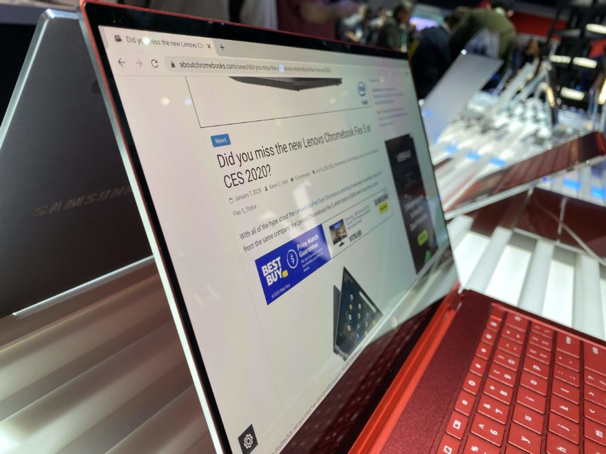

Here's that deal again: [You can get a Samsung Galaxy Chromebook for $799 right now](https://www.bestbuy.com/site/samsung-galaxy-13-3-4k-ultra-hd-touch-screen-chromebook-intel-core-i5-8gb-memory-256gb-ssd-fiesta-red/6398115.p?skuId=6398115). That's a $200 discount, or 20% off, from the typical MSRP price for this Project Athena 2-in-1 Chromebook with 4K OLED display

The Best Buy sale price is for either color: Mineral Gray or Fiesta Red.

[Get the Samsung Galaxy Chromebook](https://www.bestbuy.com/site/samsung-galaxy-13-3-4k-ultra-hd-touch-screen-chromebook-intel-core-i5-8gb-memory-256gb-ssd-fiesta-red/6398115.p?skuId=63981159 "Get the Samsung Galaxy Chromebook")

In case you forgot, the Samsung Galaxy Chromebook comes with a 13.3-inch 4K OLED display, an integrated stylus, fingerprint sensor, 10th-gen Intel Core i5 U-Series processor, 8 GB of RAM and 256 GB of speedy NVMe local storage. But that power comes at a price and I don't just mean to your wallet.

I'm still concerned about the mediocre battery life in the 4.5 to 6 hour range, depending on what activities you're doing. That could be resolved with some firmware upgrades and [software updates such as this one that could bring up to 28% more run time when browsing](https://www.aboutchromebooks.com/news/how-this-one-chrome-os-change-could-boost-chromebook-browsing-battery-life-up-to-28/), but it's still something to consider if you're interested in buying.

But if you're working from home (like so many are right now) and have ample access to power outlet, it might be worth taking a chance on the first Project Athena 2-in-1 Chromebook and the first with that gorgeous OLED panel.

[Get the Samsung Galaxy Chromebook](https://www.bestbuy.com/site/samsung-galaxy-13-3-4k-ultra-hd-touch-screen-chromebook-intel-core-i5-8gb-memory-256gb-ssd-fiesta-red/6398115.p?skuId=63981159 "Get the Samsung Galaxy Chromebook")
