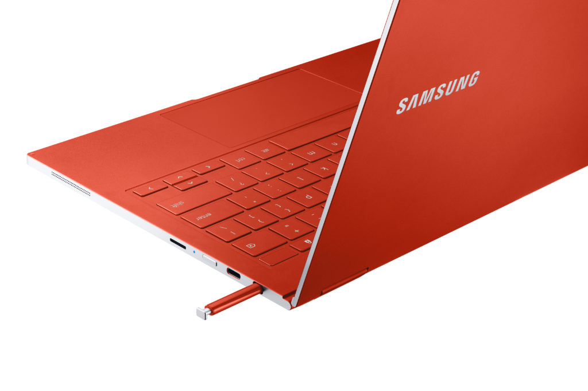
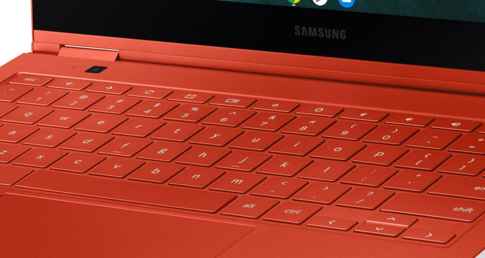
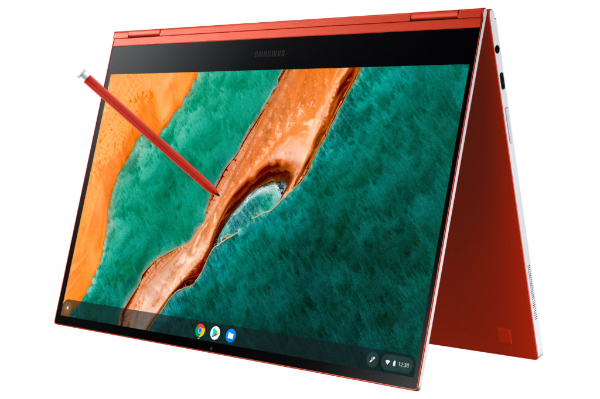
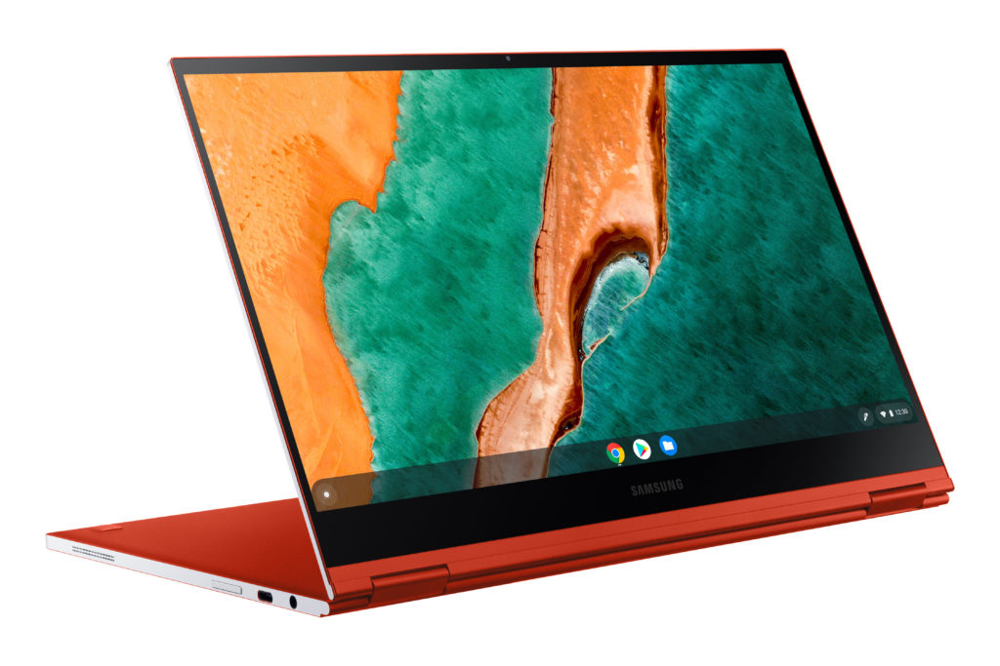

The CES 2020 show floor hasn't opened yet but already we're seeing some innovation: [Say hello to the Samsung Galaxy Chromebook](https://news.samsung.com/us/samsung-galaxy-chromebook-elevate-google-experience/?utm_source=pr_media&utm_medium=email&utm_campaign=ces2020) announced on Monday morning! This is a true flagship 2-in-1 Chromebook, the first with an AMOLED display - and in 4K to boot - that will start at $999 when it becomes available later this quarter in choice of Fiesta Red or Mercury Gray colors

The 13.3-inch AMOLED touchscreen has super slim bezels around the top, left and right sides and supports a resolution of 3840 x 2160 as well as Ambient EQ for brightness.

Samsung hasn't yet shared the brightness figure but says the panel will get a software upgrade after launch to support [HDR400](https://displayhdr.org/) content, indicating that the screen is capable of 400 nits at maximum brightness when viewing supported content.

The aluminum chassis is slim too, making the Samsung Galaxy Chromebook just 9.9 millimeters thick.

That means no room for a full-sized USB port but you do get a pair of USB Type-C interfaces, one on each side. And of course, there's a garage to house the included stylus as well.

Above you can see one of the two 2W speakers tucked away in the side near the front of the chassis and a microSD card slot for storage expansion. Samsung has wasted no space here.

Being a Chromebook, there's the standard Chrome OS keyboard, which is backlit, and multitouch trackpad. Samsung also added a small camera sensor at the top left of the chassis above the keyboard. I'm curious how that will work.

There's no dedicated Google Assistant key - that's generally reserved for Made By Google devices such as the [Pixelbook Go](https://www.aboutchromebooks.com/news/pixelbook-go-review-a-premium-price-validated-by-a-premium-device/) - but the Assistant is built into Chrome OS.

Samsung worked with [Intel's Project Athena specifications](https://www.intel.com/content/www/us/en/products/docs/devices-systems/laptops/laptop-innovation-program.html), announced at [last year's CES](https://www.pcworld.com/article/3331244/intel-project-athena-next-gen-ultrabook.html), to meet that effort's requirements here.

The idea is that certified Project Athena devices will offer instant wake from sleep, a minimum of 9.5 hours battery life with a four-hour recharge in 30 minutes, USB-C charging, and being in a connected state even when in sleep mode.

So it's no surprise that Intel is inside and powering the Samsung Galaxy Chromebook. There will be a range of processor options but they'll all be the newest 10-generation Intel Core choices.

As I understand it, the $999 base model will use an Intel Core i5 processor with Intel's Wi-Fi 6 solution. Given the thinness of the Samsung Galaxy Chromebook, I'm surprised Samsung squeezed a U-Series chip in there since they typically require a fan.

I'll take a closer look at the device and get further details such as expected battery life at Samsung's CES booth once the show floor officially opens up on Tuesday, but in the meantime, here's a rundown on the specifications:

<table class=""><tbody><tr><td>CPU</td><td>10th-gen Intel Core processors</td></tr><tr><td>GPU</td><td>Intel UHD Graphics</td></tr><tr><td>Display</td><td>13.3-inch UHD touchscreen, 16:9 aspect ratio, with stylus support</td></tr><tr><td>Memory</td><td>Up to 16 GB DDR3</td></tr><tr><td>Storage</td><td>Up to 1 TB, UFS/microSD slot for expansion</td></tr><tr><td>Connectivity</td><td>Wi-Fi 6 (Gig+), 802.11 ax 2x2 <em>Note: No mention of Bluetooth but I'm sure it's there.</em></td></tr><tr><td>Input</td><td>Backlit keyboard, multitouch trackpad, 1MP camera, 8 MP webcam on keyboard, dual array microphone</td></tr><tr><td>Ports</td><td>Two USB Type-C, combination microphone/headphone jack</td></tr><tr><td>Battery</td><td>49.2 Whr</td></tr><tr><td>Weight</td><td>1.04kg (2.3 pounds)</td></tr><tr><td>Software</td><td>Chrome OS automatic update expiration date: TBD</td></tr></tbody></table>

Depending on the detailed configuration and option pricing, this is clearly Samsung's push for Chromebooks in the business and power-user markets.

I'm not sure why it's taken so long for the company to push the envelope with high-end processors and an AMOLED display, but I'm excited to see this new device. More to follow when I get some hands-on time!
