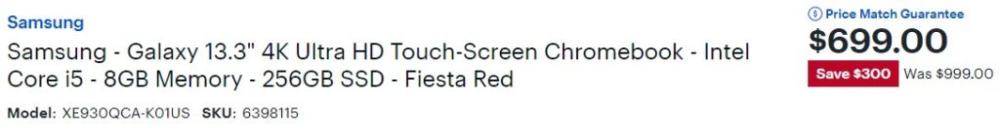
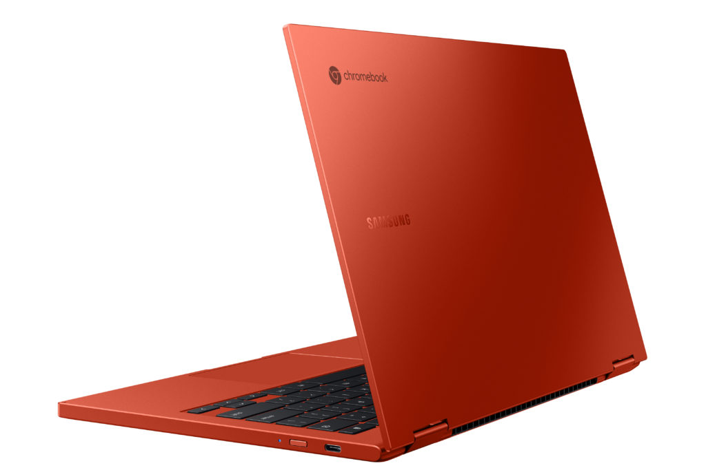

I noted earlier this week that [pre-orders of the Samsung Galaxy Chromebook 2 have begun](https://www.aboutchromebooks.com/news/samsung-galaxy-chromebook-2-pre-orders-begin-with-bonus-store-credits-from-best-buy-and-samsung/ "Samsung Galaxy Chromebook 2 pre-orders begin with bonus store credits from Best Buy and Samsung"). If you want the top-end model, it will cost you $699. For the same [$699 you can actually get the original Samsung Galaxy Chromebook](https://www.bestbuy.com/site/samsung-galaxy-13-3-4k-ultra-hd-touch-screen-chromebook-intel-core-i5-8gb-memory-256gb-ssd-fiesta-red/6398115.p?skuId=6398115) with 4K OLED display and better internals.

There are two key points to note here.

First, the 2021 version (aka: Samsung Galaxy Chromebook 2) is likely to have one key benefit over its predecessor: Longer battery life.

Everything else is either the same or a downgrade. I'm not suggesting it's a _bad_ device. Heck, I haven't even used it yet as I'm waiting on a review unit. I'm simply pointing out there only one expected benefit from choosing this year's model and it seems a little overpriced compared to other Chromebooks in its class.

The second is that you're not going to get any type of extension on Chrome OS updates if you choose the newer Samsung Galaxy Chromebook 2 over the original.

They both use 10th-generation Intel chips. Since Google starts the automatic software update expiration (AUE) clock when a Chromebooks with a new chipset is launched, both Chromebooks have the same AUE date of Jun 2028.

Aside from the meager battery life of the Galaxy Chromebook, everything else is better about it. And with the current discount at Best Buy, it's the same price as the new model.

You get the 4K OLED display instead of a 1080p QLED panel. A stylus is included as is a fingerprint reader. The convertible is thinner and runs on a Core i5 instead of a Core i3. Both models have 8 GB of memory but the 2020 model has double the internal storage with 256 GB of capacity. And that storage is the faster NVMe type, not eMMC.

All that's to say if you were considering the new $699 configuration of the Samsung Galaxy Chromebook 2, you may want to reconsider.

If it were me, I'd be looking at how often I'll be using the device away from an outlet. Since I work from home, I could deal with the 5 or so hours of run-time on the original model. My stance would change, of course, if I wasn't home all the time.

You may want to look at the same aspect in your own personal case to decide between the two.
