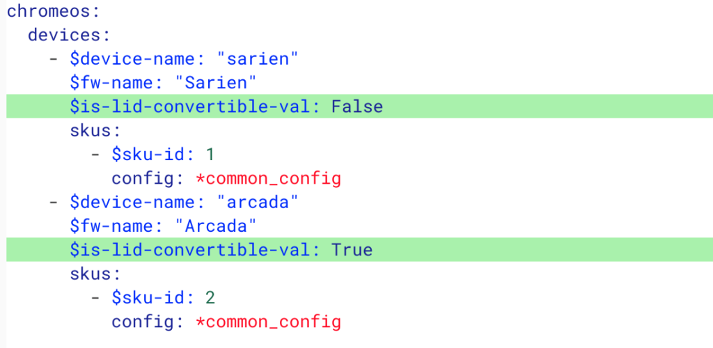
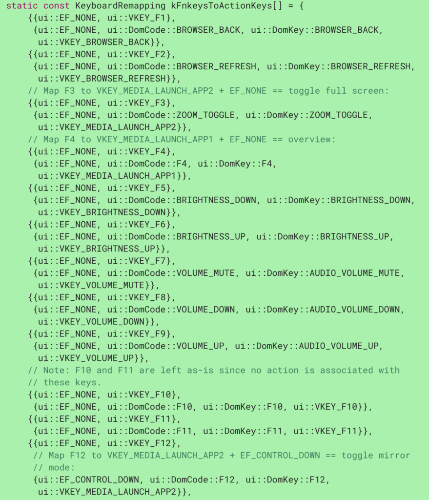

Back in February, [new Chromebook devices dubbed "Sarien" and "Arcada" appeared in the Chromium commit logs](https://www.aboutchromebooks.com/news/lte-chromebook-sarien-arcada/), but the information left me with more questions than answers about these devices. Today there are more answers.

Some thought that Sarien and Arcada might reference a single device, with one name representing a board family and one representing an actual device, but it appears that these are indeed two separate devices or at least families of devices. I determined that from a code commit made on April 3, which [sets the convertible property of Arcada from False to True](https://chromium-review.googlesource.com/c/chromiumos/overlays/board-overlays/+/1549337/3/overlay-sarien/chromeos-base/chromeos-config-bsp-sarien/files/model.yaml), while the same property for Sarien is staying at False:

That indicates two related but unique devices, with Sarien expected to be a standard clamshell Chromebook while Arcada will be a 2-in-1 Chromebook with display that can fold over completely behind the keyboard.

Speaking of keyboards, Chrome Unboxed noted in early March that [Sarien and Arcada would have a new keyboard layout](https://chromeunboxed.com/new-chromebooks-sarien-arcada-unique-keyboard/) but no details were available at that time.

Earlier today, a new commit is calling this "Keyboard layout 3" and explains some of the key remappings from existing standard Chrome OS keyboards:

> Add mapping from function -> action key and action -> function key depending on state of search key and force\[sic\]-function-key preference for new keyboard layout 3.

From what I can see so far, this new keyboard layout will have the option to use the top row of keys as dedicated Function keys, as in F1, F2, etc... which are particularly useful when running Windows or Linux.

I'm not certain the rest of this code is fully fleshed out yet, but here's what is there so far in terms of key mappings and modifier keys:

It doesn't appear that the hardware keys themselves will be much different as I read through this first swipe of code. However, it appears there will some type of modifier key - likely [the current CTRL key, which is missing from the Chrome OS software keyboard unless you do this](https://www.aboutchromebooks.com/how-to/how-to-add-ctrl-alt-keys-to-the-software-keyboard-chromebook-chrome-tablet-pixel-slate/) - that will enable the top key row to act as traditional Function keys.

The one _potential_ key movement appears to be the play/pause, or media-launch key, which is currently between the Brightness Up and Mute buttons on the most recent Chromebook keyboards. That appears to be moving to the right end of the top row and will enable mirror mode to an external monitor when pressed in combination with the CTRL key.

Does the use of traditional Function keys mean that Sarien and Arcada might become [part of Project Campfire](https://www.aboutchromebooks.com/news/project-campfire-alt-os-dual-boot-windows-10-chromebooks-linux/), which aims to bring Windows in a dual-boot mode to Chromebooks? It's possible but even if that doesn't happen, Linux on Chromebook users will certainly appreciate these new key mappings.
