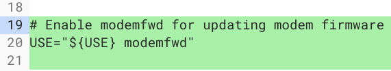
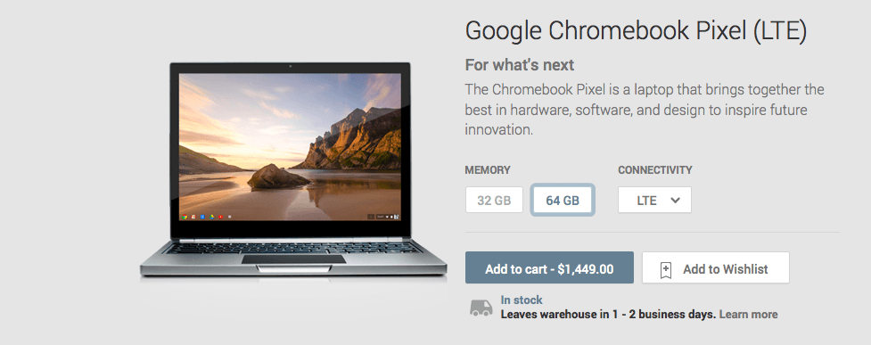

Back in February, I noted that the [Sarien and Arcada Chromebooks would likely support some time of Wireless WAN connectivity such as 4G LTE](https://www.aboutchromebooks.com/news/lte-chromebook-sarien-arcada/). A new code commit confirms my suspicion as the device family [just gained the ability for modem firmware updates](https://chromium-review.googlesource.com/c/chromiumos/overlays/board-overlays/+/1597217/1/overlay-sarien/profiles/base/make.defaults).

This code isn't super exciting on the face of things, but from an end result standpoint, many Chromebook enthusiasts will be happy.

There's been a relative dearth of Chromebooks with integrated LTE connectivity as so few devices have had the feature. I used it with my 2015 Chromebook Pixel and enjoyed the ability to work from nearly anywhere, such as out in a park setting when I didn't feel like sitting in a coffee shop.

No other Google Chromebooks since then have included an LTE radio and it's only recently that Samsung brought the feature back with its [Samsung Chromebook Plus v2 last year](https://www.aboutchromebooks.com/news/samsung-chromebook-plus-v2-lte-release-date-specs-599-price-verizon/).

Of course, you can always use a phone or tablet as a hotspot if your provider allows it so that your Chromebook is "always connected" but for road warriors, integrated LTE is a huge productivity booster. The [Chrome OS Instant Tethering feature](https://www.aboutchromebooks.com/news/google-expands-instant-tethering-connection-to-15-chromebooks-and-30-android-phone-models/) makes this connectivity quite seamless as well.

Not much else is known about Sarien and Arcada at this point, other than the [former is likely a clamshell while the latter will be a 2-in-1](https://www.aboutchromebooks.com/news/sarien-arcada-chromebooks-clamshell-convertible-new-keyboard-layout-function-keys/) and are expected to use Intel's Whiskey Lake CPUs. Both will have a remapped hardware keyboard that appears to bring traditional Function keys to Chrome OS and Linux. Perhaps we'll see these debut before the end of 2019, given the current progress.
