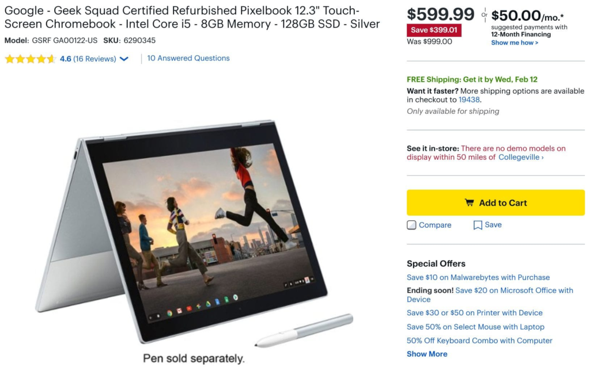

The [Pixelbook Go](https://www.aboutchromebooks.com/news/pixelbook-go-review-a-premium-price-validated-by-a-premium-device/) hasn't enamoured many potential buyers who feel that even though the newest Google Chromebook is less expensive, it cuts a few key features. That steers some back to the older Google Pixelbook, which still retails for $999. If you don't mind a refurbished unit from Best Buy though, [you can nab a Pixelbook for $599.99](https://www.bestbuy.com/site/google-geek-squad-certified-refurbished-pixelbook-12-3-touch-screen-chromebook-intel-core-i5-8gb-memory-128gb-ssd-silver/6290345.p?skuId=6290345).

This is the base model, so you get the 7th-gen Intel Core i5 Y-Series processor, 8 GB of memory, 128 GB of storage and 360-degree hinge for the 2400 x 1600, pen-capable, 12.3-inch touchscreen.

Here's the full rundown on all of the specifications:

<table class=""><tbody><tr><td>CPU</td><td>Intel Core i5-7Y57 Processor</td></tr><tr><td>GPU</td><td>Intel integrated graphics</td></tr><tr><td>Display</td><td>12.3-inch, 3:2 2400x1600 touchscreen, Pixelbook Pen support</td></tr><tr><td>Memory</td><td>8 GB</td></tr><tr><td>Storage</td><td>128 GB eMMC</td></tr><tr><td>Connectivity</td><td>Dual band 802.11ac Wi-Fi Bluetooth 4.2</td></tr><tr><td>Input</td><td>Backlit keyboard, multitouch trackpad 720p webcam</td></tr><tr><td>Ports</td><td>2 USB Type-C, combination microphone / headphone jack</td></tr><tr><td>Battery</td><td>41 WHr, claimed run-time of 10 hours</td></tr><tr><td>Weight</td><td>2.45 pounds</td></tr><tr><td>Software</td><td>Chrome OS automatic update expiration date: June 2024</td></tr></tbody></table>

I have no idea how many units Best Buy has and you can't find them in store. If you order one today, however, you should have it by Wednesday.

I've purchased refurbished laptops from Best Buy in the past and have been satisfied with all of them. You can always return the unit within two weeks if you're not happy and you do get at least a 90-day warranty. Keep in mind that you'll get automatic Chrome OS software updates through June 2024, or nearly 4.5 years, which is [nearly half that of all new Chromebooks these days](https://www.aboutchromebooks.com/news/google-announces-8-years-of-chrome-os-software-updates-aue-for-new-chromebooks/).
