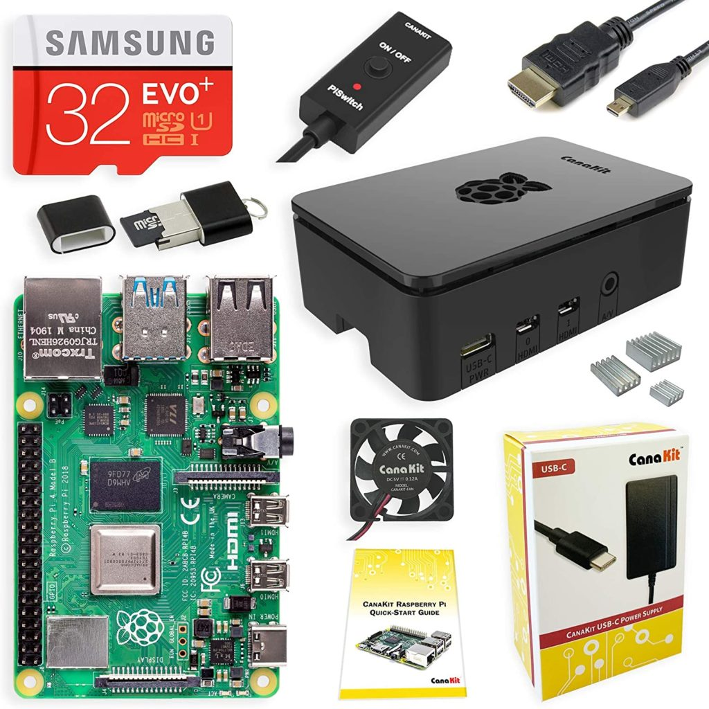

I'm getting hammered with Google News story alerts about school district after school district unable to get enough Chromebooks for virtual learning. And checking Chromebook inventory at typical retail outlets basically confirms from that perspective: Most Chromebooks are simply sold out. Don't panic though: There _**are**_ some ways to get your students online and productive in what are typically Chromebook-based districts.

## Install Neverware CloudReady on an old computer

_Image courtesy NeverWare_

Neverware has made a name for itself by creating its own Chrome OS environment that can be downloaded and installed on non-Chromebooks. In fact, many people who still have old Chromebooks that no longer get software updates turn to CloudReady which actually does keep their device up to date for the most part.

Neverware's CloudReady is free for home use and is relatively easy to download an install. I won't cover the process here as you should first [check device compatibility](https://guide.neverware.com/supported-devices/) and [follow the official instructions](https://guide.neverware.com/critical-requirements/). Note that if CloudReady hasn't been officially tested on your particular old hardware, there's a good chance that it will work just fine. So it's definitely worth the try.

Once CloudReady is installed, your student will have essentially the same Chrome OS experience as any Chromebook. That means the same user interface and most features on a traditional Chromebook. That means the software will look and behave just like Chrome OS for all Google services such as Docs, Meet and Gmail.

## Purchase a low-cost Raspberry Pi for a student desktop

While Chromebooks are hard to come by, the relatively low cost Raspberry Pi computers are readily available. I'd recommend the latest Raspberry Pi 4B with at least 4 GB of memory, which [by itself costs as little as $42 on Amazon right now](https://amzn.to/2QHrKtV). This is just a basic computing board; you'll also need your own microSD card, USB or Bluetooth keyboard, mouse and monitor but if you have any of these lying around, they should work with with the Pi.

If you want a full kit with a case, cooling fan (it's not a necessity but nice to have), memory card, cables and power supply, I recommend this [CanaKit bundle](https://amzn.to/2EQPE3M) for just under $100. I have two of these for various projects and they work well.

Keep in mind that this is a small, Linux-based computer that runs on a chip typically used for smartphones. So it won't be as powerful as a standard Chromebook. It also comes with the Firefox browser, which should work fine with Google services at your local school, although you can install Chromium, which is the open sourced version of Chrome.

This will be fine for getting things done although it can be hit or miss when it comes to videoconferencing. Google Hangouts and Meet reportedly work fine with an optional USB webcam, preferably with integrated speakers and microphone, else you'll have to add those too, but not so much for Zoom. It might be worth considering using a tablet or smartphone you have on hand for synchronous learning: Students can participate in video conferences on the secondary device and get work done on the Pi.

## Pay a premium for an actual Chromebook

I **_hate_** to suggest this because I don't like to see people spending more than they need to. But I'm adding it because some people may feel that even an overpriced Chromebook is better than a student with no Chromebook.

While the big box stores may be out of stock when it comes to Chromebook inventory, I have seen some Chromebooks in stock if you're willing to pay a premium. I'm not going to suggest specific options here but recommend doing a Google Shopping search for various Chromebooks.

When I do that I see various third-party resellers with inventory but with premium pricing. Some of the premiums are as low as 10 percent, which in the case of a pandemic situation, may be worth paying. Others are ridiculous amounts, practically doubling the cost of even very old Chromebooks. So search far and wide, comparing the premium prices, as well as shipment dates, against current MSRPs of Chromebooks.

Keep in mind that _any_ old Mac or Windows computer you might have gathering dust should be able to run a browser and likely even video conferencing software. So if you've got any hardware that still works, even if it's several years old, bringing it back to life for basic browsing and online studies should do the trick here until Chromebook supply catches up to demand.
