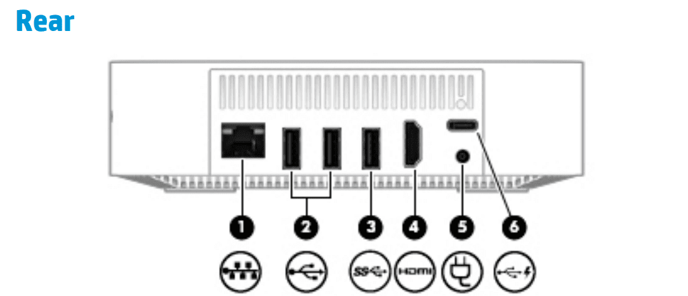

Even though HP announced the Chromebox G2 some time ago, you still can't get one directly from the company. That should be changing soon, however, and if you do [buy one](https://www.aboutchromebooks.com/news/hp-chromebox-g2-release-date-may-30-with-pre-orders-available-for-208/), you might be interested in this highly detailed [service manual for repairs or upgrades on the HP Chromebox G2](http://h10032.www1.hp.com/ctg/Manual/c06011401).

The manual confirms the specs of the three different models, complete with part numbers for the Intel processors, memory modules, solid-state flash drives, wireless boards and more.

There are two SODIMM memory slots for RAM and the most powerful Intel Core i7 configuration uses both of those with 8 GB memory boards. According to the manual, only that config supports the full 16 GB of memory, although I'd be game to try a pair of 8 GB boards in the Core i5 or even the Celeron unit, even though the manual says 4 GB is the max for the base Chromebox G2.

One other interesting thing I learned from the manual is that the HP Chromebox X2 has a single USB port (item 6, below) that can charge external devices even when the Chromebox is powered down. As long as the Chromebox is plugged in you could charge a phone, tablet or other device with that port. That port also works with external monitors that can connect over USB-C -- [similar to a Thunderbolt 3 port](https://www.aboutchromebooks.com/opinion/why-dont-chromebooks-have-thunderbolt-3-support/), but with out the super-fast data transfer of one.

Also, the manual says there's a "USB Chrome stand-alone wired keyboard and mouse combo" included so I presume all configurations will come with that.

The schematics and parts of the entire device are very detailed and set an example for other Chromebox makers to follow. In fact, if I were still in IT support -- something I did in a past life -- and our organization was considering Chromeboxes, I'd lean towards HP over another brand because of this service manual.
