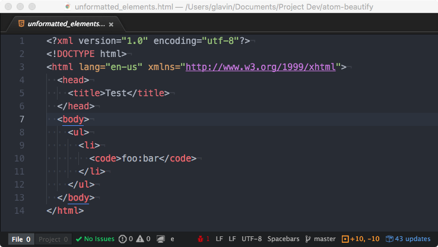

While I've noted many times that [I code on my Pixel Slate](https://www.aboutchromebooks.com/news/how-to-code-on-a-chromebook-crostini-pixel-slate/) and my newer [Acer Chromebook Spin 13 with 16 GB of memory](https://www.aboutchromebooks.com/news/acer-chromebook-spin-13-with-16-gb-ram-should-you-buy-one/), all of my coding is on the back-end. Meaning, I typically use Java or Python, along with some APIs and cloud services, to build small apps and complete homework for my Computer Science classes at the local community college.

It hasn't taken me long to create a setup workflow in this case: Enable Linux in Chrome OS, download and install my preferred development environments, connect them to GitHub and go.

Implementing a linked list stack in Java on the Pixel Slate - yay!

Setting up the same devices for full-stack web development though? I've never done that.

Luckily, John Stamp has. He's a full-stack developer and he recently [outlined his entire setup process for web development on a $200 Chromebook](https://medium.com/@stamp.john.mail/set-up-chromebook-for-web-development-with-a-build-in-linux-subsystem-crostini-65e946aa23). It works well, or well enough, and the same process can be followed on just about any other Chromebook that supports Linux.

From reading the detailed process, which of course, could vary depending on the tools you may want to use, I learned a bunch. Clearly, there are more steps in John's setup than mine, simply because there are more moving parts.

For instance, after enabling Linux on his Chromebook, John installs [NodeJs](https://nodejs.org/en/), [NPM](https://www.npmjs.com/), and [XAMPP](https://www.apachefriends.org/index.html), all of which allow him to create web-based and stand-alone apps using JavaScript and PHP. Those tools are in addition to adding the [Nautilus file manager](https://projects-old.gnome.org/nautilus/screenshots.html) and [Atom code editor](https://atom.io/), both of which are useful for both devs and non-developers alike.

Along the way throughout the process, John shares little tips and tricks that are specific to using a Chromebook and even provides fixes for some of the most common issues you may encounter, such as using an IP address to connect to the Linux container and display errors when trying to run a local webserver.

Clearly, John put a ton of time and effort into this setup process, so if you want to take the plunge and do web development on your Chromebook using Linux, I highly recommend carefully reading his guide.
