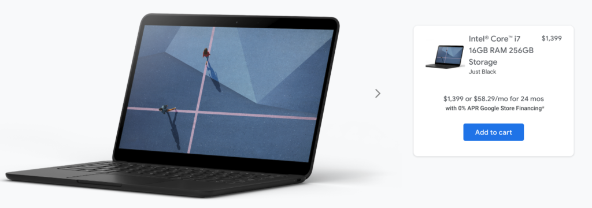

The Pixelbook Go was introduced roughly two months ago and as of today, you can finally [order the fourth configuration with Intel Core i7 processor, 16 GB of memory, 256 GB of storag](https://store.google.com/product/pixelbook_go)[e](https://store.google.com/product/pixelbook_go) [and 16:9 4K display](https://store.google.com/product/pixelbook_go). You'll pay $1,399, which is a rather large premium over the $649 base model with Core m3 CPU and 1080p display, of course.

Is it worth it?

In general, I'd say the Pixelbook Go itself is fantastic. Based on [my review of the $849 model with Core i5 processor](https://www.aboutchromebooks.com/news/pixelbook-go-review-a-premium-price-validated-by-a-premium-device/), I found the device to be more than snappy enough to handle almost any task in Chrome OS, Android or even Linux, save for full-time development work.

Yes, you can find Chromebooks with more features, such as a 360-degree hinge, digital stylus support or even more powerful processors for less than the Pixelbook Go. The lightweight overall design and thinness of the Go combined with a top-notch keyboard will beat most, if not all, of those competitors though. So if those features are important to you, the Pixelbook Go may be worth the premium.

But $1,399 to go completely upscale with that Core i7 and 4K display? I don't think that purchase will serve most Chromebook users well unless there's are two specific use cases that are extremely high on your list: Content consumption and Google Stadia gaming.

I say that because a 4K display isn't going to make you more productive. Yes, you may enjoy the visual improvement but really, a Google Doc in 1080p isn't much different from a Google Doc in 4K, for example. I doubt many Android apps are optimized for 4K displays either.

However, if you plan to use a Pixelbook Go as a primary device for also watching high-resolution content and/or you're a Stadia Pro subscriber, which provides video game streams up to 4K at 60fps, then maybe spending $1,399 is worth it for you.

I actually fit into _both_ of those categories but I'm still not going to drop that kind of money on the high-end Pixelbook Go. I'm fine with the 1080p limit on the less expensive Pixelbook Go models for gaming because I primarily use Stadia on one of two 4K HDTVs in the house.

I actually [just added a Philips Hue Sync Box to one of the televisions](https://staceyoniot.com/philips-hue-sync-box-review/) for a more immersive experience as well: The [$229 Sync Box](https://www.bestbuy.com/site/philips-hue-play-hdmi-sync-box-black/6371722.p?skuId=6371722) takes any HDMI input and syncronizes bias lights with the on-screen content and it looks amazing particularly in games with explosions and gunfire.

Put another way: Gaming on a Chromebook is a secondary activity for me, only when the televisions are in use.

So I think the $1,399 Pixelbook Go is a tough sell as it really only appeals to a niche audience of a larger niche audience. That doesn't mean you shouldn't buy it, but if you're not in the category I've mentioned above, you'll probably be happier with a less expensive Pixelbook Go, or other Chromebook, and more money in your pocket.

Are any of you ordering the $1,399 model?
