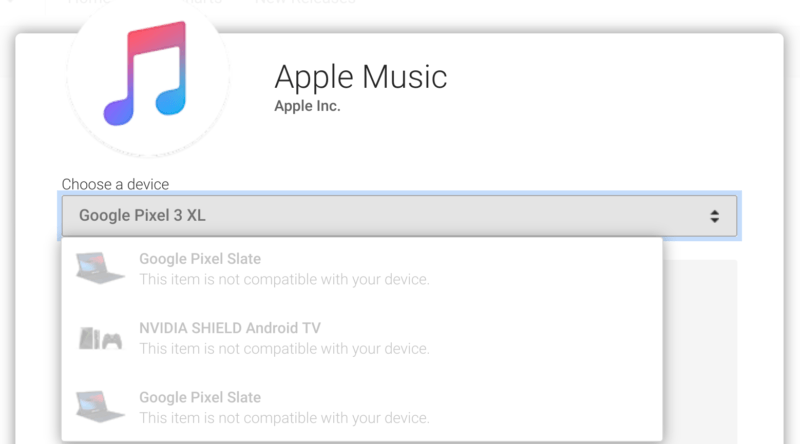
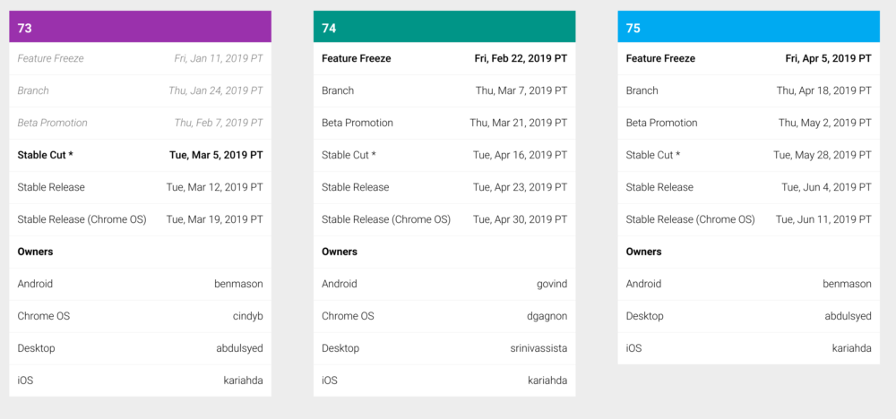
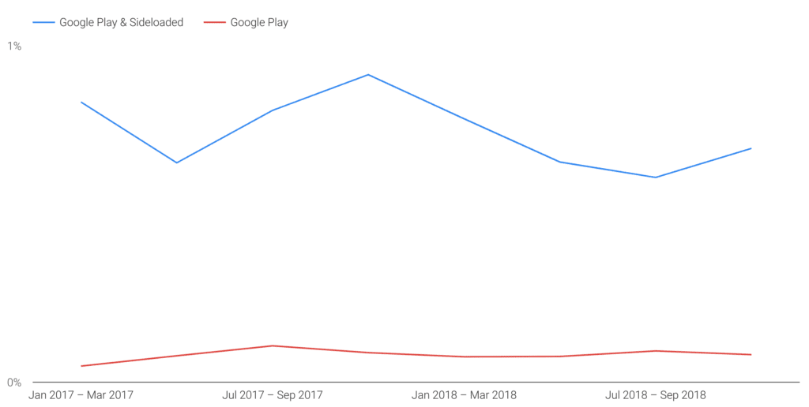

Over the weekend, I was asked on Twitter if the [recently released Chrome OS 72 Stable Channel](https://www.aboutchromebooks.com/news/stable-version-chrome-os-72-what-you-need-to-know/) added the ability to sideload Android apps on a Chromebook.

Sideloading is manually installing an Android .apk file -- the package that makes up a specific app -- instead of using the Google Play Store. It comes in handy when, for example, an Android app is available for phones but not tablets, or at least Chromebooks that act like tablets (I'm looking at you [Apple Music since you don't appear in the Play Store on my Pixel Slate](https://9to5mac.com/2018/12/03/apple-music-for-android-gaining-tablet-support-three-years-after-launch/)!)

The answer is no, you still can't sideload Android apps on a Chromebook with one exception: [Using Developer Mode](https://developer.android.com/topic/arc/sideload). This is [different from the Dev Channel](https://www.aboutchromebooks.com/qa/whats-the-difference-between-developer-mode-and-the-dev-channel-on-a-chromebook/) because it disables some of the Chrome OS security functions during and after boot. For most users, I wouldn't recommend it.

However, I did do some research on this functionality since it has been asked for since 2017 (if not prior) and found some promising information. At least it's promising at the _moment s_ince Chrome OS development plans can and will change.

A few weeks ago, one of the Chromium team developers replied to the bug for this feature request, saying:

> Thanks for being patient while we sort this feature out. I can give some details, but don't want to commit to an exact milestone given that this has been punted a few times already.
> 
> We're still working on this, and would like to be able to deliver in the next couple milestones (M-74/M-75 timeframe hopefully). Unfortunately it's been pre-empted a couple of times due to higher priority issues; for instance, you may have seen we've recently launched Android Pie on Pixel Slate and have been starting to roll it out to more devices.

Also of note: This bug is listed as having Priority 1, which is encouraging. However, it's clear that the developer wasn't committing to a particular release version. The word "hopefully" emphasizes that, which I can understand.

For the sake of argument, let's assume that the ability to sideload Android apps on a Chromebook does happen in version 74 or 75. That means -- depending on the version -- we're looking at either late April or mid-June because that's when those releases are expected to land in the Stable Channel according to the [Chromium Dash Schedule](https://chromiumdash.appspot.com/schedule).

The key here will be watching for code that makes it past testing before the Feature Freeze dates shown above. If this functionality isn't added by then, it's pushed to the next version at a minimum. Keep in mind there was a discussion about adding this a few versions back, but as the developer says, "...it's been pre-empted a couple of times" before, so the target release could very well change again.

As for why Google doesn't allow sideloading of Android apps on a Chromebook, save for Developer Mode?

It's all about security, which is the first of the three pillars of Chrome OS: Security, Simplicity, and Speed.

Apps that are downloaded from outside the Google Play Store aren't vetted by Google before availability. Google calls these PHAs, or Potentially Harmful Apps. And these are the apps that contribute the most security challenges and compromises, by far, to devices, per the [quarterly Android Security report](https://transparencyreport.google.com/android-security/overview) as shown here:

I don't think Google is against application sideloading in principle. However, to enable it, Google needs to determine the best way to protect users from any security issues when it comes to Chrome OS. Remember, that Chromebooks are used in businesses too: This isn't just something for Google to consider on the consumer side, although it could [add a policy](https://support.google.com/chrome/a/answer/1375678?hl=en) to disallow sideloading on managed work devices. Franky, I think that will be a _**must**_ for implementation.

I do know that even sideloaded apps are scanned on devices by [Google Play Protect, which is the company's machine learning solution to create a smarter security system](https://blog.google/products/android/google-play-protect/)  (_Disclosure: I wrote the linked post for Google when I worked there_). If Google deems that Play Protect alone can help keep malicious Android apps off of Chromebooks -- or even remove them if required -- that may be enough to get this feature rolled out.
