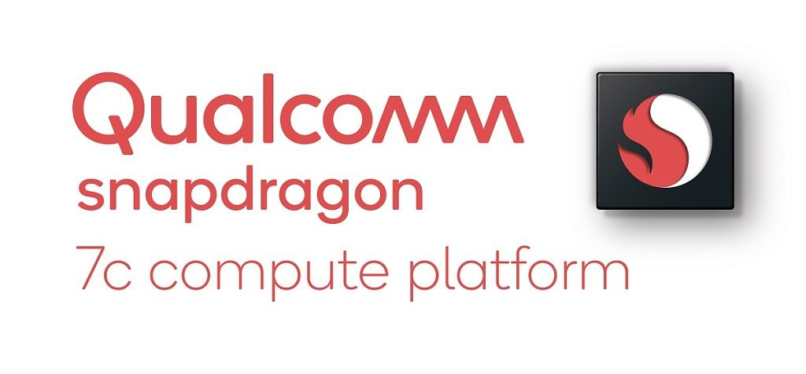
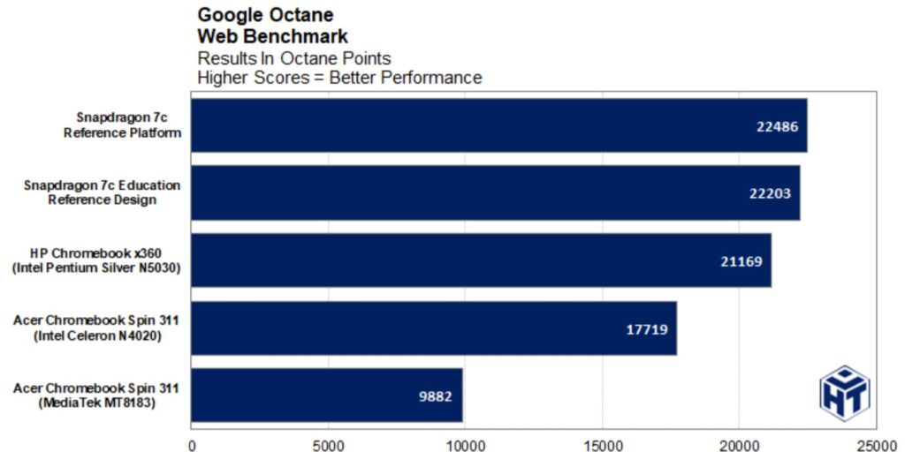
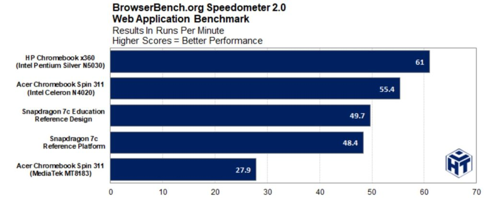

Earlier this week, I noted that the Qualcomm Snapdragon 7c-powered [Acer Chromebook Spin 513 is available outside the US](https://www.aboutchromebooks.com/news/acer-chromebook-spin-513-with-snapdragon-7c-available-in-the-uk-for-399-99/ "Acer Chromebook Spin 513 with Snapdragon 7c available in the UK for  £399.99"). I also suggested that you might want to wait before buying since this chipset doesn't yet have a history inside Chromebooks. Today, there's the beginnings of some history with [a PDF research report on expected performance](https://www.hottech.com/industry-coverage-1/2021/3/9/research-report-qualcomm-snapdragon-7c-performance-analysis-the-chromebook-experience "https://www.hottech.com/industry-coverage-1/2021/3/9/research-report-qualcomm-snapdragon-7c-performance-analysis-the-chromebook-experience").

There are some interesting test results here and the gamut of typical Chromebook tests are run: Octane, Speedometer, JetStream, and Geekbench to name a few.

Battery testing using Zoom is also part of the analysis here.

In most tests, the Snapdragon 7c reference design running Chrome OS 88 does score higher than competing systems, which include the Acer Chromebook Spin 311 in both Intel Celeron N4020 and older MediaTek 8183 variants as well as the HP Chromebook x360 with Intel Pentium Silver N5030.

However, it should be noted that one of the two reference designs used double the RAM of all other models, which could impact performance to a degree. The education reference design was on par with just 4 GB of memory, and it too performed well.

I tend to rely most on Octane as a benchmark, even though it is a retired test. And frankly, the Octane scores of the Snapdragon systems were more comparable to than much better than the other tested devices:

Put another way: I hope you expected what I expected from the Snapdragon 7c inside a Chromebook. Meaning sub-Core i3 performance in line with a Pentium-powered device.

Indeed, if you look at the Speedometer 2.0 results, my second go-to Chromebook benchmark, the Snapdragon 7c performs _**below**_ a Celeron and a Pentium:

I suspect that's why in the summary the report says the Snapdragon 7c is "roughly equivalent to the Pentium Silver N5030".

I'll let you read the full report to see where the Snapdragon 7c really shined: GPU testing and battery life were easy wins as I would expect.

Intel's integrated graphics, particularly at the low end are nothing to write home about. Nor is the company's performance per watt on older chipsets, although that's improving with 11-generation products.

This is a controlled early performance test of course, so it remains to be seen how Snapdragon 7c Chromebooks will do in the real world.

I suspect we shouldn't have to wait long since the [Acer Chromebook Flip 513 I got a sneak-peek at in October](https://www.aboutchromebooks.com/news/hello-acer-chromebook-spin-513-the-first-with-a-qualcomm-snapdragon-7c/) is expected to launch this quarter in the US. The starting price I was told back then is $399, or about what I'd expect to pay for a Chromebook with Celeron to Pentium-level performance.
