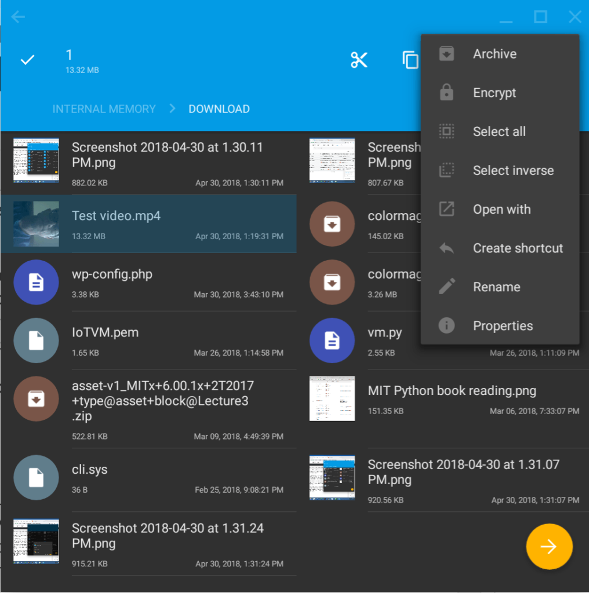
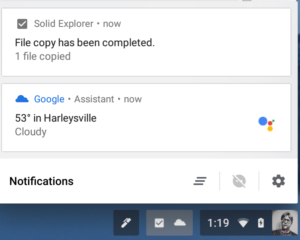

Chromebooks that run Android apps have two separate file storage locations. And that's by design: In order to keep Chrome OS as safe as possible, Android apps and files are sequestered to a different area on your local storage. That's great from a security standpoint but can be a bit annoying if you want to transfer data between those two systems.

Enter [Solid Explorer, an Android file manager that now supports Chrome OS,](https://play.google.com/store/apps/details?id=pl.solidexplorer2) so you can manipulate files between both platforms in a single app.

[XDA Developers reported this news today](https://www.xda-developers.com/solid-explorer-android-tv-chrome-os/) but I started using Solid Explorer this past weekend. And I'm glad I did because it adds tremendous value to Chromebooks with Google Play Store access.

For starters, you can browse and manipulate data on either the Chrome OS or Android file system. Well, within reason that is: Without root access on the Android side, you can't manipulate system files. I'm OK with that for this particular use case though because now I can move files between Chrome OS and Android.

I added a new Android camera app yesterday since I'm not thrilled that the [native Camera app for Chrome OS](https://www.aboutchromebooks.com/news/chromebooks-can-now-record-video-with-the-native-camera-app/) records video in the .webm format. Yes, I can use a tool to change the format to an .mp4, but why bother when another camera app can simply record natively as an .mp4?

So my .webm problem is solved but how do I get the .mp4 from Android to Chrome OS?

It's easy to do within Solid Explorer. Even better: When opened the video in the Android camera app, I was able to save it directly to the Downloads folder on Chrome OS. The Solid Explorer installation recognized my local Chrome OS storage by default from within the Android camera app. Chrome OS even provided a notification to show the saved file action.

This new support for Chrome OS isn't quite perfect though. I haven't been able to use the keyboard or trackpad to consistently select a single file and take actions on it. Luckily, the touchscreen of my Pixelbook allows Solid Explorer to act like a large Android phone, so a tap or a  long press gets around that. And of course, if there's a file that's locally stored within Chrome OS, the native Files app still works.

[Solid Explorer](http://neatbytes.com/solidexplorer/) has been around for a wile on Android devices and is chock full of other features: A dual panel mode for drop and drag, support for FTP, SFTP, WebDav, and SMB/CIFS clients, ZIP, 7ZIP, RAR and TAR reading and unpacking, as well as cloud drive access. There's a limited-feature two-week free trial of Solid Explorer and after that you'll pay $1.99 for the full, unlocked version.

Unless (or until) the native Chrome OS Files app gains access to the Android file system, Solid Explorer is a good choice for data management on a Chromebook if you want more access to your Android files.
