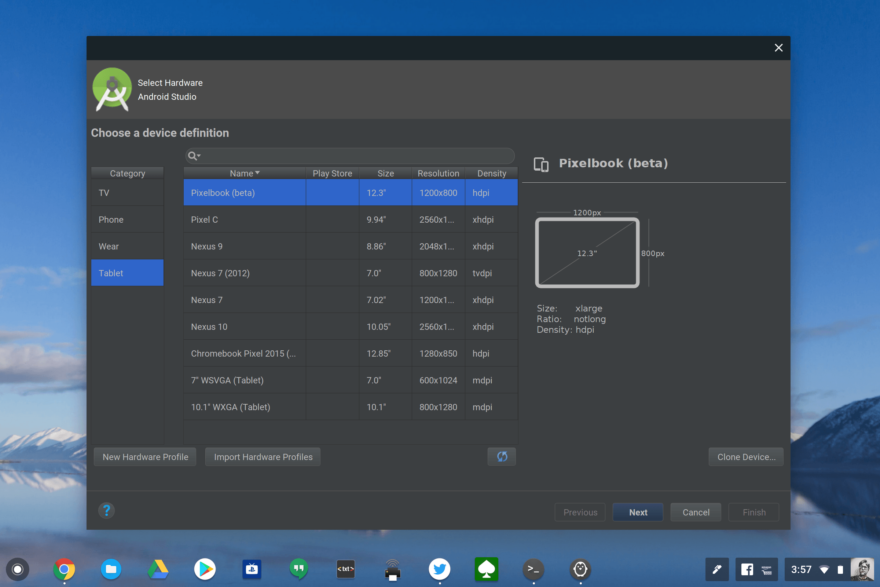
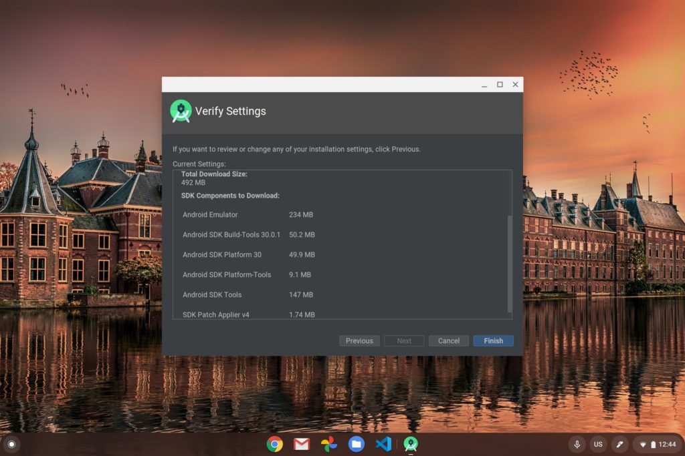

Slowly but surely, Chromebooks have been turning into a first-class option for developers and [some computer science majors](https://www.aboutchromebooks.com/news/can-you-learn-to-code-in-a-college-computer-science-program-with-a-chromebook/). The [addition of Linux](https://www.aboutchromebooks.com/news/chrome-os-69-stable-release-project-crostini-linux-apps/) support [opened the doors for Android Studio with some limitations](https://www.aboutchromebooks.com/news/android-studio-chrome-os-chromebook-recommendation-google-io-2019/) and now perhaps the biggest one is gone. Google announced support for the [Android Emulator with Android Studio on certain Chromebooks](https://android-developers.googleblog.com/2020/08/introducing-chrome-os-dev.html), with more to follow:

> [Supported Chromebooks](https://chromeos.dev/en/android-environment) can now run a full version of the Android Emulator, which allows developers to test apps on any Android version and device without needing the actual hardware. Android app developers can simulate [map locations](https://developer.android.com/studio/run/emulator#extended) and other sensor data to test how an app performs with various motions, orientations, and environmental conditions. With the Android Emulator support in Chrome OS, developers can optimize for different Android versions and devices — including tablets and [foldable smartphones](https://developer.android.com/guide/topics/ui/foldables#emulators) — right from their Chromebook.

This news came by way of another announcement, a new Google site called [ChromeOS.dev](https://chromeos.dev/en), which as you can likely guess, is about development on Chromebooks.

Developers could already code their Android apps on a Chromebook and even [deploy them to a connected phone or tablet](https://www.aboutchromebooks.com/news/chrome-os-81-stable-channel-release-what-you-need-to-know/), or within the Android container of Chrome OS.

But that's only half the battle when writing mobile apps that will be used a wide range of devices, each with different screen sizes, pixel densities, and hardware features such as GPS radios or dual-displays and folding screens. Hence the need for a device emulator to test different device scenarios.

According to Google, the following Chromebooks initially support Android emulation in Android Studio:

- **Acer:** Chromebook 712 \[C871\]
- **ASUS:** Chromebook Flip C436FA
- **Dell:** Latitude 5300 2-in-1 Chromebook Enterprise, Latitude 5400 Chromebook Enterprise
- **HP:** Chromebook x360 14c
- **Lenovo:** Flex 5 Chromebook

Even though my device isn't on that list, I installed the latest version of Android Studio on my daily driver, the [Acer Chromebook Spin 13 with 16 GB of memory](https://www.aboutchromebooks.com/news/acer-chromebook-spin-13-with-16-gb-ram-should-you-buy-one/). I made sure during a custom installation that I saw the Android Emulator component was there.

Unfortunately, Google seems to be rolling this feature out on a limited basis to just the officially supported devices right now. I couldn't create a virtual Android device for emulation on my Acer, which is more than powerful enough to handle it.

Indeed, I'm surprised the Lenovo Chromebook Flex 5 is on the list because there are various configurations of that device, such as the [$409 model with Intel Core i3 and 4 GB of memory](https://www.aboutchromebooks.com/news/lenovo-flex-5-chromebook-hands-on-and-first-impressions/) as well as [the less expensive models running on a Celeron](https://www.aboutchromebooks.com/news/lenovo-chromebook-flex-5-chromebook-release-date-price-specifications/).

Regardless, any steps forward here are progress. I'd think that after gathering some data and optimizing the emulator further, this feature will become more widely available on mid- to high-end Chromebooks in the coming months.
